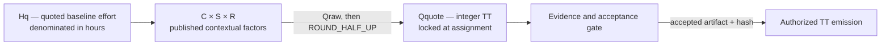

# TT Valuation Doctrine — The Baseline Hour

**Identifier:** `GQAOA-QFIN-TT-VAL-001`
**Status:** `PROPOSED` — ratification by merge
**Referenced by:** `TT-PROTOCOL.md` §5 — Quotation · `MANIFESTO.md` — No-Echo Clause

---

## 1. Governing principle

> **Hours estimate effort. Multipliers qualify context. Tokens quote contribution. Evidence authorizes emission.**

Teknia Tokens are not timesheet units. Hours enter the quotation model as an **ex-ante estimate of baseline effort**, but elapsed time does not trigger emission and does not alter a locked quotation.

A work package authorizes TT emission only after its declared output has been produced, evidenced, reviewed where required and accepted through the applicable lifecycle gate.

---

## 2. Baseline-hour calibration

One Teknia Token is the contribution-accounting unit associated with one hour of **baseline work**:

* ordinary complexity;
* general skill;
* ordinary responsibility;
* defined and freely revisable output.

```text
1 TT ≡ 1 quoted baseline-effort hour at C = S = R = 1.0
```

This equivalence is exact only at baseline.

It does **not** establish:

* a wage or hourly salary;
* a monetary exchange rate;
* a redemption entitlement;
* a market price;
* a claim on fiat funds;
* a guarantee that time spent will produce tokens.

---

## 3. Variables and valuation formula

Let:

| Symbol   | Meaning                                                                     | Unit          |
| -------- | --------------------------------------------------------------------------- | ------------- |
| `Hq`     | Ex-ante quoted baseline effort required to deliver the accepted scope       | hours         |
| `Ha`     | Actual effort observed after execution, optionally recorded for calibration | hours         |
| `C`      | Complexity multiplier                                                       | dimensionless |
| `S`      | Specialization multiplier                                                   | dimensionless |
| `R`      | Responsibility multiplier                                                   | dimensionless |
| `Qraw`   | Unquantized contribution valuation                                          | TT            |
| `Qquote` | Published integer TT quotation                                              | TT            |

The raw valuation is:

```text
Qraw = Hq × C × S × R
```

The publishable quotation is:

```text
Qquote = ROUND_HALF_UP(Qraw, 0)
```

No intermediate rounding is permitted.

The multipliers are bounded as follows unless a separately ratified exception applies:

```text
1.0 ≤ C ≤ 2.0
1.0 ≤ S ≤ 2.0
1.0 ≤ R ≤ 2.0
```

Therefore:

```text
Qraw ≥ Hq
```

Integer quantization may result in `Qquote = Hq` when the amplification is smaller than half a token.

---

## 4. Quoted effort versus actual effort

`Hq` is the effort estimated **before assignment** for a competent eligible contributor working under the declared assumptions and scope.

`Hq` is not:

* the assignee’s reported elapsed time;
* a reimbursement claim;
* a guaranteed duration;
* a post-execution adjustment mechanism.

`Ha` may be recorded after completion to improve future quotation models, but it shall not modify the quotation locked at `ASSIGNED`.

Accordingly:

```text
Ha > Hq  does not increase Qquote
Ha < Hq  does not decrease Qquote
```

If the accepted scope changes materially after assignment, the additional work requires a governed amendment or a separate work package. It shall not be absorbed by rewriting the locked quotation.

---

## 5. Multiplier rubric

| Level | `C` — Complexity                                   | `S` — Specialization                                                                           | `R` — Responsibility                                              |
| ----: | -------------------------------------------------- | ---------------------------------------------------------------------------------------------- | ----------------------------------------------------------------- |
| `1.0` | Routine, well-templated and locally bounded        | General skill                                                                                  | Low blast radius; output freely revisable                         |
| `1.2` | Moderate integration or several defined interfaces | Domain-familiar capability                                                                     | Output consumed or depended upon by others                        |
| `1.5` | Doctrinal, architectural or cross-domain           | Deep, certified or controlled-domain expertise, such as S1000D, safety engineering or Solidity | Template-setting, normative or governance-relevant output         |
| `2.0` | Novel, system-level or structurally uncertain      | Rare expertise with limited substitution                                                       | Safety-critical, authority-bearing or difficult-to-reverse output |

Intermediate values are permitted, provided that each receives a one-line motivation in the published quotation.

The rubric guides valuation; the published quotation governs the tender.

Pre-assignment contestation is the corrective mechanism.

---

## 6. Multiplier independence and anti-stacking rule

Each multiplier shall represent a distinct property:

* `C` describes the intrinsic structure and difficulty of the work;
* `S` describes the capability required to perform it competently;
* `R` describes the consequences, authority and reversibility of the accepted output.

The same characteristic shall not be used to justify more than one multiplier.

For example, the fact that an output is safety-critical may justify an elevated responsibility multiplier. It shall not automatically be reused to elevate complexity and specialization unless separate reasons are documented for those factors.

Every quotation shall therefore include:

```yaml
valuation:
  Hq: <quoted baseline hours>
  C:
    value: <1.0-2.0>
    motivation: <distinct complexity justification>
  S:
    value: <1.0-2.0>
    motivation: <distinct specialization justification>
  R:
    value: <1.0-2.0>
    motivation: <distinct responsibility justification>
  Qraw: <unrounded result>
  rounding: ROUND_HALF_UP
  Qquote: <integer TT>
```

---

## 7. Quotation lifecycle

### 7.1 Publication

A quotation becomes `QUOTED` when:

1. the work-package definition is committed;
2. the tender issue is opened;
3. the valuation factors and resulting `Qquote` are published.

### 7.2 Pre-assignment revision

Before assignment, the quotation may be contested and revised through an append-only revision record.

Each revision shall state:

* revision identifier;
* date;
* previous quotation;
* revised quotation;
* changed factor or scope assumption;
* motivation;
* evidence hash or commit reference.

Previously published revisions shall not be deleted or overwritten.

### 7.3 Assignment lock

At `ASSIGNED`, the accepted quotation revision becomes irrevocable for the declared scope.

```text
ASSIGNED ⇒ Qquote locked
```

Actual effort, implementation speed or contributor identity shall not alter it.

### 7.4 Evidence gate and emission

Assignment does not emit TT.

Emission requires the applicable evidence and acceptance event:

```text
QUOTED
   ↓
ASSIGNED
   ↓
artifact produced
   ↓
evidence recorded
   ↓
acceptance gate passed
   ↓
TT emission authorized
```

No accepted artifact means no emission, regardless of hours spent.

---

## 8. Worked examples

The following examples illustrate the formula. They are not substitutes for authoritative work-package quotations.

| Example                                             | `Hq` | `C` | `S` | `R` | `Qraw` | `Qquote` | Quoted TT/h |
| --------------------------------------------------- | ---: | --: | --: | --: | -----: | -------: | ----------: |
| Routine structured contribution                     |    8 | 1.0 | 1.0 | 1.0 |   8.00 |        8 |        1.00 |
| Domain authoring with moderate integration          |    6 | 1.2 | 1.4 | 1.0 |  10.08 |       10 |        1.67 |
| Independent specialist review                       |    2 | 1.0 | 1.5 | 1.0 |   3.00 |        3 |        1.50 |
| Architectural work with broad downstream dependency |   20 | 1.5 | 1.4 | 1.2 |  50.40 |       50 |        2.50 |
| Safety-critical novel system decision               |   10 | 2.0 | 1.8 | 2.0 |  72.00 |       72 |        7.20 |

The quoted TT-per-hour ratio is derived as:

```text
Qquote / Hq
```

It is descriptive only. It is not a wage rate.



---

## 9. The no-echo rule

A contribution shall be emitted once.

The same work shall not generate duplicate TT merely because it appears at multiple layers of:

* delegation;
* orchestration;
* supervision;
* representation;
* agent execution;
* operator accountability;
* repository mirroring.

A work package quoted from one hundred baseline-effort hours may carry a quotation greater than one hundred TT when independently justified multipliers apply.

However:

> **Hours alone mint nothing. Only an accepted and independently evidenced contribution authorizes emission.**

Echoed hours authorize zero additional TT.

### 9.1 Distinct deliverables are not echoes

The no-echo rule does not prohibit separate valuation of genuinely distinct outputs.

For example, authoring and independent review may be separate work packages when each has:

* a distinct scope;
* a distinct assignee or accountable operator;
* separate evidence;
* an independent acceptance event;
* no duplicate claim over the same contribution.

An independent review is therefore not an echo of authoring merely because it examines the same artifact. Its contribution is the review evidence, findings and acceptance recommendation.

---

## 10. Common misreadings

### 10.1 “One TT equals one hour”

Only at baseline:

```text
C = S = R = 1.0
```

In general:

```text
Qraw = Hq × C × S × R
```

The baseline hour defines the unit. It is not the valuation ceiling.

### 10.2 “TT is a timesheet”

Incorrect.

Hours are an ex-ante quotation input. They are not an emission trigger. Actual time spent does not produce TT without an accepted artifact.

### 10.3 “One hundred hours always mint one hundred TT”

Incorrect.

One hundred quoted baseline hours at `C = S = R = 1.0` produce a quotation of one hundred TT.

One hundred quoted hours with justified amplification may produce a larger quotation.

One hundred echoed, rejected or unevidenced hours authorize no emission.

### 10.4 “A faster contributor should receive fewer TT”

Incorrect.

The quotation values the accepted contribution, not the assignee’s execution speed. Completing the same locked scope efficiently does not reduce the quotation.

### 10.5 “A slower contributor should receive more TT”

Incorrect.

Actual elapsed effort does not increase a locked quotation. Material scope expansion requires a governed amendment or a separate work package.

---

## 11. Ledger requirements

Every quoted work package shall record or resolve the following fields:

```yaml
workPackage: "WP: #<issue-number>"
semanticCode: "WP-<DOMAIN>-<NODE>-<TYPE>-<SEQUENCE>"

quotation:
  revision: 0
  Hq: 0
  C:
    value: 1.0
    motivation: ""
  S:
    value: 1.0
    motivation: ""
  R:
    value: 1.0
    motivation: ""
  Qraw: 0.0
  rounding: ROUND_HALF_UP
  Qquote: 0
  quotedAt: YYYY-MM-DD
  quotationHash: "sha256:<hash>"

assignment:
  lockedRevision: 0
  assignedAt: YYYY-MM-DD

evidence:
  artifactHash: "sha256:<hash>"
  acceptanceEvent: "E3"
  acceptedAt: YYYY-MM-DD

emission:
  amountTT: 0
  emissionId: ""
  emittedAt: YYYY-MM-DD
```

The following invariant shall hold:

```text
emission.amountTT = assignment.lockedRevision.Qquote
```

unless a separately ratified settlement rule explicitly provides for partial acceptance.

---

## 12. Canonical inserts on ratification

### 12.1 `MANIFESTO.md` — append to the No-Echo Clause

> One hundred hours mint one hundred units only when they constitute one hundred hours of quoted baseline work at `C = S = R = 1.0` and the corresponding artifact passes its evidence and acceptance gate. The no-echo rule counts a contribution once across orchestration, delegation and representation layers; it does not equate TT with elapsed time. Valuation follows `Qraw = Hq × C × S × R`, with the integer quotation determined by `ROUND_HALF_UP`. Hours without an accepted artifact authorize no emission.

### 12.2 `TT-PROTOCOL.md` §5 — add calibration note

> **Calibration.** `Hq` is denominated in quoted baseline-effort hours and `Qquote` in integer TT. One TT corresponds to one quoted baseline hour when `C = S = R = 1.0`. Multipliers are dimensionless, bounded from `1.0` to `2.0` unless separately ratified, and applied according to `GQAOA-QFIN-TT-VAL-001`. `Qraw = Hq × C × S × R`; `Qquote = ROUND_HALF_UP(Qraw, 0)`, with no intermediate rounding. The rubric guides, the published quotation governs and pre-assignment contestation is the corrective. Actual elapsed effort does not alter a quotation locked at `ASSIGNED`.

---

## 13. Normative summary

```text
Hq estimates baseline effort.
C qualifies task complexity.
S qualifies required specialization.
R qualifies accepted-output responsibility.

Qraw = Hq × C × S × R
Qquote = ROUND_HALF_UP(Qraw, 0)

QUOTED publishes the valuation.
ASSIGNED locks the quotation.
Evidence proves the contribution.
Acceptance authorizes emission.
No accepted artifact means no TT.
No contribution may be emitted twice.
```
