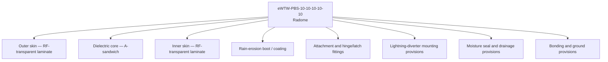
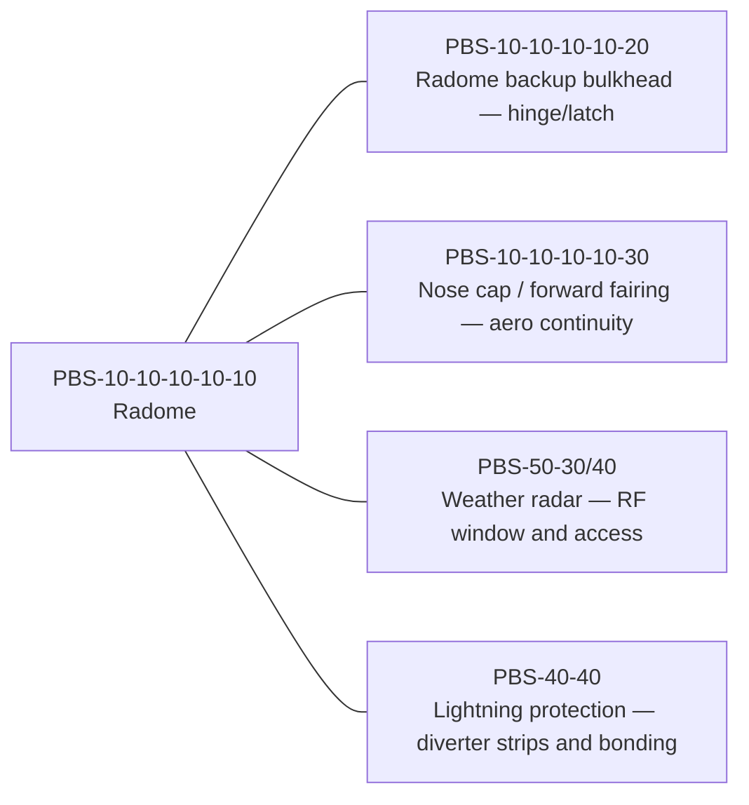

# eWTW · PBS-10-10-10-10-10 — Radome

- **Parent:** `eWTW-PBS-10-10-10-10` (Nose Structure and Radome Backup)
- **ATLAS reference:** `050-059_Primary-Structures-and-Programme-Interfaces` (programme PBS allocation; structural node not yet consolidated)
- **Effectivity:** eWTW · baseline · MSN-001..050 · active

## Index

1. [Purpose](#1-purpose)
2. [Scope](#2-scope)
3. [Glossary of Terms and Acronyms](#3-glossary-of-terms-and-acronyms)
4. [Corpus](#4-corpus)
   - [4.1 Element Definition and Product Role](#41-element-definition-and-product-role)
   - [4.2 Constituent Breakdown](#42-constituent-breakdown)
   - [4.3 Interfaces and Adjacencies](#43-interfaces-and-adjacencies)
   - [4.4 Requirements Drivers](#44-requirements-drivers)
   - [4.5 ATLAS and System References](#45-atlas-and-system-references)
   - [4.6 Traceability Anchors](#46-traceability-anchors)
   - [4.7 Part Number Register](#47-part-number-register)
   - [4.8 Bill of Materials](#48-bill-of-materials)
   - [4.9 PNR / BOM / PBS Traceability](#49-pnr--bom--pbs-traceability)
5. [Notes](#5-notes)
6. [References](#6-references)
7. [Footprint](#7-footprint)

---

## 1. Purpose

Defines the product element `eWTW-PBS-10-10-10-10-10` — the **Radome** — the RF-transparent nose fairing of the eWTW forward fuselage.

The radome is a structural fairing whose defining function is to be **transparent to the weather-radar signal** while surviving the forward-facing environment: bird strike, lightning attachment (Zone 1A), and rain erosion. This document fixes what the part is, its constituents, its interfaces, and the requirement drivers — noting the central design tension: the radome is *structure* (owned here), but its governing performance requirement (RF transmission) is *set by the radar system* (owned by PBS-50, referenced, not contained).[^parent][^atlas]

## 2. Scope

- Establishes the controlled product definition, constituents, interfaces, and requirement drivers for the Radome.
- Owns the *structural fairing and its RF-window realization*, plus mounting/bonding **provisions**.
- **References** (does not contain): the weather-radar antenna and its RF performance requirement (PBS-50-30/40); the lightning-protection system that the diverter strips belong to (PBS-40-40).
- Carries the controlled effectivity tag for configuration control.
- Anchors the matching WBS/CBS/RBS and the publication data modules (radome remove/install, description, IPD) in the element PUB layer.

## 3. Glossary of Terms and Acronyms

| Term / Acronym | Expansion | Meaning in this element |
|---|---|---|
| **Radome** | Radar dome | RF-transparent nose fairing; this element. |
| **RF transparency** | Radio-frequency transparency | Ability to pass radar signal with minimal loss and distortion. |
| **Transmission loss** | — | Fraction of radar signal energy lost passing through the radome wall. |
| **Boresight error** | — | Angular distortion the radome induces in the radar beam direction. |
| **A-sandwich** | — | Radome wall construction: two thin skins over a low-density dielectric core. |
| **Dielectric** | — | Electrically insulating material; its controlled permittivity governs RF performance. |
| **Diverter strip** | — | Conductive strip bonded to the radome to control lightning attachment; part of the LPS, not the radome. |
| **Zone 1A** | — | Lightning initial-attachment zone applicable to the forward nose. |
| **Rain erosion** | — | Surface degradation from rain impact at speed; mitigated by an erosion boot/coating. |
| **Erosion boot** | — | Protective leading-surface layer against rain erosion. |
| **LPS** | Lightning Protection System | The aircraft system owning diverters and bonding; referenced (PBS-40-40). |
| **WXR** | Weather Radar | The avionics system behind the radome; referenced (PBS-50-30/40). |
| **FPB** | Forward Pressure Bulkhead | The pressure boundary aft of the radome; the radome is **forward** of it and unpressurized. |
| **ATLAS** | Aircraft Top-Level Architecture System | Q+ATLANTIDE band `000-099`; node 053 Fuselage. |

## 4. Corpus

### 4.1 Element Definition and Product Role

The radome is the forwardmost fairing of the aircraft, enclosing the weather-radar antenna. It performs three product roles at once: it provides an **aerodynamic nose surface**, it serves as a **radio-frequency window** that the radar transmits and receives through, and it forms the **forward bird-strike and lightning-attachment surface** of the airframe.

A defining feature: the radome sits **forward of the forward pressure bulkhead** and is therefore **unpressurized**. Cabin pressurization — a primary driver for most of the forward fuselage section — is **not** a driver for the radome. Its structural loads are aerodynamic, bird-strike, and handling, not pressure. This distinction must be preserved; treating the radome as part of the pressure boundary is an error.[^parent]

The central design tension is that the radome is owned as *structure* (Q-STRUCTURES) but its hardest requirement — RF transmission efficiency and low boresight error — is **set by the weather-radar system** (PBS-50, Q-AIR/avionics). The radome realizes a requirement it does not own. The interface is therefore tightly governed (§4.3).

### 4.2 Constituent Breakdown



| Constituent | Role | Ownership note |
|---|---|---|
| Outer skin | RF-transparent structural laminate | Owned |
| Dielectric core | Controlled-permittivity sandwich core | Owned; permittivity is RF-critical |
| Inner skin | RF-transparent structural laminate | Owned |
| Rain-erosion boot / coating | Leading-surface erosion protection | Owned |
| Attachment / hinge / latch | Mounts radome to backup bulkhead; allows radar access | Owned; interface to PBS-10-10-10-10-20 |
| Lightning-diverter mounting provisions | Bonding pads / strip routing | **Provision only**; diverter strips owned by LPS (PBS-40-40) |
| Moisture seal and drainage | Prevents water ingress (degrades RF) | Owned |
| Bonding and ground provisions | Electrical continuity to airframe | **Provision only**; LPS-owned |

### 4.3 Interfaces and Adjacencies



| Interface | Type | Owner of the other side |
|---|---|---|
| Radome backup bulkhead | Structural / hinge-latch | `eWTW-PBS-10-10-10-10-20` |
| Nose cap / forward fairing | Aerodynamic continuity | `eWTW-PBS-10-10-10-10-30` |
| Weather-radar antenna | RF window + access envelope + clearance | `eWTW-PBS-50-30/40` |
| Lightning protection (diverters/bonding) | Provision / bonded interface | `eWTW-PBS-40-40` |

The radome **owns the fairing and the provisions**; it **does not own** the radar antenna behind it or the diverter strips bonded to it. The RF performance requirement flows *in* from the radar system; the diverter strips are installed *on* the radome by the LPS.

### 4.4 Requirements Drivers

- **RF transmission efficiency and boresight error.** The governing performance requirement, set by the WXR system (PBS-50). The wall construction (A-sandwich, core permittivity, skin thickness) is tuned to the radar frequency band. This requirement is *referenced from* the radar system; the radome must meet it but does not define it.[^pbs]
- **Bird strike.** As the forwardmost surface, the radome must meet bird-strike requirements without debris penetrating to damage the radar or the backup bulkhead.
- **Lightning — Zone 1A.** The composite radome is non-conductive, so lightning protection relies on **diverter strips** (owned by LPS, PBS-40-40) bonded to the radome surface. The radome provides the mounting and bonding provisions; it must not be a preferred attachment path that bypasses the diverters.
- **Rain erosion.** The leading surface requires an erosion boot/coating; erosion degrades both aerodynamics and RF performance over life.
- **Moisture ingress.** Water absorption into the core severely degrades RF transmission; sealing and drainage are RF-critical, not merely structural.
- **Removability / access.** The radome hinges or detaches for radar maintenance; the attachment design must allow repeated removal without degrading RF, sealing, or bonding performance. This drives the remove/install data modules (PUB `…-520A/720A`).
- **NOT a driver: cabin pressurization.** The radome is forward of the FPB and unpressurized.

### 4.5 ATLAS and System References

| Reference | ATLAS / PBS target |
|---|---|
| Structural domain (this element) | ATLAS `050-059_Primary-Structures-and-Programme-Interfaces` (code range; node TBC) |
| Weather-radar system (RF requirement source) | `eWTW-PBS-50-30/40` → ATLAS `040-049` Avionics |
| Lightning protection (diverters/bonding) | `eWTW-PBS-40-40` → ATLAS `030-039` Protection |
| Mechanical protection (ice/rain context) | ATLAS `030-039` Protection and Mechanical Systems |

References are edges registered through the programme impact study; no system content is duplicated into this structural element.[^atlas]

### 4.6 Traceability Anchors

- **WBS / CBS / RBS:** layup, cure, RF verification, bird-strike test, and erosion-qualification work packages, costs, and risks anchor to `eWTW-PBS-10-10-10-10-10`.
- **Requirements:** allocated requirements — RF transmission/boresight (from WXR), bird strike, lightning Zone 1A, erosion, moisture — trace to this PBS-ID. The first controlled requirements baseline for the conceptual CAD state is recorded as a revisioned ReqBS artefact: [`REV-A1/Requirements/ReqBS-RADOME-REV-A1.md`](REV-A1/Requirements/ReqBS-RADOME-REV-A1.md).
- **PUB:** radome description (`…-040A`), IPD (`…-941A`), remove/install (`…-520A/720A`), and bonding/lightning check (`…-258A`) data modules publish this element.[^pub]
- **Evidence (IEF):** RF range test, bird-strike test, lightning test, and erosion-qualification records anchor to this PBS-ID.

### 4.7 Part Number Register

The `pbs_id` identifies the product element in the PBS. The `part_number` identifies the controlled PLM/CAD part record. They are linked, never collapsed.

```yaml
part_number_register:
  pnr_id: PNR-eWTW-PBS-10-10-10-10-10
  pbs_id: eWTW-PBS-10-10-10-10-10
  part_number: PN-eWTW-5310-0001
  part_name: Radome
  item_class: physical_part
  item_type: detail_part
  revision: A
  lifecycle_state: draft
  make_buy: TBD
  serialization_required: true
  lot_control_required: true
  cad_required: true
  bom_required: true
  material_baseline: TBD
  supplier_status: TBD
  effectivity:
    product: eWTW
    configuration: baseline
    msn_range: MSN-001..050
    status: active
```

| Field | Value |
|---|---|
| PNR ID | `PNR-eWTW-PBS-10-10-10-10-10` |
| PBS ID | `eWTW-PBS-10-10-10-10-10` |
| Part Number | `PN-eWTW-5310-0001` |
| Part Name | Radome |
| Item Class | Physical part |
| Item Type | Detail part |
| Revision | `A` |
| Lifecycle State | `draft` |
| Effectivity | eWTW · baseline · MSN-001..050 |
| CAD Required | Yes |
| BOM Required | Yes |

> [!IMPORTANT]
> **PNR rule.** The PBS ID is the architecture/product-structure identifier; the part number is the PLM-controlled manufacturing and procurement identifier. They shall not be collapsed into the same field. The `5310` element of the PN is a PLM-namespace convention and does **not** assert a consolidated ATLAS node (structural node remains TBC per the ATLAS reference).

### 4.8 Bill of Materials

The radome BOM defines the controlled constituent items required to manufacture, inspect, install, and support the radome. Constituents map to the §4.2 breakdown.

```csv
parent_pn,child_pn,child_name,quantity,unit,item_type,revision,status,ownership_note
PN-eWTW-5310-0001,PN-eWTW-5310-0001-01,Outer RF-transparent laminate skin,1,EA,material_layer,A,draft,Owned
PN-eWTW-5310-0001,PN-eWTW-5310-0001-02,Dielectric core A-sandwich,1,EA,material_core,A,draft,Owned
PN-eWTW-5310-0001,PN-eWTW-5310-0001-03,Inner RF-transparent laminate skin,1,EA,material_layer,A,draft,Owned
PN-eWTW-5310-0001,PN-eWTW-5310-0001-04,Rain erosion boot or coating,1,EA,protective_layer,A,draft,Owned
PN-eWTW-5310-0001,PN-eWTW-5310-0001-05,Attachment hinge and latch fittings,1,SET,hardware_set,A,draft,Owned
PN-eWTW-5310-0001,PN-eWTW-5310-0001-06,Moisture seal and drainage provisions,1,SET,sealing_set,A,draft,Owned
PN-eWTW-5310-0001,PN-eWTW-5310-0001-07,Bonding and ground provisions,1,SET,interface_provision,A,draft,Provision only; LPS-owned function
PN-eWTW-5310-0001,REF-eWTW-LPS-DIVERTER,Lightning diverter strips,REF,REF,external_system_item,A,reference,LPS-owned; not radome-owned
PN-eWTW-5310-0001,REF-eWTW-WXR-ANTENNA,Weather radar antenna,REF,REF,external_system_item,A,reference,WXR-owned; not radome-owned
```

| Parent PN | Child PN | Child Name | Qty | Unit | Type | Ownership |
|---|---|---|---|---|---|---|
| `PN-eWTW-5310-0001` | `PN-eWTW-5310-0001-01` | Outer RF-transparent laminate skin | 1 | EA | Material layer | Owned |
| `PN-eWTW-5310-0001` | `PN-eWTW-5310-0001-02` | Dielectric core A-sandwich | 1 | EA | Material core | Owned |
| `PN-eWTW-5310-0001` | `PN-eWTW-5310-0001-03` | Inner RF-transparent laminate skin | 1 | EA | Material layer | Owned |
| `PN-eWTW-5310-0001` | `PN-eWTW-5310-0001-04` | Rain erosion boot or coating | 1 | EA | Protective layer | Owned |
| `PN-eWTW-5310-0001` | `PN-eWTW-5310-0001-05` | Attachment hinge and latch fittings | 1 | SET | Hardware set | Owned |
| `PN-eWTW-5310-0001` | `PN-eWTW-5310-0001-06` | Moisture seal and drainage provisions | 1 | SET | Sealing set | Owned |
| `PN-eWTW-5310-0001` | `PN-eWTW-5310-0001-07` | Bonding and ground provisions | 1 | SET | Interface provision | Provision only |
| `PN-eWTW-5310-0001` | `REF-eWTW-LPS-DIVERTER` | Lightning diverter strips | REF | REF | External system item | LPS-owned reference |
| `PN-eWTW-5310-0001` | `REF-eWTW-WXR-ANTENNA` | Weather radar antenna | REF | REF | External system item | WXR-owned reference |

> [!IMPORTANT]
> **BOM boundary rule.** Lightning diverter strips and the weather-radar antenna may be referenced by the radome BOM for interface control, but they shall not be owned by it. `REF` rows preserve the interface without claiming parts owned by LPS (PBS-40-40) or WXR (PBS-50-30/40).

### 4.9 PNR / BOM / PBS Traceability

| Layer | Identifier | Purpose |
|---|---|---|
| PBS | `eWTW-PBS-10-10-10-10-10` | Product-structure identity |
| PNR | `PNR-eWTW-PBS-10-10-10-10-10` | Part-number governance record |
| PN | `PN-eWTW-5310-0001` | PLM / manufacturing / procurement part number |
| BOM | `BOM-eWTW-PBS-10-10-10-10-10` | Parent-child constituent structure |
| CAD | `eWTW-PBS-10-10-10-10-10-Radome.FCStd` | Native CAD model |
| STEP | `eWTW-PBS-10-10-10-10-10-Radome.step` | Exchange geometry |
| IEF | `<sha256: to-be-stamped-at-commit>` | Evidence anchor |

```yaml
traceability_rule:
  id: PBS-PNR-BOM-TRACE-001
  rule: >
    Every physical PBS leaf item requiring CAD shall have a corresponding
    part-number record and bill of materials. The PBS ID controls product
    structure; the part number controls PLM/manufacturing identity; the BOM
    controls constituent composition.
```

## 5. Notes

> [!NOTE]
> **N1.** The radome is **structure owning an avionics-driven requirement.** RF transmission efficiency and boresight error are set by the weather-radar system (PBS-50), not by this element. The radome must meet them, but the requirement source is the radar; the interface must carry the RF specification explicitly so the radome is verified against the radar's actual need.[^pbs]

> [!NOTE]
> **N2.** Moisture ingress is an **RF requirement, not just a structural one.** Water in the core degrades transmission. Sealing and drainage provisions are therefore RF-critical and must be verified by RF performance, not only by structural leak-check.

> [!IMPORTANT]
> **N3.** Lightning diverter strips are **owned by the LPS (PBS-40-40)**, not by the radome. The radome provides bonding/mounting provisions only. A radome design that becomes a preferred lightning attachment path — bypassing the diverters — is a safety defect even if structurally sound.

> [!WARNING]
> **N4.** The radome is the forward bird-strike and Zone 1A lightning surface. Any change to wall construction, core, coating, or diverter provisions requires re-verification of **both** the RF performance (against the radar requirement) **and** the bird-strike/lightning cases before acceptance. RF and safety requirements can conflict — thinner walls help RF but hurt bird strike — so the trade must be re-closed, not assumed.[^cert]

## 6. References

[^parent]: **Parent element (PBS-10-10-10-10 Nose Structure and Radome Backup)** — [`../README.md`](../README.md).
[^section]: **Forward Fuselage Section (PBS-10-10-10)** — [`../../README.md`](../../README.md).
[^pbs]: **eWTW Product Breakdown Structure (master)** — [`../../../../../eWTW-PBS-Product-Breakdown-Structure.md`](../../../../../eWTW-PBS-Product-Breakdown-Structure.md).
[^atlas]: **Q+ATLANTIDE / ATLAS `050-059_Primary-Structures-and-Programme-Interfaces` (code range; structural node TBC)** — `01-03_TECHNOLOGIES/01-03-01_Q+ATLANTIDE/01-03-01-01_000-099_ATLAS/`.
[^pub]: **PUB layer (Forward Fuselage Section data modules)** — [`../../../../../../../../01-02-01-01-01-01-11_TPuBS_Technical-Publications-Breakdown-Structure/000-099_G-ATLAS/050-059_Primary-Structures-and-Programme-Interfaces/053_Fuselage/053-100_Forward-Fuselage-Section/PUB-Layer-Notes.md`](../../../../../../../../01-02-01-01-01-01-11_TPuBS_Technical-Publications-Breakdown-Structure/000-099_G-ATLAS/050-059_Primary-Structures-and-Programme-Interfaces/053_Fuselage/053-100_Forward-Fuselage-Section/PUB-Layer-Notes.md).
[^cert]: **AMPEL360 eWTW certification basis** — `01-02-01_AMPEL360/01-02-01-02_CERTIFICATION/`.

## 7. Footprint

| Field | Value |
|---|---|
| Document ID | `AMPEL360-eWTW-PBS-10-10-10-10-10` |
| PBS ID | `eWTW-PBS-10-10-10-10-10` |
| Parent | `eWTW-PBS-10-10-10-10` |
| Register | Q-plus / OPTIONS |
| Programme · Product | AMPEL360 · eWTW |
| Owning Q-Division | Q-STRUCTURES |
| Support Q-Divisions | Q-AIR, Q-DATAGOV, Q-HORIZON |
| ATLAS reference | `050-059_Primary-Structures-and-Programme-Interfaces` (code range; node TBC) |
| Effectivity | eWTW · baseline · MSN-001..050 · active |
| Version | 1.0.0 |
| Status | draft |
| Evidence anchor (IEF) | `<sha256: to-be-stamped-at-commit>` |

**Change log.**

| Version | Date | Author / Division | Change |
|---|---|---|---|
| 1.0.0 | 2026-05-29 | Q-STRUCTURES | Initial draft of `eWTW-PBS-10-10-10-10-10` Radome element. |

**Footprint notes.** Detail-part element (structural fairing with an avionics-driven RF requirement). Owns the fairing and provisions; references the radar system (RF requirement source) and the LPS (diverter strips). Unpressurized — forward of the FPB. RF, bird-strike, and lightning are coupled, sometimes conflicting drivers that must be jointly verified. Status is `draft` pending RF and structural substantiation; evidence anchor stamped at commit under the IEF.
