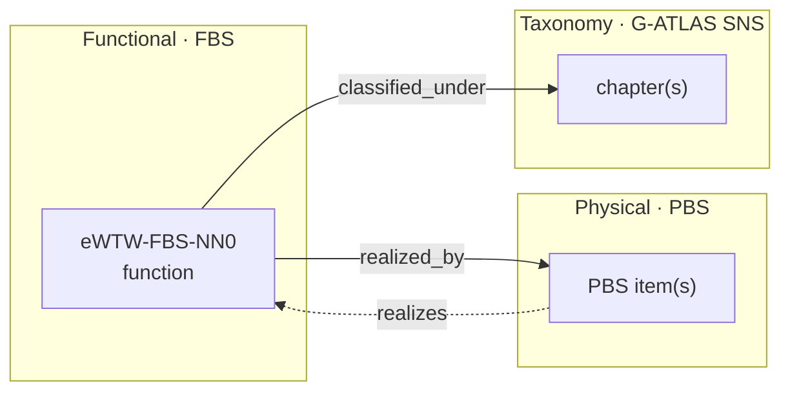
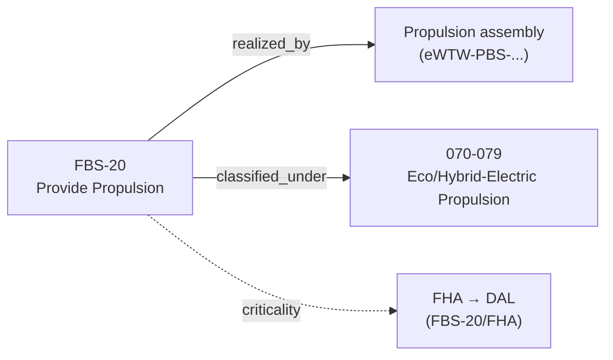

# eWTW-FBS-00 · ALLOCATION

The **aircraft-level allocation** for the eWTW functional architecture: the formal record that binds each of the thirteen aircraft-level functions to the physical product (**PBS**) and to the taxonomy (**G-ATLAS SNS**).

---

## Index

- [Glossary](#glossary)
- [1. Purpose](#1-purpose)
- [2. What Allocation Means](#2-what-allocation-means)
- [3. Files in this Folder](#3-files-in-this-folder)
- [4. The Aircraft-Level Allocation Matrix](#4-the-aircraft-level-allocation-matrix)
- [5. Allocation Semantics](#5-allocation-semantics)
- [6. Coverage and Completeness](#6-coverage-and-completeness)
- [7. Criticality and Lifecycle](#7-criticality-and-lifecycle)
- [8. Governance](#8-governance)
- [References](#references)

---

## Glossary

| Term / acronym | Meaning |
|---|---|
| **Allocation** | The act of binding a function to the physical item(s) that perform it and the taxonomy that classifies it. |
| **realized_by** | Allocation relation: a function is *realized by* one or more PBS items; conversely a PBS item *realizes* one or more functions. |
| **classified_under** | Allocation relation: a function is *classified under* one or more G-ATLAS SNS chapters. |
| **FBS** | Functional Breakdown Structure — the source of the functions being allocated. |
| **PBS** | Product Breakdown Structure — the physical target of allocation. |
| **G-ATLAS** | Green Aircraft Top-Level Architecture Schema; the SNS taxonomy target of allocation. |
| **SNS** | Standard Numbering System — the chapter grammar (`0CC` ⇄ ATA CC) used by G-ATLAS. |
| **DAL** | Development Assurance Level — criticality (A–E), determined by each function's FHA, not by allocation. |
| **FHA** | Functional Hazard Assessment — establishes the DAL referenced here. |
| **Orphan** | A function with no allocation, or a PBS item realizing no function; both are coverage defects. |
| **Shared allocation** | One PBS item realizing more than one function (e.g. an avionics platform). |
| **Traceability** | The bidirectional links function ↔ product ↔ taxonomy that allocation creates. |
| **SSOT** | Single Source of Truth; this allocation is SSOT-side engineering content. |
| **LC-A … LC-N** | The letter-coded engineering lifecycle axis (LC-A = Concept-Design, through LC-N); allocation matures across these stages. |
| **DEGF** | Democratic Enterprise Governance Framework v1.0 (eleven mandatory inheritance traits). |
| **No-AAA** | `AAA` is never a valid identifier in any allocation record. |

---

## 1. Purpose

This folder holds the allocation records for the FBS root node. Allocation is the bridge that keeps the three views of the system mutually consistent: the **functional** view (what the aircraft does), the **physical** view (what it is), and the **taxonomic** view (how it is classified). Without an explicit allocation, functions and products drift apart and traceability is lost.

At this — the aircraft — level, the allocation is **coarse**: the thirteen aircraft-level functions map to major PBS assemblies and to G-ATLAS chapters. Finer allocation is performed in the `ALLOCATION/` folder of each lower function node.

---

## 2. What Allocation Means

A function is **realized by** one or more physical items and **classified under** one or more taxonomy chapters. The relation is many-to-many in both directions: a single function may be spread across several products, and a single product may realize several functions.

This realizes the **requirement/function allocation** step of the ARP4754B development process[^arp4754] and the functional-to-physical allocation practice of systems engineering.[^incose]

---

## 3. Files in this Folder

| File | Contents |
|---|---|
| `allocation-matrix.yaml` | The master matrix — every aircraft-level function → PBS items + G-ATLAS chapters, with relation type and FHA reference. |
| `allocation-coverage.yaml` | Bidirectional coverage: orphan functions, orphan PBS areas, and shared allocations. |

---

## 4. The Aircraft-Level Allocation Matrix

The full machine-readable matrix is in `allocation-matrix.yaml`. Summary:

| FBS function | realized_by (PBS area) | classified_under (G-ATLAS) |
|---|---|---|
| `FBS-10` Lift & Aerodynamics | Airframe — lifting surfaces (`eWTW-PBS-10`) | `057` Wings, `055` Stabilizers |
| `FBS-20` Propulsion | Propulsion assembly | `070-079` Eco/Hybrid-Electric Propulsion |
| `FBS-30` Energy | Energy storage assembly | `004-900`/`005-900` energy limits (EPTA cross-band) |
| `FBS-40` Electrical Power | Electrical system | `024` Electrical Power |
| `FBS-50` Structure | Airframe structure (`eWTW-PBS-10`) | `050-059` Estructuras |
| `FBS-60` Flight Control | Flight-control system | `027` Flight Controls, `022` Auto Flight |
| `FBS-70` Environment & Protection | ECS / protection | `021` Air Conditioning, `030` Ice & Rain, `036` Pneumatic |
| `FBS-80` Nav / Comm / Surveillance | Avionics platform | `023` Communications, `034` Navigation |
| `FBS-90` Avionics & Information | Avionics platform | `042` IMA, `046` Information Systems |
| `FBS-100` Accommodation | Cabin / interior | `025` Equipment & Furnishings, `044` Cabin Systems |
| `FBS-110` Ground & Mobility | Landing gear / ground | `032` Landing Gear, `009` Towing & Taxiing, `010` Ground Handling |
| `FBS-120` Safety & Emergency | Safety systems | `026` Fire Protection, `035` Oxygen, `004-900` energy hazards |
| `FBS-130` Health Monitoring | Avionics / health | `045` Central Maintenance System |

Example fan-out for `FBS-20`:

> **PBS codes:** `eWTW-PBS-10` (Airframe) is confirmed from the PBS structure; the remaining PBS-area codes are descriptive and **bind to the actual PBS top-level codes** once that breakdown is fixed (marked `pbs_code: TBD` in the matrix).

---

## 5. Allocation Semantics

| Relation | Direction | Meaning |
|---|---|---|
| `realized_by` | function → PBS | the physical item(s) that perform the function |
| `realizes` | PBS → function | inverse; a product may realize several functions |
| `classified_under` | function → G-ATLAS | the SNS chapter(s) the function maps to |
| `allocation_type` | — | `full` (one item), `distributed` (across items), `shared` (item serves many functions) |

Criticality (**DAL**) is deliberately **not** an allocation property — it is determined by each function's FHA and only *referenced* here via `fha_ref`. This keeps the allocation matrix a pure mapping and avoids duplicating safety state.

---

## 6. Coverage and Completeness

`allocation-coverage.yaml` records the bidirectional health of the allocation:

- **No orphan functions** — every one of the thirteen functions is allocated.
- **Shared allocations are explicit** — e.g. `FBS-80`, `FBS-90`, and `FBS-130` all share the avionics platform; this is recorded, not hidden.
- **Orphan PBS areas** — any PBS assembly realizing no function is flagged for review (a structure with no function is a defect or a missing function).

Coverage is re-checked whenever the FBS or PBS changes, under the lifecycle gate.

---

## 7. Criticality and Lifecycle

Each allocation references the owning function's **FHA**, where the **DAL** is established per ARP4761A.[^arp4761] The allocation itself is **SSOT-side** content and matures across the **LC-A … LC-N** engineering lifecycle (LC-A = Concept-Design); coarse aircraft-level allocation is fixed early and refined as the PBS decomposes.

---

## 8. Governance

This allocation inherits **DEGF v1.0** (eleven mandatory traits), is governed across the **LC-A … LC-N** engineering lifecycle, and is bound by the **No-AAA** rule and the **SSOT+PUB** doctrine (allocation is SSOT-side; it is *referenced by*, never authored in, the TPuBS).

---

## References

1. SAE International — *ARP4754B: Guidelines for Development of Civil Aircraft and Systems* (Dec 2023), requirement/function allocation. <https://www.sae.org/standards/content/arp4754b/>
2. SAE International — *ARP4761A: Guidelines and Methods for Conducting the Safety Assessment Process* (Dec 2023), FHA and DAL. <https://www.sae.org/standards/content/arp4761a/>
3. INCOSE — *Systems Engineering Handbook*, functional-to-physical allocation. <https://www.incose.org/>
4. ATA / Airlines for America — *iSpec 2200: Information Standards for Aviation Maintenance* (SNS basis for G-ATLAS). <https://publications.airlines.org/>

<!-- Footprint: footnote definitions -->

[^arp4754]: SAE International, *ARP4754B — Guidelines for Development of Civil Aircraft and Systems*, December 2023. <https://www.sae.org/standards/content/arp4754b/>
[^arp4761]: SAE International, *ARP4761A — Guidelines and Methods for Conducting the Safety Assessment Process on Civil Aircraft, Systems, and Equipment*, December 2023. <https://www.sae.org/standards/content/arp4761a/>
[^incose]: INCOSE, *Systems Engineering Handbook*, on functional architecture and allocation to physical architecture. <https://www.incose.org/>
