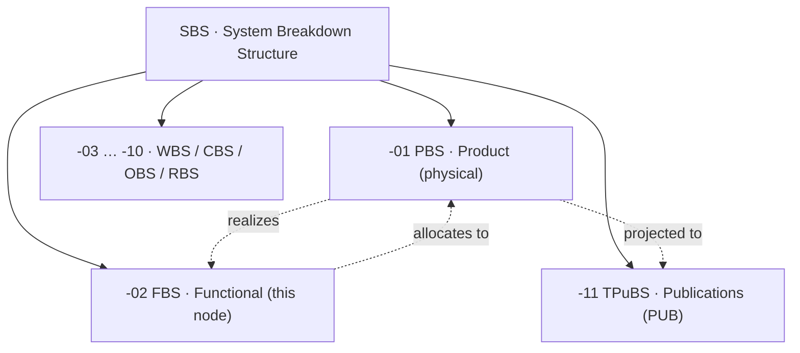
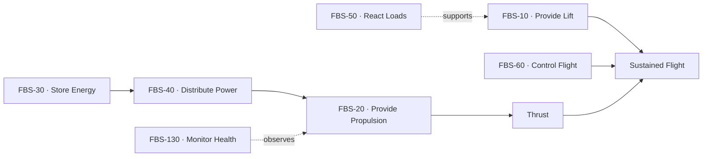
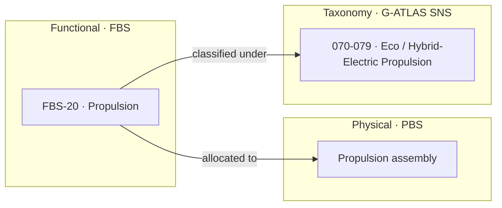

# eWTW-FBS-00 — Aircraft Functions

The root node of the **Functional Breakdown Structure** for the AMPEL360 **eWTW** (electric wide tube-and-wing). It defines *what the aircraft must do* and is the parent of all aircraft-level functions and their decomposition.

---

## Index

- [Glossary](#glossary)
- [1. Purpose](#1-purpose)
- [2. Position in the Breakdown-Structure Family](#2-position-in-the-breakdown-structure-family)
- [3. Functional Architecture](#3-functional-architecture)
- [4. Functional Decomposition Principle](#4-functional-decomposition-principle)
- [5. Functional Flow](#5-functional-flow)
- [6. Allocation to Product and Taxonomy](#6-allocation-to-product-and-taxonomy)
- [7. Functional Hazard Assessment](#7-functional-hazard-assessment)
- [8. Lifecycle and Governance](#8-lifecycle-and-governance)
- [References](#references)

---

## Glossary

| Term / acronym | Meaning |
|---|---|
| **ARP4754B** | SAE Aerospace Recommended Practice — *Guidelines for Development of Civil Aircraft and Systems*; defines the aircraft-and-system development and **function development** process.[^arp4754] |
| **ARP4761A** | SAE Aerospace Recommended Practice — *Guidelines and Methods for Conducting the Safety Assessment Process*; defines the **FHA**, PSSA, SSA, and supporting analyses.[^arp4761] |
| **ATA** | Air Transport Association (now Airlines for America, A4A); originator of the ATA 100 chapter system.[^ispec2200] |
| **DAL** | Development Assurance Level — rigour level (A–E) assigned to a function/item from the severity of its failure conditions. |
| **DEGF** | Democratic Enterprise Governance Framework (v1.0); the eleven mandatory inheritance traits applied across the architecture. |
| **eWTW** | electric wide tube-and-wing — the product this FBS describes. |
| **FBS** | Functional Breakdown Structure — decomposition of the system by **function** (this structure). |
| **FFBD** | Functional Flow Block Diagram — ordered/behavioural view of how functions execute. |
| **FHA** | Functional Hazard Assessment — function-based safety analysis that classifies failure-condition severity and drives DAL. |
| **G-ATLAS** | Green Aircraft Top-Level Architecture Schema — the `000-099` band of `Q+ATLANTIDE1000`; the SNS taxonomy functions are classified under. |
| **iSpec 2200** | ATA *Information Standards for Aviation Maintenance*; the chapter/section numbering G-ATLAS mirrors.[^ispec2200] |
| **LC-A … LC-N** | The letter-coded **engineering lifecycle** axis (LC-A = Concept-Design, through LC-N); SSOT-side content matures through these stages. Supersedes the deprecated LC01–LC14 numbering. |
| **N²** | N-squared diagram — matrix capturing functional/interface couplings between N elements. |
| **PBS** | Product Breakdown Structure — decomposition of the system by **physical product**; the allocation target of the FBS. |
| **PUB** | Publication side of the SSOT+PUB doctrine; realized in the TPuBS. |
| **SBS** | System Breakdown Structure — the umbrella holding PBS, FBS, and the other breakdown views. |
| **SNS** | Standard Numbering System — the chapter/section grammar used by ATA/S1000D and mirrored by G-ATLAS. |
| **SSOT** | Single Source of Truth — authoritative source content; PBS and FBS are SSOT-side. |
| **TPuBS** | Technical Publications Breakdown Structure — the S1000D/CSDB publication projection (PUB side).[^s1000d] |

---

## 1. Purpose

This node establishes the **functional architecture** of the eWTW: the complete set of functions the aircraft must perform, decomposed top-down and allocated to the physical product. It exists so that requirements, behaviour, interfaces, and safety can be reasoned about in terms of *what the aircraft does* before, and independent of, *how it is built*.

The functional view follows the development-assurance philosophy of **ARP4754B**, in which aircraft-level functions are defined, decomposed, allocated to systems and items, and verified against their requirements throughout the development cycle.[^arp4754] The FBS is **SSOT-side**: it is engineering source-of-truth, not a published deliverable.

---

## 2. Position in the Breakdown-Structure Family

The FBS is one projection of the **SBS**. Its physical counterpart is the **PBS**, and its publication counterpart is the **TPuBS**. Functions defined here *allocate to* products in the PBS; products *realize* functions.

---

## 3. Functional Architecture

The eWTW is decomposed into **thirteen aircraft-level functions**. Because the product is electric, energy storage and electrical power are first-class functions alongside the classical lift, propulsion, structure, and control set.

```mermaid
flowchart TD
    R["eWTW-FBS-00 · Aircraft Functions"]
    R --> F10["FBS-10 · Lift & Aerodynamics"]
    R --> F20["FBS-20 · Propulsion"]
    R --> F30["FBS-30 · Energy"]
    R --> F40["FBS-40 · Electrical Power"]
    R --> F50["FBS-50 · Structure"]
    R --> F60["FBS-60 · Flight Control"]
    R --> F70["FBS-70 · Environment & Protection"]
    R --> F80["FBS-80 · Nav / Comm / Surveillance"]
    R --> F90["FBS-90 · Avionics & Information"]
    R --> F100["FBS-100 · Accommodation"]
    R --> F110["FBS-110 · Ground & Mobility"]
    R --> F120["FBS-120 · Safety & Emergency"]
    R --> F130["FBS-130 · Health Monitoring"]
```

Each function is a folder under this root, decomposed into sub-functions (see the FBS folder breakdown). Functions `FBS-30` (store and manage energy) and `FBS-40` (generate and distribute electrical power) carry the electric-propulsion character of the product, while `FBS-120` includes energy-hazard containment for the traction-battery system.

---

## 4. Functional Decomposition Principle

Functions decompose top-down using a `×10` numbering grammar — `eWTW-FBS-20` → `eWTW-FBS-20-10` → `eWTW-FBS-20-10-10` — leaving gaps for insertion at every level. Each function node, at any depth, carries a consistent engineering-content set alongside its child function folders:

- `function-definition.yaml` — the function statement, parent, children, criticality, owner;
- `FRS/` — the functional requirements specification;
- `FFBD/` — the functional flow / behavioural view;
- `N2/` — the functional interface matrix;
- `FHA/` — the functional hazard assessment;
- `ALLOCATION/` — the mapping to PBS items and G-ATLAS chapters;
- `SSOT/` — the source-of-truth manifest.

This mirrors the systems-engineering practice of separating functional architecture from physical architecture and binding the two by allocation.[^incose]

---

## 5. Functional Flow

Functions do not exist in isolation; they chain to deliver the mission. The electric energy path feeds propulsion, which — with lift and control — produces and governs sustained flight.

This flow is captured formally in each function's `FFBD/`, and the couplings shown as dotted edges are recorded in the `N2/` interface matrices.

---

## 6. Allocation to Product and Taxonomy

Allocation is the bridge from the functional world to the physical and taxonomic worlds. A function is *performed by* one or more PBS items and is *classified under* one or more G-ATLAS chapters.

The complete function-to-product-to-taxonomy table is maintained in the FBS folder breakdown and in each node's `ALLOCATION/` folder. Allocation is the formal record that keeps the FBS, PBS, and G-ATLAS taxonomy mutually consistent.

---

## 7. Functional Hazard Assessment

Each function carries a **Functional Hazard Assessment** in its `FHA/` folder. The FHA examines the function's failure conditions, classifies their severity, and assigns the resulting **Development Assurance Level** — the discipline defined by **ARP4761A** in conjunction with ARP4754B.[^arp4761] Because the FHA is function-based, it lives in the FBS rather than the PBS: it is the safety view of *what the aircraft does*, and it drives the assurance rigour that the physical realization must then satisfy.

---

## 8. Lifecycle and Governance

The FBS is **SSOT-side engineering content**, so its leaf artifacts mature through the engineering lifecycle (`LC-A_Concept-Design` → `LC-B` → … → `LC-N`) with design revisions (`REV-A0`, `REV-A1`), and lifecycle/revision folders are the correct governance container here.

This contrasts deliberately with the **TPuBS**, where publications are *decoupled* from engineering lifecycle and revision and are governed by their own publication baselines. The distinction is the SSOT/PUB line: the FBS is source-of-truth, the TPuBS is projection.

This node inherits **DEGF v1.0** (eleven mandatory traits), is governed across the **LC-A … LC-N** engineering lifecycle, and is bound by the **No-AAA** rule and the **SSOT+PUB** doctrine.

---

## References

1. SAE International — *ARP4754B: Guidelines for Development of Civil Aircraft and Systems* (Dec 2023; supersedes ARP4754A). <https://www.sae.org/standards/content/arp4754b/>
2. SAE International — *ARP4761A: Guidelines and Methods for Conducting the Safety Assessment Process on Civil Aircraft, Systems, and Equipment* (Dec 2023; supersedes ARP4761). <https://www.sae.org/standards/content/arp4761a/>
3. S1000D — *International Specification for Technical Publications Using a Common Source Data Base*, Issue 6.0 (Sep 2024). Programme publication baseline: Issue 4.2. <https://s1000d.org/>
4. ATA / Airlines for America — *iSpec 2200: Information Standards for Aviation Maintenance*. <https://publications.airlines.org/>
5. INCOSE — *Systems Engineering Handbook* (functional architecture and functional-to-physical allocation). <https://www.incose.org/>

<!-- Footprint: footnote definitions -->

[^arp4754]: SAE International, *ARP4754B — Guidelines for Development of Civil Aircraft and Systems*, December 2023 (revises ARP4754A, 2010). <https://www.sae.org/standards/content/arp4754b/>
[^arp4761]: SAE International, *ARP4761A — Guidelines and Methods for Conducting the Safety Assessment Process on Civil Aircraft, Systems, and Equipment*, December 2023 (revises ARP4761). <https://www.sae.org/standards/content/arp4761a/>
[^s1000d]: S1000D, *International Specification for Technical Publications Using a Common Source Data Base*, current Issue 6.0 (September 2024); the eWTW programme baselines on Issue 4.2. <https://s1000d.org/>
[^ispec2200]: ATA / Airlines for America, *iSpec 2200 — Information Standards for Aviation Maintenance*; successor to ATA 100. <https://publications.airlines.org/>
[^incose]: INCOSE, *Systems Engineering Handbook*, on functional architecture, functional flow, and allocation to physical architecture. <https://www.incose.org/>
