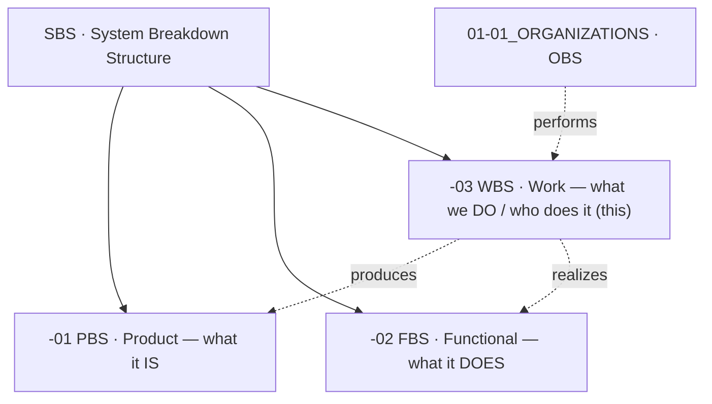
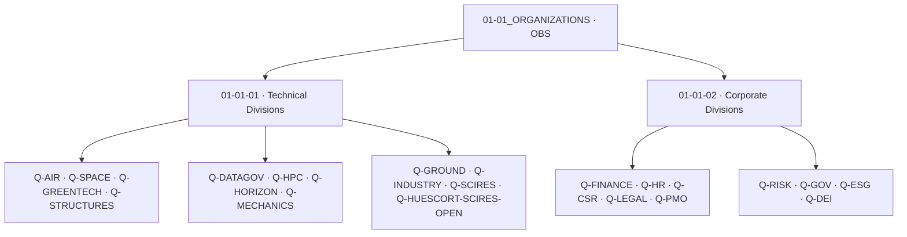
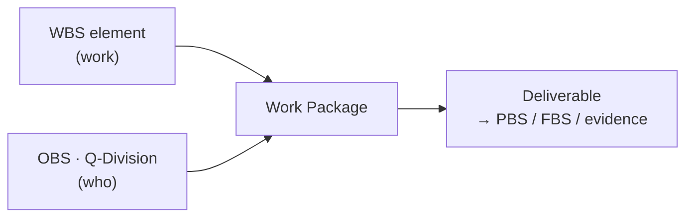

# eWTW-WBS — Work Breakdown Structure

The **work** view of the eWTW under the SBS. It decomposes *the work required to deliver the eWTW* into work packages, and assigns each to an owning **Q-Division** (the Organizational Breakdown Structure). The WBS is the spine for scope, schedule, cost, and responsibility.

---

## Index

- [Glossary](#glossary)
- [1. Purpose](#1-purpose)
- [2. The Three SBS Views](#2-the-three-sbs-views)
- [3. WBS Numbering](#3-wbs-numbering)
- [4. WBS Folder Breakdown](#4-wbs-folder-breakdown)
- [5. Organizational Breakdown Structure](#5-organizational-breakdown-structure)
- [6. WBS × OBS — Responsibility Assignment Matrix](#6-wbs--obs--responsibility-assignment-matrix)
- [7. Work-Package → Deliverable Traceability](#7-work-package--deliverable-traceability)
- [8. Work-Package Node Content](#8-work-package-node-content)
- [9. Lifecycle, Design Authority and Governance](#9-lifecycle-design-authority-and-governance)
- [References](#references)

---

## Glossary

| Term / acronym | Meaning |
|---|---|
| **WBS** | Work Breakdown Structure — deliverable/work-oriented decomposition of the total programme work (this structure). |
| **OBS** | Organizational Breakdown Structure — the hierarchy of organizational units (the Q-Divisions) that perform the work. |
| **Work package** | The lowest planned WBS element; a discrete unit of work with scope, owner, deliverables, schedule, and budget. |
| **Control account** | A management control point where scope, budget, and schedule integrate, at or above the work-package level. |
| **RAM** | Responsibility Assignment Matrix — the WBS × OBS intersection that assigns each work package to organizational units. |
| **RACI** | Responsible / Accountable / Consulted / Informed — the role model used within the RAM. |
| **Q-Division** | An organizational unit under `01-01_ORGANIZATIONS`; technical (`01-01-01-*`) or corporate (`01-01-02-*`). |
| **Deliverable** | A work-package output; populates the PBS (product), FBS (function), or the evidence chain. |
| **PBS / FBS** | Product / Functional Breakdown Structures — what the work produces and the functions it realizes. |
| **CAD / PLM** | Computer-Aided Design / Product Lifecycle Management — geometry-authoring tools and the backbone managing product data and configuration. |
| **DMU** | Digital Mock-Up — the integrated 3D assembly of all parts; used for spatial integration, space allocation, and clash detection. |
| **OML** | Outer Mould Line — the external aerodynamic master surface that all parts are designed to. |
| **DO-178C** | RTCA / EUROCAE *Software Considerations in Airborne Systems and Equipment Certification* (ED-12C); development-assurance standard for **airborne software**. Governs WBS-70.[^do178c] |
| **IMA** | Integrated Modular Avionics — shared computing platform hosting partitioned airborne software. |
| **BMS** | Battery Management System — the software/hardware that monitors and controls the energy store. |
| **ILS** | Integrated Logistics Support — spares, maintenance, training, and support planning. |
| **MIL-STD-881F** | DoD standard practice for Work Breakdown Structures; Appendix A defines the aircraft-systems WBS.[^milstd881] |
| **PMO** | Programme Management Office (Q-PMO); owns the WBS and its baseline. |
| **SSOT** | Single Source of Truth; the WBS is SSOT-side programme content. |
| **LC-A … LC-N** | The letter-coded engineering lifecycle axis (LC-A = Concept-Design, through LC-N); work matures across these stages. |
| **DEGF** | Democratic Enterprise Governance Framework v1.0 (eleven mandatory inheritance traits). |
| **No-AAA** | `AAA` is never a valid identifier in any WBS element. |

---

## 1. Purpose

This structure defines **what work must be done** to deliver the eWTW, decomposed into work packages and assigned to the organizational units that perform it. It is the integrating framework for scope, schedule, cost, risk, and responsibility — the role MIL-STD-881F assigns to a programme WBS.[^milstd881] Whereas the PBS answers *what the aircraft is* and the FBS *what it does*, the WBS answers *what the enterprise must do, and who does it*.

The WBS is **SSOT-side** and is owned by **Q-PMO**.

---

## 2. The Three SBS Views



A work package produces deliverables that populate the PBS and realize FBS functions; the OBS supplies the people who execute it. The WBS is where these meet.

---

## 3. WBS Numbering

| Level | Code pattern | Example |
|---|---|---|
| Root | `eWTW-WBS-00` | eWTW Programme Work |
| Element (L1) | `eWTW-WBS-NN0` (×10) | `eWTW-WBS-70` Software & Embedded Systems |
| Work package (L2) | `<el>-NN0` (×10) | `eWTW-WBS-70-30` Energy/Battery Management Software |
| Sub-package (L3) | `<wp>-NN0` (×10) | `eWTW-WBS-70-30-10` BMS Application Software |

WBS codes are an independent space from PBS and FBS codes; they are joined by **traceability** (§7) and to the OBS by the **RAM** (§6).

---

## 4. WBS Folder Breakdown

```text
01-02-01-01-01-01-03_WBS_Work-Breakdown-Structure/
└── eWTW-WBS-00_eWTW-Programme-Work/
    ├── eWTW-WBS-10_Programme-Management/                  [owner: Q-PMO]
    │   ├── eWTW-WBS-10-10_Programme-Planning-and-Scheduling/
    │   ├── eWTW-WBS-10-20_Cost-and-Budget-Management/
    │   ├── eWTW-WBS-10-30_Risk-and-Opportunity-Management/
    │   ├── eWTW-WBS-10-40_Programme-Reviews-and-Gate-Control/
    │   ├── eWTW-WBS-10-50_Supplier-and-Subcontract-Management/
    │   └── eWTW-WBS-10-60_Reporting-and-Stakeholder-Communication/
    ├── eWTW-WBS-20_Systems-Engineering/                   [owner: Q-DATAGOV]
    │   ├── eWTW-WBS-20-10_Requirements-Engineering-and-Management/
    │   ├── eWTW-WBS-20-20_Architecture-and-Interface-Management/
    │   ├── eWTW-WBS-20-30_Configuration-and-Data-Management/
    │   ├── eWTW-WBS-20-40_CAD-PLM-and-Geometry-Configuration/          ← NEW (central CAD/PLM backbone)
    │   ├── eWTW-WBS-20-50_Verification-and-Validation-Planning/
    │   └── eWTW-WBS-20-60_Specialty-Engineering-Integration/
    ├── eWTW-WBS-30_Air-Vehicle/                           [owner: Q-AIR]
    │   ├── eWTW-WBS-30-10_Aerodynamics-and-OML/
    │   ├── eWTW-WBS-30-20_Flight-Physics-and-Performance/
    │   ├── eWTW-WBS-30-30_Vehicle-Configuration-Integration-and-Digital-Mock-Up-DMU/   ← renamed (+DMU)
    │   └── eWTW-WBS-30-40_Mass-Properties-and-Balance/
    ├── eWTW-WBS-40_Propulsion-and-Energy/                 [owner: Q-GREENTECH]
    │   ├── eWTW-WBS-40-10_Electric-Propulsion-System/
    │   ├── eWTW-WBS-40-20_Energy-Storage-System/
    │   ├── eWTW-WBS-40-30_Power-Electronics/
    │   ├── eWTW-WBS-40-40_Thermal-Management/
    │   └── eWTW-WBS-40-50_Propulsion-Integration/
    ├── eWTW-WBS-50_Structures/                            [owner: Q-STRUCTURES]
    │   ├── eWTW-WBS-50-10_Fuselage/
    │   ├── eWTW-WBS-50-20_Wing/
    │   ├── eWTW-WBS-50-30_Empennage/
    │   ├── eWTW-WBS-50-40_Landing-Gear-Structure/
    │   └── eWTW-WBS-50-50_Materials-and-Processes/
    ├── eWTW-WBS-60_Systems-and-Avionics/                  [owner: Q-AIR]
    │   ├── eWTW-WBS-60-10_Flight-Control-System/
    │   ├── eWTW-WBS-60-20_Electrical-Power-Distribution/
    │   ├── eWTW-WBS-60-30_Avionics-Displays-and-Information-Systems/
    │   ├── eWTW-WBS-60-40_Navigation-Communication-and-Surveillance/
    │   ├── eWTW-WBS-60-50_Environmental-Control-and-Pressurization/
    │   ├── eWTW-WBS-60-60_Mechanical-and-Actuation-Systems/
    │   ├── eWTW-WBS-60-70_Fire-Protection-Oxygen-and-Safety-Systems/
    │   └── eWTW-WBS-60-80_Lighting-Water-Waste-and-Cabin-Systems/
    ├── eWTW-WBS-70_Software-and-Embedded-Systems/         [owner: Q-HPC]
    │   ├── eWTW-WBS-70-10_Airborne-Embedded-Software-DO-178C/
    │   ├── eWTW-WBS-70-20_Flight-Control-Software/
    │   ├── eWTW-WBS-70-30_Energy-and-Battery-Management-Software/
    │   ├── eWTW-WBS-70-40_Propulsion-and-Power-Electronics-Control-Software/
    │   ├── eWTW-WBS-70-50_IMA-Platform-and-Partitioning-Software/
    │   ├── eWTW-WBS-70-60_Software-Integration-and-Embedding/
    │   └── eWTW-WBS-70-70_Software-Verification-and-Assurance/
    ├── eWTW-WBS-80_Engineering-Analysis-and-Simulation/   [owner: Q-HPC]
    │   ├── eWTW-WBS-80-10_Aerodynamic-Analysis-CFD/
    │   ├── eWTW-WBS-80-20_Structural-Analysis-FEA/
    │   ├── eWTW-WBS-80-30_Systems-and-Performance-Simulation/
    │   ├── eWTW-WBS-80-40_Multidisciplinary-Optimization-MDO/
    │   └── eWTW-WBS-80-50_HPC-Infrastructure-and-Workflows/
    ├── eWTW-WBS-90_Integration-Test-and-Verification/     [owner: Q-AIR]
    │   ├── eWTW-WBS-90-10_Test-Planning-and-Readiness/
    │   ├── eWTW-WBS-90-20_Ground-Test/
    │   ├── eWTW-WBS-90-30_Systems-Integration-Rig-Iron-Bird/
    │   ├── eWTW-WBS-90-40_Flight-Test/
    │   ├── eWTW-WBS-90-50_Test-Instrumentation-and-Data/
    │   └── eWTW-WBS-90-60_Verification-Evidence-Capture/
    ├── eWTW-WBS-100_Certification-and-Compliance/         [owner: Q-DATAGOV]
    │   ├── eWTW-WBS-100-10_Certification-Planning-and-Authority-Liaison/
    │   ├── eWTW-WBS-100-20_Means-of-Compliance-and-Compliance-Matrix/
    │   ├── eWTW-WBS-100-30_Type-Certification-Data-Package/
    │   ├── eWTW-WBS-100-40_Safety-Assessment-Coordination-ARP4761A/
    │   ├── eWTW-WBS-100-50_Airworthiness-Limitations-and-Continued-Airworthiness/
    │   └── eWTW-WBS-100-60_Compliance-Evidence-and-Audit-Support/
    ├── eWTW-WBS-110_Technical-Data-and-Publications/      [owner: Q-DATAGOV]
    │   ├── eWTW-WBS-110-10_S1000D-CSDB-and-BREX-Setup/
    │   ├── eWTW-WBS-110-20_Data-Module-Authoring/
    │   ├── eWTW-WBS-110-30_Illustrations-and-Multimedia-ICN/
    │   ├── eWTW-WBS-110-40_Publication-Modules-and-Assembly-PM/
    │   ├── eWTW-WBS-110-50_Applicability-and-DMRL-Management/
    │   └── eWTW-WBS-110-60_Publication-Baselines-and-Issue-Control/
    ├── eWTW-WBS-120_Industrialization-and-Production/     [owner: Q-INDUSTRY]
    │   ├── eWTW-WBS-120-10_Manufacturing-Engineering-and-Process-Planning/
    │   ├── eWTW-WBS-120-20_Tooling-and-Jigs/
    │   ├── eWTW-WBS-120-30_Assembly-and-Final-Assembly-Line/
    │   ├── eWTW-WBS-120-40_Production-Supply-Chain-and-Procurement/
    │   ├── eWTW-WBS-120-50_Quality-Assurance-and-Inspection/
    │   └── eWTW-WBS-120-60_Production-Ramp-up-and-Rate/
    ├── eWTW-WBS-130_Ground-Support-and-Operations/        [owner: Q-GROUND]
    │   ├── eWTW-WBS-130-10_Ground-Support-Equipment-GSE/
    │   ├── eWTW-WBS-130-20_Energy-Replenishment-Infrastructure/
    │   ├── eWTW-WBS-130-30_Maintenance-Planning-and-MSG-3/
    │   ├── eWTW-WBS-130-40_Spares-and-Logistics-ILS/
    │   ├── eWTW-WBS-130-50_Training-Crew-and-Maintenance/
    │   └── eWTW-WBS-130-60_Ground-Operations-and-Servicing-Procedures/
    ├── eWTW-WBS-140_Sustainability-and-Lifecycle/         [owner: Q-GREENTECH]
    │   ├── eWTW-WBS-140-10_Lifecycle-Assessment-LCA/
    │   ├── eWTW-WBS-140-20_Digital-Product-Passport-DPP/
    │   ├── eWTW-WBS-140-30_Circularity-and-End-of-Life/
    │   ├── eWTW-WBS-140-40_Emissions-and-Environmental-Compliance/
    │   └── eWTW-WBS-140-50_Materials-Sustainability-and-Declarations/
    ├── eWTW-WBS-150_Research-and-Advanced-Concepts/       [owner: Q-SCIRES]
    │   ├── eWTW-WBS-150-10_Technology-Research-and-TRL-Maturation/
    │   ├── eWTW-WBS-150-20_Advanced-Concepts-and-Roadmap/
    │   ├── eWTW-WBS-150-30_Demonstrators-and-Prototypes/
    │   ├── eWTW-WBS-150-40_Intellectual-Property-and-Publications/
    │   └── eWTW-WBS-150-50_Academic-and-Laboratory-Partnerships/
    ├── eWTW-WBS-160_EU-Programmes-and-Partnerships/       [owner: Q-HUESCORT-SCIRES-OPEN]
    │   ├── eWTW-WBS-160-10_EU-Calls-Monitoring-and-Bid-Preparation/
    │   ├── eWTW-WBS-160-20_Consortium-and-Partner-Engagement/
    │   ├── eWTW-WBS-160-30_Grant-Agreement-and-Compliance/
    │   ├── eWTW-WBS-160-40_Funding-Reporting-and-Audits/
    │   └── eWTW-WBS-160-50_Dissemination-and-Open-Science/
    └── eWTW-WBS-170_Enterprise-and-Corporate-Support/     [owner: Q-PMO + corporate]
        ├── eWTW-WBS-170-10_Finance-and-Controlling/            [Q-FINANCE]
        ├── eWTW-WBS-170-20_Human-Resources-and-Skills/         [Q-HR]
        ├── eWTW-WBS-170-30_Legal-and-IP/                       [Q-LEGAL]
        ├── eWTW-WBS-170-40_Enterprise-Risk-Management/         [Q-RISK]
        ├── eWTW-WBS-170-50_Governance-and-Compliance/          [Q-GOV]
        ├── eWTW-WBS-170-60_ESG/                                [Q-ESG]
        ├── eWTW-WBS-170-70_Corporate-Social-Responsibility/    [Q-CSR]
        └── eWTW-WBS-170-80_Diversity-Equity-and-Inclusion/     [Q-DEI]
```



```mermaid
flowchart TD
    R["eWTW-WBS-00 · Programme Work"]
    R --> W10["10 Programme Mgmt"]
    R --> W20["20 Systems Eng"]
    R --> W30["30 Air Vehicle"]
    R --> W40["40 Propulsion & Energy"]
    R --> W50["50 Structures"]
    R --> W60["60 Systems & Avionics"]
    R --> W70["70 Software & Embedded Systems"]:::new
    R --> W80["80 Engineering Analysis & Simulation"]
    R --> W90["90 Integration/Test/V&V"]
    R --> W100["100 Certification"]
    R --> W110["110 Technical Data & Pubs"]
    R --> W120["120 Industrialization"]
    R --> W130["130 Ground Support"]
    R --> W140["140 Sustainability & Lifecycle"]
    R --> W150["150 Research & Adv. Concepts"]
    R --> W160["160 EU Programmes"]
    R --> W170["170 Enterprise Support"]
    classDef new fill:#0a7,stroke:#064,color:#fff;
```

> **Why 70 sits here:** software is placed immediately after Systems & Avionics (60) because airborne/embedded software runs *on* the avionics and systems it controls. Engineering Analysis & Simulation (80) — formerly "Modelling/Simulation/HPC" — is the computational **design and analysis** capability (CFD, FEA, MDO), distinct from producing software.
>
> **CAD note:** there is no standalone CAD node. Part geometry is authored inside each domain element (30/40/50/60); only the integrated **DMU** (`30-30`) and the **CAD/PLM backbone** (`20-40`) are centralized. See §9.

---

## 5. Organizational Breakdown Structure

The OBS lives under `01-01_ORGANIZATIONS` and supplies the work-package owners. Two groups: **technical** (`01-01-01-*`) and **corporate** (`01-01-02-*`).



### Technical divisions (`01-01-01-*`)

| Code | Division | Domain |
|---|---|---|
| `01-01-01-01` | Q-AIR | Air vehicle, aerodynamics, flight, air systems |
| `01-01-01-02` | Q-SPACE | Space systems (cross-programme; not a primary eWTW owner) |
| `01-01-01-03` | Q-GREENTECH | Green technology, electric propulsion, energy, sustainability |
| `01-01-01-04` | Q-STRUCTURES | Airframe and structures |
| `01-01-01-05` | Q-DATAGOV | Data governance, digital thread, PLM, CSDB, configuration |
| `01-01-01-06` | Q-HPC | High-performance computing, software & embedded systems, simulation, optimization |
| `01-01-01-07` | Q-HORIZON | Advanced/horizon programmes and roadmap |
| `01-01-01-08` | Q-MECHANICS | Mechanical systems, actuation, mechanisms |
| `01-01-01-09` | Q-GROUND | Ground operations, support, servicing |
| `01-01-01-10` | Q-INDUSTRY | Industrialization, manufacturing, production |
| `01-01-01-11` | Q-SCIRES | Sciences and research |
| `01-01-01-12` | Q-HUESCORT-SCIRES-OPEN | Binding and engagement to EUROPE calls and programmes |

### Corporate divisions (`01-01-02-*`)

| Code | Division | Domain |
|---|---|---|
| `01-01-02-01` | Q-FINANCE | Finance |
| `01-01-02-02` | Q-HR | Human resources |
| `01-01-02-03` | Q-CSR | Corporate social responsibility |
| `01-01-02-04` | Q-LEGAL | Legal and IP |
| `01-01-02-05` | Q-PMO | Programme management office (owns the WBS) |
| `01-01-02-06` | Q-RISK | Risk management |
| `01-01-02-07` | Q-GOV | Governance |
| `01-01-02-08` | Q-ESG | Environmental, social, governance |
| `01-01-02-09` | Q-DEI | Diversity, equity, inclusion |

---

## 6. WBS × OBS — Responsibility Assignment Matrix

Each work package sits at the intersection of a WBS element (the work) and an OBS unit (who does it): a **primary** owner (Accountable/Responsible) plus **supporting** units (Consulted/Informed).



| WBS element | Primary (A/R) | Supporting (C/I) |
|---|---|---|
| `10` Programme Management | Q-PMO | Q-RISK, Q-FINANCE, Q-GOV |
| `20` Systems Engineering | Q-DATAGOV | Q-AIR, Q-HPC |
| `30` Air Vehicle | Q-AIR | Q-HPC, Q-STRUCTURES |
| `40` Propulsion & Energy | Q-GREENTECH | Q-AIR, Q-MECHANICS |
| `50` Structures | Q-STRUCTURES | Q-MECHANICS, Q-GREENTECH |
| `60` Systems & Avionics | Q-AIR | Q-MECHANICS, Q-DATAGOV |
| `70` Software & Embedded Systems | Q-HPC | Q-AIR, Q-DATAGOV |
| `80` Engineering Analysis & Simulation | Q-HPC | Q-AIR, Q-STRUCTURES, Q-SCIRES |
| `90` Integration, Test & Verification | Q-AIR | Q-HPC, Q-SCIRES, Q-STRUCTURES |
| `100` Certification & Compliance | Q-DATAGOV | Q-AIR, Q-LEGAL |
| `110` Technical Data & Publications | Q-DATAGOV | Q-AIR, Q-GROUND |
| `120` Industrialization & Production | Q-INDUSTRY | Q-STRUCTURES, Q-MECHANICS |
| `130` Ground Support & Operations | Q-GROUND | Q-AIR, Q-INDUSTRY |
| `140` Sustainability & Lifecycle | Q-GREENTECH | Q-ESG, Q-CSR |
| `150` Research & Advanced Concepts | Q-SCIRES | Q-HORIZON, Q-HPC |
| `160` EU Programmes & Partnerships | Q-HUESCORT-SCIRES-OPEN | Q-SCIRES, Q-LEGAL, Q-FINANCE |
| `170` Enterprise & Corporate Support | Q-PMO | Q-FINANCE, Q-HR, Q-LEGAL, Q-RISK, Q-GOV, Q-ESG, Q-DEI, Q-CSR |

> **WBS-70 ownership note.** Q-HPC is set as primary per the software-as-computing remit. Because WBS-70 contains **airborne/embedded software under DO-178C**, certification accountability is shared: **Q-AIR** (the systems the software serves) and **Q-DATAGOV** (certification and software lifecycle data) are supporting. If this node is predominantly airborne software, consider Q-AIR as primary with Q-HPC supporting — a one-line flip.
>
> **WBS-170** sub-packages map one-to-one to the corporate divisions, so each corporate Q-Division owns its own work package while Q-PMO integrates.
>
> **Q-SPACE** is not a primary owner for eWTW work (it leads space-model programmes such as the Q10 spacecraft). The per-work-package RACI is recorded in each element's `RAM.yaml`.

---

## 7. Work-Package → Deliverable Traceability

| WBS element | Produces (PBS / FBS / evidence) |
|---|---|
| `30` Air Vehicle | OML / PBS lifting surfaces; FBS-10 Lift; aero/performance evidence; **integrated DMU** |
| `40` Propulsion & Energy | PBS propulsion + energy; FBS-20/30/40; energy-limit evidence |
| `50` Structures | PBS-10 Airframe (fuselage, wing, …); FBS-50; substantiation evidence |
| `60` Systems & Avionics | PBS avionics/systems hardware; FBS-60/70/80 |
| `70` Software & Embedded Systems | airborne/embedded software items; FBS-60 flight-control SW, FBS-30/40 energy & power-management SW; **DO-178C software lifecycle data**; embeds into PBS avionics/systems |
| `80` Engineering Analysis & Simulation | validated analyses, CFD/FEA/MDO results; substantiation feeding 30/40/50 |
| `100` Certification & Compliance | compliance evidence; airworthiness-limitation data |
| `110` Technical Data & Publications | the TPuBS data modules (PUB projection of the product) |
| `140` Sustainability & Lifecycle | DPP records; circularity evidence |

The forward link (work → product/function) is recorded per work package; the reverse (a PBS/FBS item back to the work that produced it) closes the loop.

---

## 8. Work-Package Node Content

Each work-package node carries a consistent set:

```text
eWTW-WBS-NN0_Work-Package/
├── README.md
├── work-package.yaml      scope, owner Q-Division, control account, schedule + budget refs
├── RAM.yaml               RACI for this package (primary + supporting Q-Divisions)
├── deliverables/          links to the PBS / FBS / evidence items produced
├── SSOT/                  source-of-truth manifest
└── (child work-package folders …)
```

**`work-package.yaml` example (the new software node):**

```yaml
work_package_id: eWTW-WBS-70-30
title: Energy and Battery Management Software
owner_obs: 01-01-01-06_Q-HPC
supporting_obs: [01-01-01-01_Q-AIR, 01-01-01-05_Q-DATAGOV]
assurance_standard: DO-178C
control_account: CA-70
produces:
  pbs: ["eWTW-PBS-...Energy-Storage (embedded SW)"]
  fbs: ["eWTW-FBS-30"]
  evidence: ["DO-178C software lifecycle data"]
lifecycle: LC-A..LC-N
status: baseline
```

---

## 9. Lifecycle, Design Authority and Governance

**Design authority follows PBS ownership.** Each part's geometry is designed by the Q-Division that owns the corresponding PBS item — CAD execution is a task inside each domain work package (`WBS-30/40/50/60`), **not a node of its own**. Only two geometry functions are centralized:

- the integrated **Digital Mock-Up** (`WBS-30-30`, Q-AIR) — spatial integration, space allocation, clash detection;
- the **CAD/PLM & geometry-configuration backbone** (`WBS-20-40`, Q-DATAGOV) — tools, CAD standards/methods, master-model and geometry configuration management.

The external aerodynamic surface (**OML**) is defined in `WBS-30-10` (Q-AIR); every domain designs *to* it. This keeps design intent with the domain experts while the OML, the DMU, and the CAD/PLM backbone hold the geometry coherent across teams.

The WBS is **SSOT-side** programme content. Work packages mature across the **LC-A … LC-N** engineering lifecycle (LC-A = Concept-Design); the WBS baseline is owned and version-controlled by **Q-PMO**. The structure inherits **DEGF v1.0** (eleven mandatory traits), is bound by the **No-AAA** rule, and follows the **SSOT+PUB** doctrine — the WBS is source-of-truth and is *referenced by*, never authored in, the TPuBS.

---

## References

1. US DoD — *MIL-STD-881F: Work Breakdown Structures for Defense Materiel Items* (13 May 2022; supersedes 881E). Appendix A — Aircraft Systems. <https://assist.dla.mil/>
2. RTCA / EUROCAE — *DO-178C / ED-12C: Software Considerations in Airborne Systems and Equipment Certification* (2011). <https://www.rtca.org/>
3. PMI — *Practice Standard for Work Breakdown Structures* and *PMBOK Guide* (WBS, OBS, RAM/RACI). <https://www.pmi.org/>
4. ISO — *ISO 21502:2020, Project, programme and portfolio management — Guidance on project management*. <https://www.iso.org/>
5. SAE International — *ARP4754B* (systems-engineering work-package context). <https://www.sae.org/standards/content/arp4754b/>

<!-- Footprint: footnote definitions -->

[^milstd881]: US Department of Defense, *MIL-STD-881F — Work Breakdown Structures for Defense Materiel Items*, 13 May 2022; Appendix A defines the aircraft-systems WBS and Appendix K the common elements. <https://assist.dla.mil/>
[^do178c]: RTCA / EUROCAE, *DO-178C / ED-12C — Software Considerations in Airborne Systems and Equipment Certification*, 2011; the development-assurance standard for airborne software. <https://www.rtca.org/>
