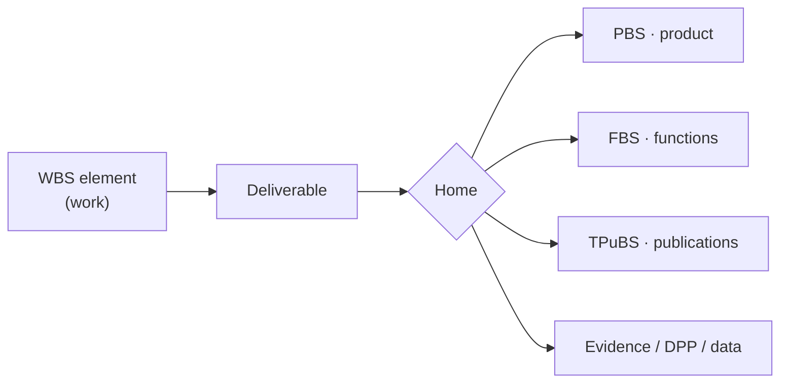

# eWTW-WBS-00 · deliverables

The **programme-level deliverables register** for the eWTW WBS root. It lists the major outputs of the programme, the WBS element that produces each, and the **home** where each actually lives — without storing any of them here.

---

## Index

- [Glossary](#glossary)
- [1. Purpose](#1-purpose)
- [2. Principle — Linked, Not Stored](#2-principle--linked-not-stored)
- [3. Deliverable → Home Mapping](#3-deliverable--home-mapping)
- [4. The Register](#4-the-register)
- [5. Roll-up vs Per-Element](#5-roll-up-vs-per-element)
- [6. Governance](#6-governance)
- [References](#references)

---

## Glossary

| Term / acronym | Meaning |
|---|---|
| **Deliverable** | A defined output of a WBS work element (product, function, document, dataset, or evidence). |
| **Deliverables register** | The manifest of deliverables, each with its producer, home, and owner (this artifact). |
| **Home** | The authoritative location where a deliverable lives — a sibling SBS structure or an evidence/data store. |
| **PBS / FBS / TPuBS** | Product / Functional / Technical-Publications Breakdown Structures — homes for product, function, and publication deliverables. |
| **Evidence chain** | The linked record of verification, certification, and assurance artifacts. |
| **DPP** | Digital Product Passport — the lifecycle/sustainability record (home for WBS-140 outputs). |
| **ILS** | Integrated Logistics Support — spares, maintenance, training package (WBS-130). |
| **DO-178C** | Airborne-software development-assurance standard; governs the WBS-70 software lifecycle data.[^do178c] |
| **ARP4761A** | Safety-assessment process (FHA/PSSA/SSA); governs the safety deliverables.[^arp4761] |
| **SSOT** | Single Source of Truth — the register links to each deliverable's single home; it never duplicates it. |
| **LC-A … LC-N** | The letter-coded engineering lifecycle axis (LC-A = Concept-Design, through LC-N). |
| **DEGF / No-AAA** | Governance framework inherited from the band; `AAA` is never a valid identifier. |

---

## 1. Purpose

This register answers, for the programme as a whole: *what does the eWTW programme deliver, who produces each output, and where does it live?* It is the roll-up index at the WBS root; each L1 element keeps its own granular `deliverables/` folder.

---

## 2. Principle — Linked, Not Stored

Deliverables are **referenced**, not copied, into the WBS. The WBS describes *work*; the *outputs* of that work belong to their home structure. A product deliverable lives in the PBS, a functional one in the FBS, a publication in the TPuBS, and evidence in the evidence chain. This preserves the **SSOT** discipline — one authoritative copy, many references.

---

## 3. Deliverable → Home Mapping

| Deliverable | Produced by | Home |
|---|---|---|
| eWTW product definition (as-designed, DMU) | WBS-30/40/50/60 | **PBS** |
| Functional architecture (functions, FHA, allocation) | WBS-20/30 | **FBS** |
| Technical publications (S1000D CSDB) | WBS-110 | **TPuBS** |
| Certification data package & compliance | WBS-90/100 | evidence chain |
| Safety assessment (FHA/PSSA/SSA) | WBS-20/100 | FBS (FHA) + evidence |
| Software lifecycle data (DO-178C) | WBS-70 | WBS-70 store |
| Analysis & simulation results | WBS-80 | WBS-80 store |
| Sustainability — LCA + DPP | WBS-140 | DPP |
| ILS / ground-support package | WBS-130 | WBS-130 store |
| Programme baseline (plan/schedule/cost/risk) | WBS-10 | WBS-10 store |

The complete, machine-readable register is in [`deliverables-index.yaml`](./deliverables-index.yaml); quick pointers to the three sibling homes are in `PBS.link`, `FBS.link`, `TPuBS.link`.

---

## 4. The Register

See `deliverables-index.yaml` for all 16 programme deliverables, each with `produced_by`, `home`, `owner_obs`, and `status`. Product, functional, and publication deliverables resolve to the sibling SBS structures; evidence/data deliverables resolve to the evidence chain, the DPP, or the producing element's store. A dedicated evidence/requirements structure can be linked here once defined.

---

## 5. Roll-up vs Per-Element

This root register is a **roll-up**. Each L1 element (`eWTW-WBS-10` … `-170`) carries its own `deliverables/` folder with the granular, work-package-level deliverable links. The root aggregates; the children detail.

---

## 6. Governance

Inherits **DEGF v1.0**; governed across **LC-A … LC-N**; bound by **No-AAA** and the **SSOT+PUB** doctrine. The register is SSOT-side and is owned by **Q-PMO**.

---

## References

1. PMI — *Practice Standard for Work Breakdown Structures* / *PMBOK Guide* (WBS dictionary, deliverables). <https://www.pmi.org/>
2. US DoD — *MIL-STD-881F* (WBS deliverables and common elements). <https://assist.dla.mil/>
3. S1000D — *International Specification for Technical Publications* (publication deliverables). <https://s1000d.org/>
4. RTCA / EUROCAE — *DO-178C / ED-12C* (software lifecycle data). <https://www.rtca.org/>
5. SAE International — *ARP4761A* (safety-assessment deliverables). <https://www.sae.org/standards/content/arp4761a/>

[^do178c]: RTCA / EUROCAE, *DO-178C / ED-12C — Software Considerations in Airborne Systems and Equipment Certification*, 2011. <https://www.rtca.org/>
[^arp4761]: SAE International, *ARP4761A — Guidelines and Methods for Conducting the Safety Assessment Process*, December 2023. <https://www.sae.org/standards/content/arp4761a/>
