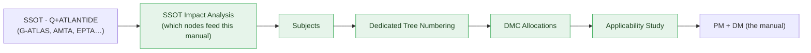

# eWTW · TPuBS — Technical Publications Breakdown Structure

The **root** of the eWTW model's technical publications, and the `-11` (PUB) member of the SBS. The TPuBS is organized **manual-first**: it holds one **PMC** folder per publication type, and the Q+ATLANTIDE taxonomy breakdown (G-ATLAS, AMTA, EPTA, …) lives **inside each PMC**, generated by that manual's own **SSOT impact analysis**.

> **Correction (v2.0).** v1.0 placed a shared `000-099_G-ATLAS/` content pool at the TPuBS root with a `_PUBLICATIONS/` folder of assembling PMs. That band-first nesting is replaced: the breakdown is per-manual and **multi-band**, because a single manual draws from several Q+ATLANTIDE bands.

---

## Index

- [Glossary](#glossary)
- [1. Manual-First Organization](#1-manual-first-organization)
- [2. Why Per-Manual, Not Band-First](#2-why-per-manual-not-band-first)
- [3. The Per-PMC Pipeline](#3-the-per-pmc-pipeline)
- [4. Anatomy of a PMC](#4-anatomy-of-a-pmc)
- [5. The 19 PMCs](#5-the-19-pmcs)
- [6. SSOT + PUB Preserved](#6-ssot--pub-preserved)
- [7. Governance](#7-governance)
- [References](#references)

---

## Glossary

| Term | Meaning |
|---|---|
| **PMC** | Publication Module Code — one folder per manual; the organizing unit of the TPuBS. |
| **SSOT impact analysis** | The query that selects which SSOT (Q+ATLANTIDE) nodes feed a given manual. |
| **Subject** | A documentation topic generated from an impacted SSOT node. |
| **Dedicated tree numbering** | The manual's own TOC structure, derived from its subjects. |
| **DMC** | Data Module Code — allocated per subject; encodes the source SNS (= G-ATLAS node). |
| **Applicability study** | The effectivity analysis fixing which configurations each subject applies to. |
| **Q+ATLANTIDE breakdown** | The multi-band taxonomy slice (G-ATLAS, AMTA, EPTA, …) scoped to a manual. |

---

## 1. Manual-First Organization

```text
01-02-01-01-01-01-11_TPuBS_Technical-Publications-Breakdown-Structure/
├── README.md                                            ← this root doctrine
├── PMC-EWTW-AMM_Aircraft-Maintenance-Manual/
├── PMC-EWTW-CMM_Component-Maintenance-Manual/
├── PMC-EWTW-CPM_Consumable-Products-Manual/
├── PMC-EWTW-DPP-Pub_Digital-Product-Passport-publication/
├── PMC-EWTW-ECHM_Energy-Carrier-Handling-Manual/
├── PMC-EWTW-ESMM_Energy-Storage-Maintenance-Manual/
├── PMC-EWTW-FCOM_Flight-Crew-Operations-Manual/
├── PMC-EWTW-FIM_Fault-Isolation-Manual/
├── PMC-EWTW-HVSM_High-Voltage-Safety-Manual/
├── PMC-EWTW-IPC_Illustrated-Parts-Catalog/
├── PMC-EWTW-MMEL_Master-Minimum-Equipment-List/
├── PMC-EWTW-MPD_Maintenance-Planning-Document/
├── PMC-EWTW-PM-IPC_Propulsion-Module-Illustrated-Parts-Catalog/
├── PMC-EWTW-PMM_Propulsion-Module-Manual/
├── PMC-EWTW-SBI_Service-Bulletin-Index/
├── PMC-EWTW-SB_Service-Bulletin-set/
├── PMC-EWTW-SDS_System-Description-Section/
├── PMC-EWTW-SRM_Structural-Repair-Manual/
└── PMC-EWTW-TEM_Tool-and-Equipment-Manual/
```

Each PMC is a **self-contained, derived breakdown** — not a thin assembly pointing at a shared pool.

---

## 2. Why Per-Manual, Not Band-First

A manual rarely lives in one band. The breakdown inside a PMC is **multi-band by design**:

| Manual | Bands its breakdown spans |
|---|---|
| SRM | G-ATLAS `050-059` (structures) + **AMTA `500-599`** (materials/repair) |
| ECHM | G-ATLAS green-deltas (`012-900`, `003-900`, `010-900`, `011-900`, `020-900`) + **EPTA `400-499`** + **AMTA `500-599`** |
| DPP-Pub | G-ATLAS `025-900` + **AMTA `500-599`** (material passport) |
| PMM / PM-IPC | G-ATLAS `070-079` (eWTW electric propulsion) + EPTA `400-499` |
| AMM | G-ATLAS `000-099` (all systems) |

A band-first root cannot express a manual that crosses bands; a manual-first PMC, carrying its own Q+ATLANTIDE breakdown, can.

---

## 3. The Per-PMC Pipeline

Inside each PMC, one generative pipeline runs from the SSOT:



The impact analysis is the **only** thing that reads the SSOT; everything downstream is generated and lives inside the PMC. SSOT → PUB stays one-way.

---

## 4. Anatomy of a PMC

```text
PMC-EWTW-<TYPE>_<Name>/
├── README.md                       ← this manual's doctrine + pipeline status
├── 00_SSOT-IMPACT-ANALYSIS/        ← the generative source query
│   └── impact-analysis.yaml
├── 01_QplusATLANTIDE-BREAKDOWN/    ← the multi-band taxonomy slice (the backbone)
├── 02_SUBJECTS/                    ← generated subjects
│   └── subject-register.yaml
├── 03_TREE-NUMBERING/              ← the manual's dedicated TOC tree
│   └── publication-tree.yaml
├── 04_DMC-ALLOCATIONS/             ← DMC per subject (encodes source SNS)
│   └── dmc-register.yaml
├── 05_APPLICABILITY/               ← effectivity study
│   └── applicability-study.yaml
├── DM/  ICN/  PM/                  ← S1000D content, graphics, assembly
└── PUB-BASELINES/                  ← publication baselines (decoupled from engineering)
```

The worked reference implementation is `PMC-EWTW-ECHM/` (see its README).

---

## 5. The 19 PMCs

13 heritage (AMM, CMM, CPM, FCOM, FIM, IPC, MMEL, MPD, SB, SBI, SDS, SRM, TEM), 2 green-native propulsion-module (PM-IPC, PMM), 4 green-delta (DPP-Pub, ECHM, ESMM, HVSM). The set is authorized by the SSOT **Publication-Type (DTD) Register**; the TPuBS may instantiate only types defined there.

---

## 6. SSOT + PUB Preserved

The SSOT (the Q+ATLANTIDE standard nodes plus engineering content) remains the single source. Each PMC's impact analysis **reads** the SSOT to derive its scope; it never writes back. A manual is a derived projection: change an SSOT node, re-run the affected manuals' impact analyses, re-baseline only those. *Engineering revision ≠ publication revision.*

---

## 7. Governance

Inherits **DEGF v1.0**; governed across **LC-A … LC-N**; bound by **No-AAA** and **SSOT+PUB**. Publication types authorized by the SSOT DTD register; terminology by **G-ATLAS-NORM-TERM-001**. Owner **Q-DATAGOV**.

---

## References

1. S1000D — *International Specification for Technical Publications Using a Common Source Data Base* (DM, PM, DMRL, BREX, SNS, applicability; baseline Issue 4.2). <https://s1000d.org/>
2. ATA / Airlines for America — *iSpec 2200* (publication-type origin). <https://publications.airlines.org/>

<!--
Last.MarkedDown:
  artifact: TPuBS/README.md (root)
  revision: v2.0 — manual-first; Q+ATLANTIDE breakdown inside each PMC; multi-band; per-PMC SSOT-impact pipeline
  supersedes: v1.0 (band-first nesting)
  version: "2.0"
.YieldedAlgorithmicMachineLearning: true
-->

