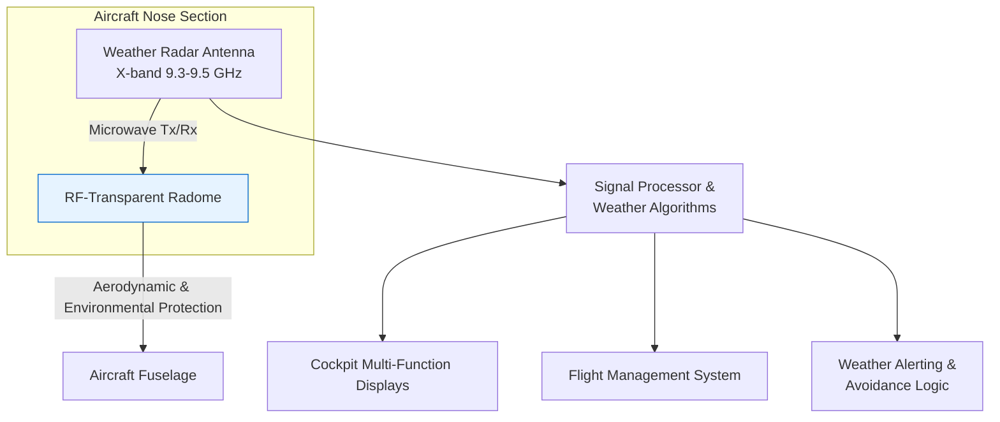
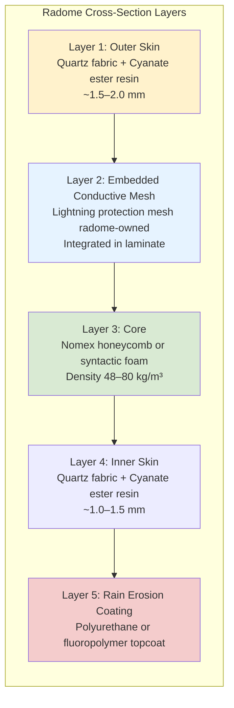

# Aircraft Requirements Specification (ARS)  
**Forward-Looking Weather-Detection Capability**

**Document Number:** ARS-A1-0101  
**Revision:** 1.1  
**Effective Date:** 2026-06-03  

---

## Document Control

**Revision History**

| Revision | Date       | Description                          | Author                  | Approved By |
|----------|------------|--------------------------------------|-------------------------|-------------|
| 1.0A     | 2026-06-03 | Initial draft for review             | Systems Engineering     | TBD         |
| 1.1      | 2026-06-03 | Governance alignment: programme naming (AMPEL360-eWTW), radome ownership clarification (embedded mesh vs. LPS diverter strips), explicit note on §7 materials vs. Finding F2 | Systems Engineering     | TBD         |

**Distribution List**  
- Programme Chief Engineer  
- Avionics Lead  
- Structures Lead  
- Systems Integration Team  
- Quality Assurance  

---

## Index (Table of Contents)

1. [Introduction and Purpose](#1-introduction-and-purpose)  
2. [Scope](#2-scope)  
3. [Applicable Documents](#3-applicable-documents)  
4. [Definitions, Acronyms and Abbreviations](#4-definitions-acronyms-and-abbreviations)  
5. [Requirements](#5-requirements)  
   5.1 [Primary Requirement — REQ-A1-0101](#51-primary-requirement--req-a1-0101)  
   5.2 [Derived Requirements](#52-derived-requirements)  
6. [System Description and Architecture](#6-system-description-and-architecture)  
7. [Materials and Construction](#7-materials-and-construction)  
8. [Verification and Validation](#8-verification-and-validation)  
9. [Glossary of Terms and Acronyms](#9-glossary-of-terms-and-acronyms)  
10. [References and Citations](#10-references-and-citations)  
11. [Document Footprint and Approval](#11-document-footprint-and-approval)  

---

## 1. Introduction and Purpose

This Aircraft Requirements Specification (ARS) defines the technical requirements for the forward-looking weather-detection capability on the A1 aircraft programme. The capability is essential for safe operation in all weather conditions, enabling pilots to detect and avoid hazardous weather phenomena such as thunderstorms, turbulence, and icing.

The specification is derived directly from customer expectation **REQ-A1-0101** and expands upon it by specifying the necessary systems, interfaces, materials, and performance characteristics. Particular emphasis is placed on the radio-frequency (RF) transparent nose fairing (radome), which is a critical enabling component for the weather radar installation.

---

## 2. Scope

This document applies to:

- The nose section of the aircraft fuselage  
- The weather radar system and its integration with cockpit displays and flight management systems  
- The RF-transparent nose fairing (radome) including its materials, construction, and protective coatings  
- All associated structural, electrical, and environmental interfaces  

The specification covers the complete lifecycle from design and manufacture through to verification, certification, and in-service support.

Out of scope: Ground-based weather systems, satellite weather data links, and non-nose-mounted sensors.

---

## 3. Applicable Documents

The following documents form part of this specification to the extent specified herein:

- RTCA DO-220B — Minimum Operational Performance Standards (MOPS) for Airborne Weather Radar Systems  
- ARINC 708A — Airborne Weather Radar  
- SAE ARP4754B — Guidelines for Development of Civil Aircraft and Systems  
- Programme Document A1-SYS-ICD-001 — Nose Avionics Interface Control Document (latest revision)  
- Programme Document A1-STR-REQ-015 — Structural Design Requirements for Nose Fairing  

---

## 4. Definitions, Acronyms and Abbreviations

See Section 9 — Glossary of Terms and Acronyms.

---

## 5. Requirements

### 5.1 Primary Requirement — REQ-A1-0101

**Requirement ID:** REQ-A1-0101  
**Title:** Weather-detection capability  
**Source:** Programme-level (REQBS-01 Customer Expectations Baseline)  
**Revision:** A0  
**Status:** Active  
**Verification Method:** Analysis (supported by test)  

**Statement**  
The aircraft shall have forward-looking weather-detection capability requiring an RF-transparent nose fairing.

**Rationale**  
Forward-looking weather detection is a fundamental safety and operational requirement for all-weather operations. The nose-mounted installation provides the optimal field of view and minimises aerodynamic penalties. An RF-transparent nose fairing (radome) is mandatory to protect the radar antenna while permitting unimpeded transmission and reception of microwave energy.

**Attributes**  
- **Priority:** High (Safety-critical)  
- **Traceability:** Customer expectation  
- **Verification Level:** Aircraft level (analysis) with equipment-level testing  

### 5.2 Derived Requirements

The following requirements are derived from REQ-A1-0101 to provide measurable and verifiable criteria.

**REQ-A1-0101-D01 — Radome RF Transparency Performance**  
The nose fairing shall exhibit a one-way transmission loss of no more than 0.8 dB across the operational frequency band of 9.3–9.5 GHz and over the full antenna scan range of ±60° in azimuth and ±15° in elevation.

**REQ-A1-0101-D02 — Structural and Environmental Integrity**  
The nose fairing shall maintain structural integrity and RF performance after exposure to the full environmental envelope, including bird strike (per CS-25.631), hail, rain erosion, lightning strike, and aerodynamic loads up to VMO/MMO.

**REQ-A1-0101-D03 — Weather Radar Integration**  
The weather radar system shall comply with RTCA DO-220B and ARINC 708A, and shall interface with the aircraft’s display and alerting systems to provide timely, unambiguous weather information to the flight crew.

**REQ-A1-0101-D04 — Lightning and Static Protection**  
The radome shall incorporate an embedded conductive mesh for lightning protection as an integral part of the laminate. Mounting provisions for LPS-owned surface diverter strips shall be provided on the outer surface. Neither feature shall degrade RF performance beyond the limits specified in REQ-A1-0101-D01. The embedded mesh is radome-owned; diverter strips remain under LPS ownership per the provisions-vs-systems boundary.

---

## 6. System Description and Architecture

The forward-looking weather-detection system consists of three primary elements:

1. **Weather Radar Antenna and Transceiver** — X-band (9.3–9.5 GHz) phased-array or mechanically scanned antenna located in the nose compartment.  
2. **RF-Transparent Nose Fairing (Radome)** — Aerodynamically contoured composite structure that protects the antenna while permitting microwave transmission.  
3. **Signal Processing and Display Integration** — Digital signal processor feeding weather data to the flight deck displays and flight management system.

### 6.1 High-Level System Context

### 6.2 Radome Construction Concept

The sandwich construction provides an optimal balance of low dielectric loss, high stiffness-to-weight ratio, and environmental durability.  

**Ownership note (provisions-vs-systems):** Layer 2 (embedded conductive mesh) is radome-owned. Surface-mounted diverter strips for the Lightning Protection System (LPS) are external to the radome and are addressed via interface provisions only (see REQ-A1-0703 and D04).

---

## 7. Materials and Construction

The nose fairing shall be manufactured as a monolithic or sandwich composite structure using the following principal materials:

**Primary Structural Materials**  
- **Facesheets:** Quartz fabric (style 4581 or equivalent) impregnated with cyanate ester resin system (e.g., EX-1515 or equivalent). Cyanate ester is selected for its low dielectric constant (≈ 3.0–3.2) and low loss tangent (≈ 0.003–0.005) at X-band frequencies, combined with excellent elevated-temperature performance.  
- **Core:** Nomex honeycomb (density 48–64 kg/m³) or closed-cell syntactic foam where additional contouring is required.  
- **Adhesive:** Epoxy film adhesive qualified for radome applications.

**Protective and Functional Coatings**  
- Rain-erosion resistant polyurethane or fluoropolymer coating on the external surface.  
- Conductive lightning protection mesh or metallic diverter strips embedded or applied to the outer surface.  
- Anti-static coating on internal surfaces as required.

**Alternative Materials (for trade studies)**  
- Fibreglass/epoxy constructions may be considered for lower-cost variants, provided RF performance requirements are still satisfied.  
- Quartz/cyanate ester remains the baseline for performance-critical installations.

All materials shall be qualified in accordance with the programme materials and processes specification and shall demonstrate long-term resistance to UV, moisture, and hydraulic fluid exposure.

**Clarification on scope of material specification (Finding F2):**  
The material selections and performance targets described in this section constitute baseline requirements for RF transparency, structural integrity, and environmental resistance. Detailed product definition — including specific ply schedule, adhesive identification, core geometry, and manufacturing parameters — is deferred to LC-C in accordance with Gate Finding F2 of the radome ReqBS. This section does not constitute a closed manufacturing specification.

---

## 8. Verification and Validation

Verification of REQ-A1-0101 and its derived requirements shall be accomplished primarily by analysis, supplemented by component and aircraft-level testing:

- **Electromagnetic Analysis:** Full-wave simulation (e.g., HFSS or CST) of the complete radome + antenna assembly to demonstrate compliance with transmission loss requirements.  
- **Structural Analysis:** Finite Element Analysis (FEA) for bird strike, hail, and aerodynamic pressure loads.  
- **Environmental Testing:** Coupon and full-scale radome specimens subjected to rain erosion, lightning, thermal cycling, and humidity.  
- **Flight Test:** Final validation during the aircraft flight test campaign using calibrated weather targets and comparison with ground-based radar.

---

## 9. Glossary of Terms and Acronyms

| Term / Acronym | Definition |
|----------------|------------|
| **Radome** | Radar dome — a structural enclosure that protects a radar antenna while being transparent to radio-frequency energy. |
| **RF** | Radio Frequency — electromagnetic waves in the radio portion of the spectrum (typically 3 kHz to 300 GHz). |
| **X-band** | Microwave frequency band approximately 8–12 GHz; the band commonly used for airborne weather radar. |
| **Dielectric Constant (εr)** | Measure of a material’s ability to store electrical energy in an electric field; lower values are preferred for radomes. |
| **Loss Tangent (tan δ)** | Measure of dielectric loss; lower values indicate better RF transparency. |
| **Nomex** | Meta-aramid honeycomb core material widely used in aerospace sandwich structures. |
| **Cyanate Ester** | High-performance thermoset resin system offering low dielectric loss and good thermal stability. |
| **FEA** | Finite Element Analysis — numerical method for structural and multi-physics simulation. |
| **VMO / MMO** | Maximum Operating Speed / Maximum Operating Mach Number. |
| **CS-25** | Certification Specification 25 — EASA large aeroplane certification requirements. |
| **ARINC 708** | Aeronautical Radio, Incorporated standard for airborne weather radar interfaces. |
| **RTCA DO-220** | Radio Technical Commission for Aeronautics document defining MOPS for airborne weather radar. |

---

## 10. References and Citations

1. RTCA DO-220B, *Minimum Operational Performance Standards (MOPS) for Airborne Weather Radar Systems with Forward-Looking Windshear Capability*, RTCA, Inc., 2023.  
2. ARINC Specification 708A, *Airborne Weather Radar*, Aeronautical Radio, Inc.  
3. SAE ARP4754B, *Guidelines for Development of Civil Aircraft and Systems*, SAE International, 2023.  
4. Programme Document A1-SYS-ICD-001, *Nose Avionics Interface Control Document*, latest revision.  
5. EASA CS-25, *Certification Specifications and Acceptable Means of Compliance for Large Aeroplanes*, Amendment 28, 2025.  
6. MIL-HDBK-17 (or CMH-17), *Composite Materials Handbook* — relevant sections on radome design and testing.

---

## 11. Document Footprint and Approval

**Document Information**  
- **File Name:** ARS-A1-0101_Weather_Detection_Requirements_Specification.md  
- **Location:** /programme/A1/Requirements/ARS/  
- **Configuration Control:** This document is under configuration control of the A1 Systems Engineering Team.  

**Revision Record**  
See table in Section “Document Control”.

**Prepared By**  
Systems Engineering Team  
Date: 2026-06-03  

**Technical Review**  
Avionics Lead: ___________________________ Date: __________  
Structures Lead: _________________________ Date: __________  

**Approval for Release**  
Chief Engineer: _________________________ Date: __________  
Programme Manager: _____________________ Date: __________  

---

*End of Document*  
*This document contains programme-proprietary information. Unauthorised distribution is prohibited.*
