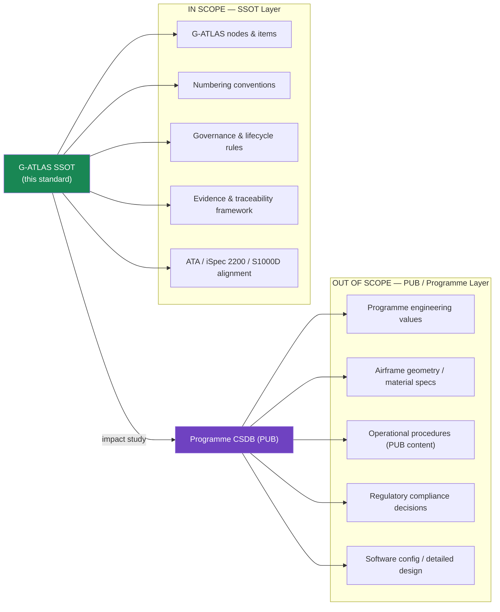

# 000-000-001 — Scope and Definitions

> **Node:** `000-000` · **Item:** `001` · **ATA ref:** 00-00-01
> **Owner:** Q-DATAGOV · **Status:** baseline · **Agnostic:** yes

---

## Index

- [1. Scope](#1-scope)
  - [1.1 What Is Covered](#11-what-is-covered)
  - [1.2 What Is Not Covered](#12-what-is-not-covered)
- [2. Definitions](#2-definitions)
  - [2.1 Structural Terms](#21-structural-terms)
  - [2.2 Publication and Governance Terms](#22-publication-and-governance-terms)
  - [2.3 Doctrine Terms](#23-doctrine-terms)
  - [2.4 Evidence Terms](#24-evidence-terms)
- [Scope Boundary Diagram](#scope-boundary-diagram)
- [Glossary](#glossary)
- [References and Citations](#references-and-citations)

---

## 1. Scope

### 1.1 What Is Covered

This item defines the scope of **master range `000–009` General Information and Service** and the controlled vocabulary used throughout that range and, by reference, throughout all of G-ATLAS band `000–099`.

The scope includes:

- The architectural standard layer (SSOT): G-ATLAS nodes, items, and their governance.
- The programme publication layer (PUB): CSDB instances derived from the SSOT via impact studies.
- The lifecycle governance model (Q+ATLANTIDE LC-letter stages, LC-A through LC-N) as it applies to nodes in this master range.
- The traceability linkage from items to requirements, evidence, and DMCs.

### 1.2 What Is Not Covered

- Programme-specific engineering requirements (these reside in programme CSDB instances).
- System-level design details (these reside in the relevant system bands, `010–099` and above).
- Regulatory compliance plans (these reside in the programme certification folder `01-02-XX-02_CERTIFICATION/`).

---

## 2. Definitions

### 2.1 Structural Terms

| Term | Definition |
|---|---|
| **Band** | The top-level numbering block of G-ATLAS. Band `000–099` is G-ATLAS. |
| **Master range** | A ten-chapter block within a band (e.g. `000–009`). Equivalent to a group of ATA chapters. |
| **Chapter** | A physical folder within a master range, numbering one ATA chapter (e.g. `000_General` ⇄ ATA 00). |
| **Node (code section)** | The primary addressable unit of G-ATLAS content; maps to an ATA chapter-section (e.g. `000-000` ⇄ ATA 00-00). |
| **Item (subject)** | A single markdown file inside a node; maps to an ATA subject (e.g. item `001` ⇄ ATA 00-00-01). |
| **Delta node** | A node with suffix `-900`, covering topics with no ATA equivalent (energy-carrier specifics, DPP, sustainability). |

### 2.2 Publication and Governance Terms

| Term | Definition |
|---|---|
| **SSOT** | Single Source of Truth. The authoritative G-ATLAS repository. Programmes may not modify it; they only publish derived instances. |
| **PUB** | Programme publication. A CSDB instance derived from SSOT by impact study, containing programme-applicable DMCs. |
| **DMC** | Data Module Code. An S1000D identifier assigned to a PUB instance of a G-ATLAS item. |
| **CSDB** | Common Source DataBase. The S1000D-compliant storage for programme data modules. |
| **Impact study** | The documented process by which a programme determines which G-ATLAS nodes/items apply, and maps them to DMCs. |
| **LC-letter stage** | A product/CAD maturity phase in the Q+ATLANTIDE lifecycle model (LC-A Conceptual Design … LC-N Nature Sustainment), each closed by a `REV-<LC>_RELEASED` gate. |

### 2.3 Doctrine Terms

| Term | Definition |
|---|---|
| **SSOT+PUB** | The two-layer publication architecture: SSOT (this standard) and PUB (programme CSDB). |
| **Agnostic** | A content attribute meaning the item contains no programme- or product-specific assumption. |
| **Baseline** | A governance status meaning the item is formally approved and under change control. |

### 2.4 Evidence Terms

| Term | Definition |
|---|---|
| **IEF** | Integrity Evidence Framework. The evidence anchoring scheme used across Q+ATLANTIDE. |
| **SHA-256 anchor** | A cryptographic hash stamped at baseline to make an item tamper-evident. |
| **Traceability record** | A structured link from an item to its parent requirement, applicable standard, owner, and DMC. |

---

## Scope Boundary Diagram

---

## Glossary

| Term / Acronym | Definition |
|---|---|
| **Band** | Top-level numbering block of G-ATLAS (e.g. `000–099`). |
| **Master range** | Ten-chapter block within a band (e.g. `000–009`). |
| **Chapter** | Physical folder within a master range corresponding to one ATA chapter. |
| **Node** | Primary addressable G-ATLAS unit; maps to an ATA chapter-section. |
| **Item** | Single markdown file inside a node; maps to an ATA subject. |
| **Delta node** | Node with suffix `-900`; covers topics with no ATA equivalent. |
| **SSOT** | Single Source of Truth — the authoritative G-ATLAS standard repository. |
| **PUB** | Programme publication — S1000D CSDB instance derived from SSOT. |
| **CSDB** | Common Source DataBase — S1000D-compliant programme document store. |
| **DMC** | Data Module Code — S1000D identifier for a programme data module. |
| **Impact study** | Documented process mapping G-ATLAS nodes to programme DMCs. |
| **LC-letter stage** | Q+ATLANTIDE lifecycle maturity phase (LC-A … LC-N). |
| **SSOT+PUB** | Two-layer publication architecture: SSOT standard + PUB programme instances. |
| **Agnostic** | No programme- or product-specific assumption. |
| **Baseline** | Formally approved; under change control. |
| **IEF** | Integrity Evidence Framework — evidence anchoring using SHA-256. |
| **SHA-256** | Cryptographic hash algorithm used for tamper-evident content anchoring. |
| **DPP** | Digital Product Passport — lifecycle sustainability data record for a physical product. |
| **ATA** | Air Transport Association — publisher of ATA 100 / iSpec 2200. |
| **S1000D** | International specification for technical publications (data modules, CSDBs). |

---

## References and Citations

| # | Reference | External Link | Applicability |
|---|---|---|---|
| R1 | Model Digital Constitution | [`00_MODEL-DIGITAL-CONSTITUTION/`](../../../../../../../../00_MODEL-DIGITAL-CONSTITUTION/) | Constitutional authority for G-ATLAS; parent of all governance rules |
| R2 | ATA 100 / iSpec 2200 (Airlines for America) | <https://www.airlines.org/data/ispec-2200/> | Numbering and structure reference for bands, master ranges, chapters |
| R3 | S1000D Issue 4.2 | <https://www.s1000d.net/> | DMC, CSDB, and data module rules |
| R4 | IEF (Integrity Evidence Framework) | [`01-07-04-03_EVIDENCE-AND-PROVENANCE-IEF/`](../../../../../../01-07-04-03_EVIDENCE-AND-PROVENANCE-IEF/) | Evidence anchoring and SHA-256 stamping rules |
| R5 | Q+ATLANTIDE Lifecycle Model | [`02_LIFECYCLE_MODEL/README.md`](../../../../../../../../02_LIFECYCLE_MODEL/README.md) | LC-letter stage definitions (LC-A through LC-N) |

---

*Document footprint: G-ATLAS-000-000-001 · v0.1.0 · 2026-06-05 · Owner: Q-DATAGOV · Status: baseline · SHA-256: TBS*
