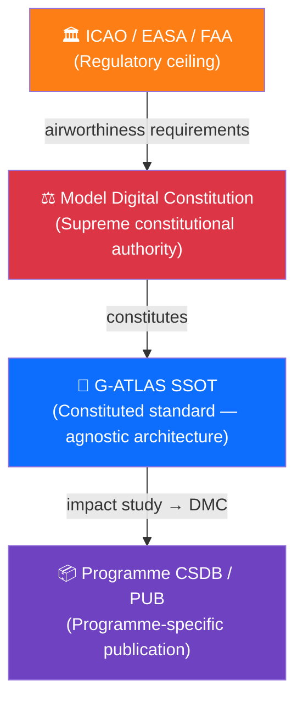

# 000-000-002 — Purpose and Mission

> **Node:** `000-000` · **Item:** `002` · **ATA ref:** 00-00-02
> **Owner:** Q-DATAGOV · **Status:** baseline · **Agnostic:** yes

---

## Index

- [1. Mission Statement](#1-mission-statement)
- [2. Purpose](#2-purpose)
  - [2.1 Close the Gap Between ATA and Green Architecture](#21-close-the-gap-between-ata-and-green-architecture)
  - [2.2 Enable Multi-Programme Reuse](#22-enable-multi-programme-reuse)
  - [2.3 Support Certification Readiness](#23-support-certification-readiness)
  - [2.4 Maintain Governance Integrity](#24-maintain-governance-integrity)
- [3. Boundaries](#3-boundaries)
- [4. Relationship to the Model Digital Constitution](#4-relationship-to-the-model-digital-constitution)
- [Constitutional Hierarchy Diagram](#constitutional-hierarchy-diagram)
- [Glossary](#glossary)
- [References and Citations](#references-and-citations)

---

## 1. Mission Statement

G-ATLAS exists to provide a **single, programme-neutral, certification-ready architectural standard** for green aviation systems — one that any programme may instantiate without modifying the standard itself, and that any authority, auditor, or integrator can read as a stable reference independent of product decisions.

---

## 2. Purpose

### 2.1 Close the Gap Between ATA and Green Architecture

ATA 100 / iSpec 2200 was designed for conventional aircraft. It does not define architecture slots for novel energy carriers (batteries, cryogenic hydrogen, ammonia, fuel cells), for Digital Product Passports, or for sustainability accounting across the full lifecycle.

G-ATLAS fills this gap by:

1. Mirroring ATA chapter–section–subject numbering so existing toolchains and workforce training remain valid.
2. Adding **agnostic delta nodes** (`00X-900`) for functions that ATA has no equivalent for.
3. Keeping every slot energy-carrier-neutral and geometry-neutral so the same standard applies to tube-and-wing, blended-wing-body, and any future geometry.

### 2.2 Enable Multi-Programme Reuse

A single standard that all Q+ATLANTIDE programmes share means:

- A certifier learns one structure, not one per programme.
- Cross-programme comparisons are structurally valid.
- Common evidence and traceability tooling can be developed once.

### 2.3 Support Certification Readiness

Every G-ATLAS item is structured so that a programme can, at any lifecycle gate from LC-A (Conceptual Design) onwards, demonstrate:

- Which standard node/item the content derives from.
- Which requirement the item satisfies.
- Which evidence supports it.
- Which authority owns it.
- Which DMC it is published as in the programme CSDB.

### 2.4 Maintain Governance Integrity

G-ATLAS is governed under the **SSOT+PUB** doctrine. This ensures the standard cannot be silently modified by a programme, and that all changes go through controlled amendment.

---

## 3. Boundaries

| In scope | Out of scope |
|---|---|
| Agnostic architecture nodes and items (SSOT) | Programme-specific engineering values |
| Numbering conventions and naming rules | Specific airframe geometry or material specifications |
| Governance and lifecycle rules | Operational procedures (these are programme-PUB content) |
| Evidence and traceability framework | Regulatory compliance decisions |
| ATA / iSpec 2200 / S1000D alignment | Software configuration or detailed design |

---

## 4. Relationship to the Model Digital Constitution

G-ATLAS is constituted power under the **Model Digital Constitution** (`00_MODEL-DIGITAL-CONSTITUTION`). It may not override constitutional values (Safety First, Traceability, Certification Readiness, Sustainability by Design, Technical Sovereignty, Democratic Enterprise Governance, Realistic Ambition). Any G-ATLAS node that conflicts with the Constitution is the defect to be corrected.

---

## Constitutional Hierarchy Diagram

---

## Glossary

| Term / Acronym | Definition |
|---|---|
| **G-ATLAS** | Green Aircraft Top-Level Architecture Schema. |
| **SSOT** | Single Source of Truth — the authoritative G-ATLAS repository. |
| **PUB** | Programme publication — S1000D CSDB derived from SSOT via impact study. |
| **SSOT+PUB** | Two-layer architecture: SSOT standard + PUB programme instances. |
| **MDC** | Model Digital Constitution — constitutional authority for G-ATLAS. |
| **DMC** | Data Module Code — S1000D identifier for a programme data module. |
| **LC-A** | First Q+ATLANTIDE lifecycle stage: Conceptual Design. |
| **Delta node** | G-ATLAS node with suffix `-900`; no ATA equivalent; tagged `[G]`. |
| **ATA** | Air Transport Association — publisher of ATA 100 / iSpec 2200. |
| **iSpec 2200** | ATA specification extending ATA 100 with structured authoring rules. |
| **DPP** | Digital Product Passport — lifecycle sustainability data record. |
| **CSDB** | Common Source DataBase — S1000D document store. |
| **Agnostic** | No programme- or product-specific assumption; energy-carrier and geometry neutral. |

---

## References and Citations

| # | Reference | External Link | Applicability |
|---|---|---|---|
| R1 | Model Digital Constitution | [`00_MODEL-DIGITAL-CONSTITUTION/`](../../../../../../../../00_MODEL-DIGITAL-CONSTITUTION/) | Constitutional ceiling; source of G-ATLAS governance values |
| R2 | ATA 100 / iSpec 2200 (Airlines for America) | <https://www.airlines.org/data/ispec-2200/> | Documentation structure standard G-ATLAS mirrors and extends |
| R3 | S1000D Issue 4.2 | <https://www.s1000d.net/> | Publication standard for programme CSDB / PUB instances |
| R4 | ICAO Annex 8 — Airworthiness | <https://www.icao.int/safety/airnavigation/nationalitymarks/annexes_booklet/annex8.pdf> | Regulatory authority above all documentation standards |
| R5 | EASA CS-25 | <https://www.easa.europa.eu/en/document-library/certification-specifications/cs-25-large-aeroplanes> | Primary certification basis for large aircraft programmes |
| R6 | Q+ATLANTIDE Lifecycle Model | [`02_LIFECYCLE_MODEL/README.md`](../../../../../../../../02_LIFECYCLE_MODEL/README.md) | LC-letter stage definitions referenced in §2.3 |

---

*Document footprint: G-ATLAS-000-000-002 · v0.1.0 · 2026-06-05 · Owner: Q-DATAGOV · Status: baseline · SHA-256: TBS*
