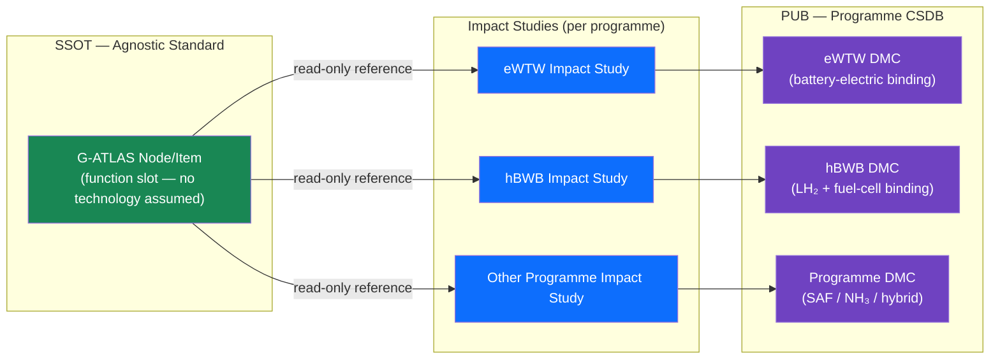

# 000-000-003 — Programme and Product Agnosticism

> **Node:** `000-000` · **Item:** `003` · **ATA ref:** 00-00-03
> **Owner:** Q-DATAGOV · **Status:** baseline · **Agnostic:** yes

---

## Index

- [1. The Neutral-Standard Principle](#1-the-neutral-standard-principle)
- [2. What Agnosticism Means in Practice](#2-what-agnosticism-means-in-practice)
  - [2.1 Function Slots, Not Technology Slots](#21-function-slots-not-technology-slots)
  - [2.2 Programme Binding via Impact Study](#22-programme-binding-via-impact-study)
  - [2.3 Delta Nodes for Novel Functions](#23-delta-nodes-for-novel-functions)
- [3. What Breaks Agnosticism](#3-what-breaks-agnosticism)
- [4. Reference Programme Instantiations](#4-reference-programme-instantiations)
- [Agnosticism Binding Diagram](#agnosticism-binding-diagram)
- [Glossary](#glossary)
- [References and Citations](#references-and-citations)

---

## 1. The Neutral-Standard Principle

G-ATLAS is **agnostic by design**. No node, item, or definition in the standard assumes a specific energy carrier, airframe geometry, propulsion architecture, or programme identity. Every slot is defined in terms of **function, limit, zone, or interval** — not in terms of a specific technology realising it.

This principle is constitutional. It is not a preference that a programme may override.

---

## 2. What Agnosticism Means in Practice

### 2.1 Function Slots, Not Technology Slots

A G-ATLAS node defines *what* a function is and *what* must be documented about it. It does not define *how* the function is realised. Examples:

| G-ATLAS slot (agnostic) | eWTW binding | hBWB binding |
|---|---|---|
| `000-900` — Sustainability, lifecycle & DPP framing | Battery-electric DPP; LC-letter lifecycle accounting | Hydrogen DPP; well-to-wake H₂ lifecycle |
| `004-900` — Energy-carrier & storage airworthiness limits | Battery + power-electronics limits (CS-23/25 + SC) | Cryo-tank + fuel-cell stack limits (novel SC) |
| `008-900` — Energy-carrier mass & CG effects | Battery mass distribution; pack layout CG model | LH₂ low-density mass + boil-off CG shift |

### 2.2 Programme Binding via Impact Study

A programme **binds** each G-ATLAS slot to its real technology through an **impact study**. The impact study is stored in the programme's `01-02-XX-04_IMPACT-STUDIES/` folder. It maps:

```text
G-ATLAS node/item  ──(impact study)──►  Programme DMC
                                        Programme-specific engineering value
                                        Applicable certification basis
```

The G-ATLAS SSOT does not change when a binding is made. Only the programme's PUB (CSDB) changes.

### 2.3 Delta Nodes for Novel Functions

Where ATA has no equivalent function slot, G-ATLAS defines an **agnostic delta node** (`00X-900`). These nodes are explicitly labelled `[G]` (green-architecture delta). They are part of the standard; programmes bind them exactly as they bind any other node.

---

## 3. What Breaks Agnosticism

An item is **not agnostic** if it:

- Names a specific energy carrier (battery, hydrogen, …) as an assumption rather than an example.
- Names a specific airframe geometry as a constraint.
- Contains a programme identifier (eWTW, hBWB, …) in the normative body of the item.
- References a specific certification special condition that is not universally applicable.

Agnosticism violations are **defects** in the SSOT and must be raised as change requests under the document-control process ([`000-000-007`](000-000-007-Document-Control-and-Configuration.md)).

---

## 4. Reference Programme Instantiations

These are listed for illustration only. They are not part of the standard.

| Programme | Energy carrier | Geometry | Example binding |
|---|---|---|---|
| **eWTW** | Battery-electric | Wide tube-and-wing | Battery mass + HV zoning |
| **hBWB** | Hydrogen (cryo LH₂ + fuel cell) | Blended-wing-body | Cryo-tank CG + LH₂ airworthiness limits |
| *(other)* | NH₃, SAF, hybrid, … | any | Per architecture; determined by impact study |

The standard is identical for all three. Only the bindings differ.

---

## Agnosticism Binding Diagram



---

## Glossary

| Term / Acronym | Definition |
|---|---|
| **Agnostic** | No programme- or product-specific assumption; valid for any energy carrier and geometry. |
| **Function slot** | A G-ATLAS node/item defined in terms of function, limit, zone, or interval — not technology. |
| **Delta node** | G-ATLAS node with suffix `-900`; covers novel functions with no ATA equivalent; tagged `[G]`. |
| **Impact study** | Documented process mapping G-ATLAS nodes to programme-specific DMCs and engineering values. |
| **SSOT** | Single Source of Truth — the authoritative G-ATLAS repository; not modified by programmes. |
| **PUB** | Programme publication — S1000D CSDB instance reflecting programme-specific bindings. |
| **CSDB** | Common Source DataBase — S1000D document store for programme data modules. |
| **DMC** | Data Module Code — S1000D identifier for a programme data module. |
| **eWTW** | Electric Wide Tube-and-Wing — battery-electric reference programme. |
| **hBWB** | Hydrogen Blended-Wing-Body — LH₂ + fuel-cell reference programme. |
| **LH₂** | Liquid hydrogen — cryogenic aviation fuel. |
| **CG** | Centre of gravity. |
| **SAF** | Sustainable Aviation Fuel. |
| **NH₃** | Ammonia — alternative aviation fuel. |
| **CS-25** | EASA Certification Specifications for Large Aeroplanes. |
| **SC** | Special Condition — regulatory certification requirement beyond the standard CS. |

---

## References and Citations

| # | Reference | External Link | Applicability |
|---|---|---|---|
| R1 | Model Digital Constitution | [`00_MODEL-DIGITAL-CONSTITUTION/`](../../../../../../../../00_MODEL-DIGITAL-CONSTITUTION/) | Constitutional basis for the agnosticism principle |
| R2 | ATA 100 / iSpec 2200 (Airlines for America) | <https://www.airlines.org/data/ispec-2200/> | Structure standard G-ATLAS mirrors with function-slot agnosticism |
| R3 | EASA CS-25 | <https://www.easa.europa.eu/en/document-library/certification-specifications/cs-25-large-aeroplanes> | Airworthiness basis for large-aircraft programmes (example binding) |
| R4 | Document Control item 007 | [`000-000-007-Document-Control-and-Configuration.md`](000-000-007-Document-Control-and-Configuration.md) | Change request process for agnosticism-violation defects |
| R5 | Impact Studies folder (eWTW example) | [`01-02-01-04_IMPACT-STUDIES/`](../../../../../../01-02-01-04_IMPACT-STUDIES/) | Example of a programme binding store |

---

*Document footprint: G-ATLAS-000-000-003 · v0.1.0 · 2026-06-05 · Owner: Q-DATAGOV · Status: baseline · SHA-256: TBS*
