# 000-000-004 — How to Use This Architecture and Data Set

> **Node:** `000-000` · **Item:** `004` · **ATA ref:** 00-00-04
> **Owner:** Q-DATAGOV · **Status:** baseline · **Agnostic:** yes

---

## Index

- [1. Who This Is For](#1-who-this-is-for)
- [2. Repository Navigation](#2-repository-navigation)
  - [2.1 Root Path to G-ATLAS](#21-root-path-to-g-atlas)
  - [2.2 Key Index Files](#22-key-index-files)
- [3. Tags and Labels](#3-tags-and-labels)
- [4. Reading Order](#4-reading-order)
  - [4.1 First-Time Reader](#41-first-time-reader-orientation-sequence)
  - [4.2 Programme Integrator](#42-programme-integrator)
  - [4.3 Auditor / Certifier](#43-auditor--certifier)
- [5. Conventions Used Throughout the Data Set](#5-conventions-used-throughout-the-data-set)
- [Reading-Order Flow Diagram](#reading-order-flow-diagram)
- [Glossary](#glossary)
- [References and Citations](#references-and-citations)

---

## 1. Who This Is For

| Reader | Primary use |
|---|---|
| **New contributor / engineer** | Understand the standard before reading any system band |
| **Programme integrator** | Identify applicable nodes, run an impact study, build the CSDB |
| **Certifier / authority** | Navigate to a specific node, verify traceability, check evidence anchor |
| **Auditor** | Check governance status, owner, change history, SHA-256 anchor |
| **System architect** | Find the agnostic function slot for a new technology |

---

## 2. Repository Navigation

### 2.1 Root Path to G-ATLAS

```text
01_OPTIONS_ARCHITECTURE/
└── 01-03_TECHNOLOGIES/
    └── 01-03-01_Q+ATLANTIDE/
        └── 000-099_G-ATLAS/              ← band index
            └── 000-009_General-Information-and-Service/   ← master range index
                └── 000_General/          ← chapter folder
                    └── 000-000_General-Introduction/      ← this node
```

### 2.2 Key Index Files

| File | Purpose |
|---|---|
| [`000-099_G-ATLAS/README.md`](../../../../../README.md) | Band overview, governance framework, all master ranges |
| [`000-009_.../README.md`](../../README.md) | Node register, numbering rules, green-delta table |
| [`000_General/README.md`](../README.md) | Chapter-level navigation |
| [`000-000_.../README.md`](README.md) | Node item set, governance, navigation |

Start at the **master-range README** to orient yourself to a chapter, then navigate to the **node README** for the item list.

---

## 3. Tags and Labels

Items carry the following navigation tags in their front matter:

| Tag | Meaning |
|---|---|
| `agnostic: true` | Item contains no programme- or product-specific assumption |
| `status: baseline` | Item is formally approved and under change control |
| `[G]` in node title | Agnostic green-architecture delta node (suffix `-900`) |
| `owner: Q-DATAGOV` | The Q-Division responsible for the item |

---

## 4. Reading Order

### 4.1 First-Time Reader (orientation sequence)

```text
000-000-000  →  000-000-001  →  000-000-002  →  000-000-003
          →  000-000-005  →  000-000-006  →  000-000-004  →  000-000-007  →  000-000-008
```

### 4.2 Programme Integrator

1. Read [`000-000-003`](000-000-003-Programme-and-Product-Agnosticism.md) (agnosticism principle).
2. Read [`000-000-006`](000-000-006-Standards-Alignment-ATA-iSpec-2200.md) (ATA / iSpec 2200 / S1000D alignment).
3. Read [`000-000-005`](000-000-005-Numbering-and-Structure-Orientation.md) (numbering, to understand node IDs).
4. Run impact study against the master-range node register (`000-009/README.md §4`).
5. Map applicable nodes to programme DMCs.
6. Read [`000-000-007`](000-000-007-Document-Control-and-Configuration.md) (change control) before creating CSDB entries.
7. Read [`000-000-008`](000-000-008-Traceability-and-Evidence-Index.md) (traceability) to set up evidence links.

### 4.3 Auditor / Certifier

1. Read [`000-000-007`](000-000-007-Document-Control-and-Configuration.md) (change control, configuration status).
2. Read [`000-000-008`](000-000-008-Traceability-and-Evidence-Index.md) (traceability and evidence index).
3. Navigate directly to the node in question via the node register.
4. Verify SHA-256 anchor at baseline.

---

## 5. Conventions Used Throughout the Data Set

| Element | Convention | Example |
|---|---|---|
| Node identifier | `00X-Y00` | `000-000` |
| Item file | `<node>-<item>-<Title>.md` | `000-000-001-Scope-and-Definitions.md` |
| Delta node | suffix `-900`, tagged `[G]` | `000-900` |
| ATA mirror | `00X-Y00 ⇄ ATA 0X-Y0` | `000-000 ⇄ ATA 00-00` |
| Section scaling | ATA `Y0` → G-ATLAS `Y00` (×10) | `05-50 → 005-500` |
| Retired term | ~~code range~~ → **master range** | — |

---

## Reading-Order Flow Diagram

```mermaid
flowchart TD
    subgraph "First-Time Reader"
        direction LR
        F0["000 Overview"] --> F1["001 Scope"] --> F2["002 Purpose"] --> F3["003 Agnosticism"]
        F3 --> F5["005 Numbering"] --> F6["006 Standards"] --> F4["004 Usage (this item)"]
        F4 --> F7["007 Doc Control"] --> F8["008 Traceability"]
    end

    subgraph "Programme Integrator"
        direction LR
        P3["003 Agnosticism"] --> P6["006 Standards"] --> P5["005 Numbering"]
        P5 --> P7["007 Doc Control"] --> P8["008 Traceability"]
    end

    subgraph "Auditor / Certifier"
        direction LR
        A7["007 Doc Control"] --> A8["008 Traceability"] --> A6["006 Standards"]
    end
```



---

## Glossary

| Term / Acronym | Definition |
|---|---|
| **G-ATLAS** | Green Aircraft Top-Level Architecture Schema. |
| **SSOT** | Single Source of Truth — the authoritative G-ATLAS repository. |
| **CSDB** | Common Source DataBase — S1000D document store for programme data modules. |
| **DMC** | Data Module Code — S1000D identifier for a programme data module. |
| **Impact study** | Documented process mapping G-ATLAS nodes to programme-specific DMCs. |
| **SHA-256** | Cryptographic hash used for tamper-evident content anchoring (IEF). |
| **Q-DATAGOV** | Q-Division responsible for G-ATLAS content governance. |
| **Agnostic** | No programme- or product-specific assumption. |
| **Baseline** | Formally approved; under change control. |
| **Delta node** | G-ATLAS node with suffix `-900`; tagged `[G]`; no ATA equivalent. |
| **Master range** | Ten-chapter block within a band (e.g. `000–009`). |
| **Band** | Top-level G-ATLAS numbering block (e.g. `000–099`). |
| **ATA** | Air Transport Association — publisher of ATA 100 / iSpec 2200. |

---

## References and Citations

| # | Reference | External Link | Applicability |
|---|---|---|---|
| R1 | G-ATLAS Band README | [`000-099_G-ATLAS/README.md`](../../../../../README.md) | Band-level orientation and master-range register |
| R2 | Master Range README | [`000-009_.../README.md`](../../README.md) | Node register and green-delta table |
| R3 | ATA 100 / iSpec 2200 (Airlines for America) | <https://www.airlines.org/data/ispec-2200/> | Numbering conventions and structure standard |
| R4 | S1000D Issue 4.2 | <https://www.s1000d.net/> | CSDB, DMC, and data module rules |
| R5 | Document Control (item 007) | [`000-000-007-Document-Control-and-Configuration.md`](000-000-007-Document-Control-and-Configuration.md) | Change control and SSOT+PUB rules |

---

*Document footprint: G-ATLAS-000-000-004 · v0.1.0 · 2026-06-05 · Owner: Q-DATAGOV · Status: baseline · SHA-256: TBS*
