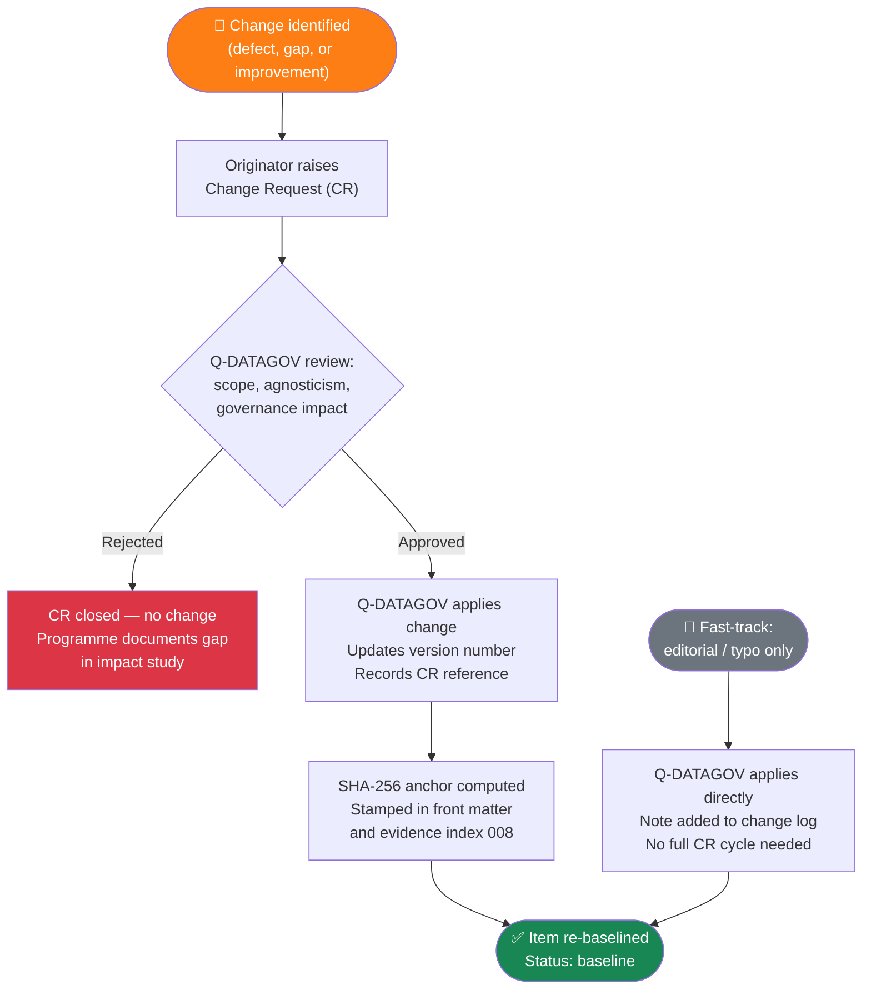

# 000-000-007 — Document Control and Configuration

> **Node:** `000-000` · **Item:** `007` · **ATA ref:** 00-00-07
> **Owner:** Q-DATAGOV · **Status:** baseline · **Agnostic:** yes

---

## Index

- [1. Purpose](#1-purpose)
- [2. SSOT+PUB Doctrine](#2-ssotpub-doctrine)
- [3. Versioning](#3-versioning)
  - [3.1 Version Format](#31-version-format)
  - [3.2 Status Values](#32-status-values)
- [4. Change Control](#4-change-control)
  - [4.1 Change Request (CR)](#41-change-request-cr)
  - [4.2 Fast-Track Corrections](#42-fast-track-corrections)
  - [4.3 No Programme Override](#43-no-programme-override)
- [5. Configuration and Evidence Anchor](#5-configuration-and-evidence-anchor)
- [6. Lifecycle Gate Control](#6-lifecycle-gate-control)
- [7. Change Log (this item)](#7-change-log-this-item)
- [Change Control Workflow Diagram](#change-control-workflow-diagram)
- [Glossary](#glossary)
- [References and Citations](#references-and-citations)

---

## 1. Purpose

This item defines how G-ATLAS content (nodes, items, and indices) is version-controlled, change-controlled, and configuration-managed under the **SSOT+PUB** doctrine.

---

## 2. SSOT+PUB Doctrine

| Layer | Name | Who controls it | What it contains |
|---|---|---|---|
| **SSOT** | Single Source of Truth | Q-DATAGOV | All G-ATLAS standard nodes and items (this repository) |
| **PUB** | Programme publication | Programme (e.g. eWTW, hBWB) | S1000D data modules derived from SSOT via impact study |

Only Q-DATAGOV may modify SSOT content. A programme may never modify an SSOT file; it creates its own PUB (CSDB) entries.

---

## 3. Versioning

### 3.1 Version Format

```text
<major>.<minor>.<patch>
```

| Component | Triggers a change |
|---|---|
| `major` | Structural change (new node, retired node, numbering change) |
| `minor` | Content addition or substantive revision to an existing item |
| `patch` | Editorial correction, typo fix, clarification without substantive change |

### 3.2 Status Values

| Status | Meaning |
|---|---|
| `draft` | Work in progress; not under formal change control |
| `baseline` | Formally approved; changes require a Change Request (CR) |
| `superseded` | Replaced by a newer baseline; retained for traceability |
| `withdrawn` | Removed from the standard; reason recorded in change log |

---

## 4. Change Control

### 4.1 Change Request (CR)

All changes to SSOT content at status `baseline` require a **Change Request**:

1. Originator raises CR, citing the affected node/item and the reason.
2. Q-DATAGOV reviews for scope, agnosticism compliance, and governance impact.
3. If approved, Q-DATAGOV applies the change, updates the version, and records the CR reference in the item's change log.
4. The updated item is re-baselined with a new SHA-256 anchor (see §5).

### 4.2 Fast-Track Corrections

Patch-level corrections (editorial, typos) may be applied directly by Q-DATAGOV without a full CR cycle, provided no normative content changes. A note is added to the change log.

### 4.3 No Programme Override

Programmes may not apply their own changes to SSOT items. If a programme finds a defect or gap in the SSOT, it raises a CR. Until the CR is resolved, the programme documents the gap in its impact study.

---

## 5. Configuration and Evidence Anchor

Each item at status `baseline` is stamped with a **SHA-256 hash** of its content at the time of baseline. This hash is the **integrity evidence anchor** under the IEF (Integrity Evidence Framework).

```yaml
ief_anchor:
  sha256: <to-be-stamped-at-baseline>
  stamped_at: <ISO-8601 timestamp>
  stamped_by: Q-DATAGOV
```

The anchor is recorded in the item's front matter and in the master evidence index ([`000-000-008`](000-000-008-Traceability-and-Evidence-Index.md)).

---

## 6. Lifecycle Gate Control

Nodes in master range `000–009` are governed across the Q+ATLANTIDE **LC-letter stages** (LC-A through LC-N). The following nodes are **gate-critical** (their baseline status is verified at named lifecycle gates):

| Node | Gate-critical at |
|---|---|
| `004-xxx` (Airworthiness Limitations) | LC-D (Analysis/Verification), LC-G (Qualification), LC-J (Certification), LC-M (MRO) |
| `005-xxx` (Time Limits) | LC-D (Analysis/Verification), LC-G (Qualification), LC-J (Certification), LC-M (MRO) |
| `000-000` (this node) | LC-A (first formal baseline — `REV-A_RELEASED`) |

---

## 7. Change Log (this item)

| Version | Date | Change | CR ref |
|---|---|---|---|
| 0.1.0 | 2026-06-05 | Initial baseline | — |

---

## Change Control Workflow Diagram



---

## Glossary

| Term / Acronym | Definition |
|---|---|
| **SSOT** | Single Source of Truth — the authoritative G-ATLAS repository. |
| **PUB** | Programme publication — S1000D CSDB derived from SSOT via impact study. |
| **SSOT+PUB** | Two-layer architecture: SSOT standard + PUB programme instances. |
| **CR** | Change Request — formal document raising a proposed modification to a baselined item. |
| **Baseline** | Formally approved status; changes require a CR. |
| **SHA-256** | Cryptographic hash algorithm; used to create a tamper-evident content anchor. |
| **IEF** | Integrity Evidence Framework — evidence anchoring scheme using SHA-256 hashes. |
| **LC-A** | First Q+ATLANTIDE lifecycle stage: Conceptual Design. |
| **LC-letter stage** | Q+ATLANTIDE lifecycle maturity phase (LC-A … LC-N). |
| **REV-A_RELEASED** | Release gate closing LC-A stage. |
| **Q-DATAGOV** | Q-Division responsible for G-ATLAS content governance. |
| **CSDB** | Common Source DataBase — S1000D document store. |
| **DMC** | Data Module Code — S1000D identifier for a programme data module. |
| **Impact study** | Documented programme process mapping G-ATLAS nodes to programme DMCs. |
| **major / minor / patch** | Semantic versioning components (structural / content / editorial). |

---

## References and Citations

| # | Reference | External Link | Applicability |
|---|---|---|---|
| R1 | Model Digital Constitution | [`00_MODEL-DIGITAL-CONSTITUTION/`](../../../../../../../../00_MODEL-DIGITAL-CONSTITUTION/) | Constitutional authority for SSOT+PUB doctrine |
| R2 | IEF (Integrity Evidence Framework) | [`01-07-04-03_EVIDENCE-AND-PROVENANCE-IEF/`](../../../../../../01-07-04-03_EVIDENCE-AND-PROVENANCE-IEF/) | SHA-256 anchoring and evidence stamping rules |
| R3 | S1000D Issue 4.2 — CSDB and change management | <https://www.s1000d.net/> | S1000D change management practices for PUB layer |
| R4 | Traceability and Evidence Index (item 008) | [`000-000-008-Traceability-and-Evidence-Index.md`](000-000-008-Traceability-and-Evidence-Index.md) | Master evidence register where SHA-256 anchors are recorded |
| R5 | Q+ATLANTIDE Lifecycle Model | [`02_LIFECYCLE_MODEL/README.md`](../../../../../../../../02_LIFECYCLE_MODEL/README.md) | LC-letter stage definitions for lifecycle gate control |

---

*Document footprint: G-ATLAS-000-000-007 · v0.1.0 · 2026-06-05 · Owner: Q-DATAGOV · Status: baseline · SHA-256: TBS*
