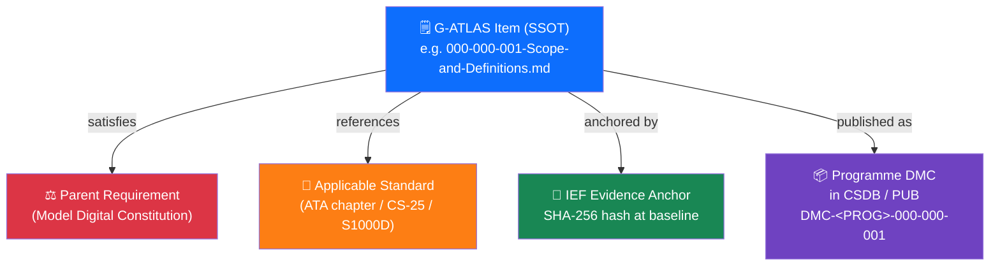

# 000-000-008 — Traceability and Evidence Index

> **Node:** `000-000` · **Item:** `008` · **ATA ref:** 00-00-08
> **Owner:** Q-DATAGOV · **Status:** baseline · **Agnostic:** yes

---

## Index

- [1. Purpose](#1-purpose)
- [2. Traceability Structure](#2-traceability-structure)
- [3. Item Traceability Register — Node 000-000](#3-item-traceability-register--node-000-000)
- [4. Evidence Anchor Protocol](#4-evidence-anchor-protocol)
- [5. DMC Mapping Notes](#5-dmc-mapping-notes)
- [6. Upstream Evidence References](#6-upstream-evidence-references)
- [Traceability Chain Diagram](#traceability-chain-diagram)
- [Glossary](#glossary)
- [References and Citations](#references-and-citations)

---

## 1. Purpose

This item is the **traceability and evidence index** for node `000-000`. It records:

- The parent requirement that each item satisfies.
- The applicable standard(s) each item references.
- The IEF (Integrity Evidence Framework) anchor for each item at baseline.
- The canonical DMC short-form for programme publications.

---

## 2. Traceability Structure

Each G-ATLAS item has a four-link traceability chain:

```text
Item (SSOT)
  └── Parent requirement (Model Digital Constitution / governing standard)
      └── Applicable standard reference (ATA chapter, CS-25 article, …)
          └── IEF evidence anchor (SHA-256 at baseline)
              └── Programme DMC (in programme CSDB / PUB)
```

---

## 3. Item Traceability Register — Node 000-000

| Item | File | Parent requirement | Applicable standard | IEF anchor | DMC short-form |
|---|---|---|---|---|---|
| `000` | [`000-000-000-…-Overview.md`](000-000-000-General-Introduction-Overview.md) | MDC — Orientation entry point for the data set | ATA 00-00-00; iSpec 2200 §0 | `<sha256: TBS>` | `DMC-<PROG>-000-000-000` |
| `001` | [`000-000-001-…-Definitions.md`](000-000-001-Scope-and-Definitions.md) | MDC — Scope and vocabulary control | ATA 00-00-01 | `<sha256: TBS>` | `DMC-<PROG>-000-000-001` |
| `002` | [`000-000-002-…-Mission.md`](000-000-002-Purpose-and-Mission.md) | MDC Art. 2 — Mission and foundational values | ATA 00-00-02 | `<sha256: TBS>` | `DMC-<PROG>-000-000-002` |
| `003` | [`000-000-003-…-Agnosticism.md`](000-000-003-Programme-and-Product-Agnosticism.md) | MDC — Agnosticism principle | ATA 00-00-03 | `<sha256: TBS>` | `DMC-<PROG>-000-000-003` |
| `004` | [`000-000-004-…-Use.md`](000-000-004-How-to-Use-This-Architecture-and-Data-Set.md) | MDC — Navigation and usage guide | ATA 00-00-04 | `<sha256: TBS>` | `DMC-<PROG>-000-000-004` |
| `005` | [`000-000-005-…-Numbering.md`](000-000-005-Numbering-and-Structure-Orientation.md) | MDC — Numbering convention | ATA 00-00-05; iSpec 2200 SNS rules | `<sha256: TBS>` | `DMC-<PROG>-000-000-005` |
| `006` | [`000-000-006-…-ATA-iSpec.md`](000-000-006-Standards-Alignment-ATA-iSpec-2200.md) | MDC — Standards alignment | ATA 100; iSpec 2200; S1000D Issue 4.2 | `<sha256: TBS>` | `DMC-<PROG>-000-000-006` |
| `007` | [`000-000-007-…-Control.md`](000-000-007-Document-Control-and-Configuration.md) | MDC Art. 4 — Document control | SSOT+PUB doctrine; IEF | `<sha256: TBS>` | `DMC-<PROG>-000-000-007` |
| `008` | [`000-000-008-…-Index.md`](000-000-008-Traceability-and-Evidence-Index.md) (this) | MDC — Evidence index | IEF; S1000D DMC rules | `<sha256: TBS>` | `DMC-<PROG>-000-000-008` |

> **TBS** — To Be Stamped at formal baseline by Q-DATAGOV IEF tooling.
> **MDC** — Model Digital Constitution (`00_MODEL-DIGITAL-CONSTITUTION/`).
> **`<PROG>`** — Replace with programme identifier (e.g. `EWTW`, `HBWB`) in programme CSDB.

---

## 4. Evidence Anchor Protocol

At each formal baseline event:

1. Q-DATAGOV computes `SHA-256(<file-content>)` for each item.
2. The hash is recorded in the item's `ief_anchor` front-matter block.
3. The hash is also recorded in this index (column *IEF anchor*) and in the band-level evidence register.
4. The baseline timestamp and authorising officer are appended to the item's change log.

Anchors marked `<sha256: TBS>` indicate the item is approved in content but awaiting the formal stamping ceremony.

---

## 5. DMC Mapping Notes

| Rule | Detail |
|---|---|
| Short-form DMC | `DMC-<PROG>-<node>-<item>` — for internal cross-referencing |
| Full S1000D DMC | Constructed by the programme at PUB stage (adds MIC, disassembly code, info code, applicability) |
| Issue alignment | S1000D Issue 4.2 baseline; programme may adopt later issue in PUB without SSOT amendment |
| SNS alignment | Node prefix `00X` aligns to S1000D SNS system `0X`; sub-system and subject codes follow item numbering |

---

## 6. Upstream Evidence References

| Upstream artefact | Location | Relevance |
|---|---|---|
| Model Digital Constitution | [`00_MODEL-DIGITAL-CONSTITUTION/`](../../../../../../../../00_MODEL-DIGITAL-CONSTITUTION/) | Constitutional authority for G-ATLAS |
| SSOT+PUB doctrine | [`000-000-007`](000-000-007-Document-Control-and-Configuration.md) | Change-control and publication rules |
| IEF (Integrity Evidence Framework) | [`01-07-04-03_EVIDENCE-AND-PROVENANCE-IEF/`](../../../../../../01-07-04-03_EVIDENCE-AND-PROVENANCE-IEF/) | Evidence anchoring scheme |
| ATA 100 / iSpec 2200 | [`01-07-02-02_ATA-iSpec-2200/`](../../../../../../01-07-02-02_ATA-iSpec-2200/) | Numbering and structure reference |
| S1000D Issue 4.2 | [`01-07-02-01_S1000D/`](../../../../../../01-07-02-01_S1000D/) | Data module and DMC rules |

---

## Traceability Chain Diagram



---

## Glossary

| Term / Acronym | Definition |
|---|---|
| **DMC** | Data Module Code — S1000D identifier for a programme data module. |
| **IEF** | Integrity Evidence Framework — evidence anchoring scheme using SHA-256 hashes. |
| **SHA-256** | Cryptographic hash algorithm; creates a tamper-evident content fingerprint. |
| **MDC** | Model Digital Constitution — constitutional parent of all G-ATLAS governance. |
| **SSOT** | Single Source of Truth — the authoritative G-ATLAS repository. |
| **PUB** | Programme publication — S1000D CSDB derived from SSOT via impact study. |
| **CSDB** | Common Source DataBase — S1000D document store for programme data modules. |
| **SNS** | System/Sub-system/Subject — S1000D code component. |
| **MIC** | Model Identification Code — S1000D DMC component identifying the aircraft model. |
| **TBS** | To Be Stamped — indicator that a SHA-256 anchor is pending formal baseline ceremony. |
| **Traceability chain** | Four-link structure: Item → parent requirement → applicable standard → evidence → DMC. |
| **Baseline** | Formally approved; under change control; SHA-256 anchor stamped. |
| **Q-DATAGOV** | Q-Division responsible for G-ATLAS content governance and IEF stamping. |
| **Impact study** | Documented programme process mapping G-ATLAS nodes to programme DMCs. |
| **ATA** | Air Transport Association — publisher of ATA 100 / iSpec 2200. |

---

## References and Citations

| # | Reference | External Link | Applicability |
|---|---|---|---|
| R1 | Model Digital Constitution | [`00_MODEL-DIGITAL-CONSTITUTION/`](../../../../../../../../00_MODEL-DIGITAL-CONSTITUTION/) | Constitutional authority — parent requirement source for all items |
| R2 | IEF (Integrity Evidence Framework) | [`01-07-04-03_EVIDENCE-AND-PROVENANCE-IEF/`](../../../../../../01-07-04-03_EVIDENCE-AND-PROVENANCE-IEF/) | SHA-256 anchoring and evidence stamping protocol |
| R3 | S1000D Issue 4.2 | <https://www.s1000d.net/> | DMC construction rules, SNS alignment, CSDB management |
| R4 | ATA 100 / iSpec 2200 (Airlines for America) | <https://www.airlines.org/data/ispec-2200/> | Numbering structure reference for SNS alignment |
| R5 | Document Control (item 007) | [`000-000-007-Document-Control-and-Configuration.md`](000-000-007-Document-Control-and-Configuration.md) | IEF stamping ceremony and baseline event rules |

---

*Document footprint: G-ATLAS-000-000-008 · v0.1.0 · 2026-06-05 · Owner: Q-DATAGOV · Status: baseline · SHA-256: TBS*
