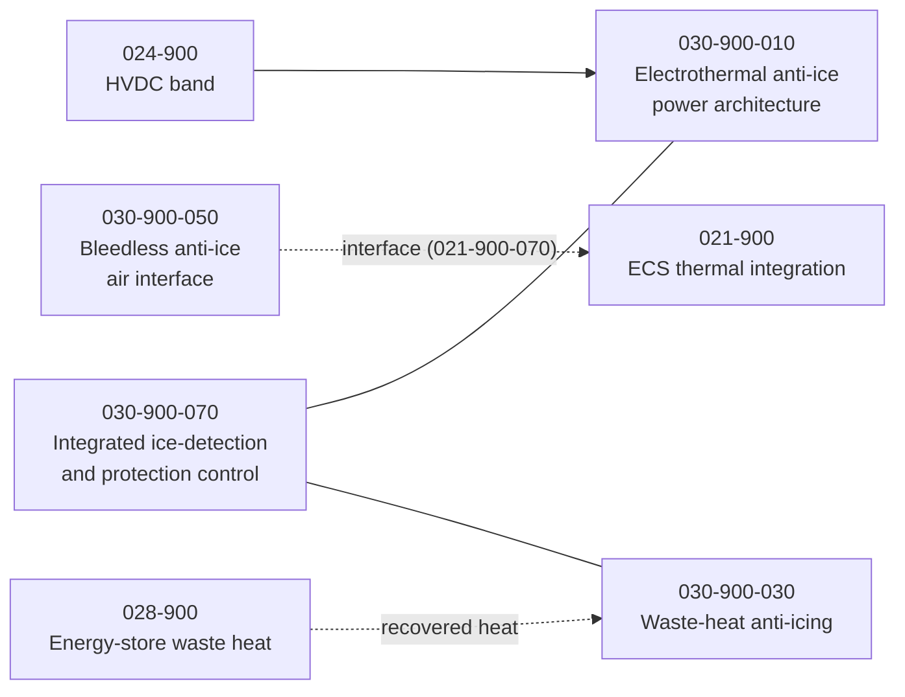

# 030-900_Bleedless-Energy-Integrated-Ice-Protection

**Chapter:** 030_Ice-and-Rain-Protection · **Node:** 030-900

## Scope

The bleedless / energy-integrated content of ice protection: the electrothermal anti-ice power architecture that replaces engine bleed, waste-heat anti-icing recovered from the energy system, the bleedless air interface, and integrated ice-detection and protection control. Cross-references the HVDC band (REF 024-900), ECS thermal integration (REF 021-900), and energy-store waste heat (REF 028-900).

## Context

## Subject register

| Subject | Title | Folder |
|---|---|---|
| 010 | Electrothermal Anti-Ice Power Architecture | [030-900-010](030-900-010_Electrothermal-Anti-Ice-Power-Architecture/) |
| 030 | Waste-Heat Anti-Icing | [030-900-030](030-900-030_Waste-Heat-Anti-Icing/) |
| 050 | Bleedless Anti-Ice Air Interface | [030-900-050](030-900-050_Bleedless-Anti-Ice-Air-Interface/) |
| 070 | Integrated Ice-Detection and Protection Control | [030-900-070](030-900-070_Integrated-Ice-Detection-and-Protection-Control/) |

## Boundary summary

Bleedless / energy-integrated ice-protection architecture and control: here. HVDC power source: 024-900. ECS thermal integration and bleedless air interface counterpart: 021-900. Energy-store waste heat: 028-900. Electric surface and probe heating that is already conventional: the STD section-nodes of this chapter (030-100 through 030-820).
