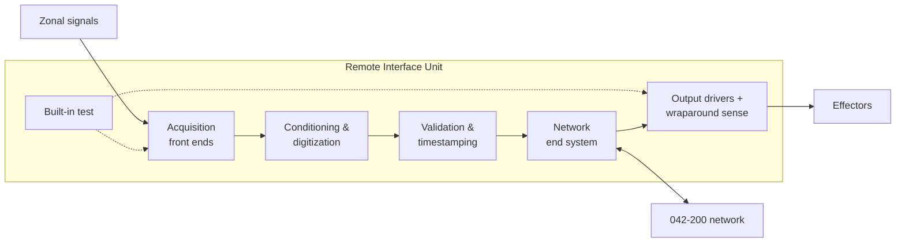

# 042-300-002 — Remote Unit Architecture and Installation Zones

**Node:** 042-300_Remote-Interface-and-IO-Concentration · **Subject:** 002

- Unit architecture: acquisition front ends per channel class, conditioning and digitization stages, a validation and timestamping function, output drivers with wraparound sensing, built-in test, and the network end system.
- Zonal installation rationale: units sit near signal clusters to minimize analog harness length, mass and susceptibility; zone assignment is a declared architecture item.
- Environmental capability classes per installation zone are declared unit properties; qualification data are evidence items (009).
- Channel-count granularity and spare-channel policy are declared growth reserves.

