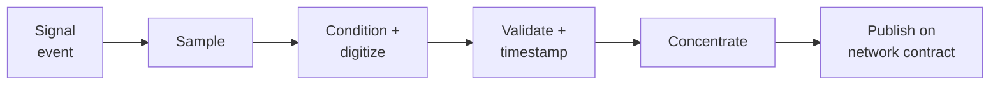

# 042-300-003 — Signal Acquisition Conditioning and Digitization

**Node:** 042-300_Remote-Interface-and-IO-Concentration · **Subject:** 003

- Channel classes are enumerated and characterized: analog (voltage/current/resistive), discrete (levels, open/ground), and legacy serial buses accepted at the boundary as characterized interfaces.
- Each channel declares its sampling policy, filtering, range, accuracy, and failure detection (open, short, out-of-range, stuck).
- Validation and timestamping happen at acquisition: a published value carries validity state and time reference (time base per 042-200-007).
- The acquisition-to-publication latency chain is a declared, analyzed property per channel class — an input to consumers' end-to-end budgets, not a discovered behavior.

