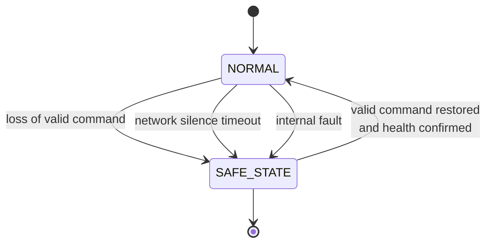

# 042-300-005 — Command Output and Effector Interfaces

**Node:** 042-300_Remote-Interface-and-IO-Concentration · **Subject:** 005

- Output channels drive effectors from received network commands under declared authority: command validity checking, wraparound monitoring of the achieved output, and annunciation of mismatch.
- Safe-state behavior is a declared, configuration-controlled property per output channel: on loss of valid command, network silence, or internal fault, each output transitions to its declared safe state.
- Effector ownership stays with functional chapters; the output channel's electrical characteristics and protection are owned here.

