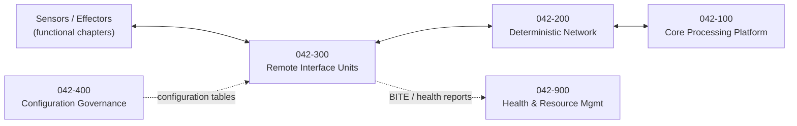

# 042-300_Remote-Interface-and-IO-Concentration

**Chapter:** 042_Integrated-Modular-Avionics · **Node:** 042-300

## Scope

Remote interface units and input/output concentration: zonal acquisition of sensor signals, signal conditioning and digitization, publication onto the deterministic network, command output toward effectors with wraparound monitoring and declared safe-state behavior. Sensors and effectors belong to their functional chapters; this node owns the interfacing and concentration function between them and the avionics network.

## Context

## Subject register

| Subject | Title | Folder |
|---|---|---|
| 000 | Remote Interface and IO Concentration Overview | [042-300-000](042-300-000_Remote-Interface-and-IO-Concentration-Overview/) |
| 001 | Scope and Definitions | [042-300-001](042-300-001_Scope-and-Definitions/) |
| 002 | Remote Unit Architecture and Installation Zones | [042-300-002](042-300-002_Remote-Unit-Architecture-and-Installation-Zones/) |
| 003 | Signal Acquisition Conditioning and Digitization | [042-300-003](042-300-003_Signal-Acquisition-Conditioning-and-Digitization/) |
| 004 | IO Concentration and Publication | [042-300-004](042-300-004_IO-Concentration-and-Publication/) |
| 005 | Command Output and Effector Interfaces | [042-300-005](042-300-005_Command-Output-and-Effector-Interfaces/) |
| 006 | Configuration and Data Loading | [042-300-006](042-300-006_Configuration-and-Data-Loading/) |
| 007 | Built In Test and Health Reporting | [042-300-007](042-300-007_Built-In-Test-and-Health-Reporting/) |
| 008 | Interfaces and Boundaries | [042-300-008](042-300-008_Interfaces-and-Boundaries/) |
| 009 | Evidence and Certification Data | [042-300-009](042-300-009_Evidence-and-Certification-Data/) |

## Boundary summary

Interfacing and concentration function: here. Sensors and effectors: functional chapters. Network contracts and time: 042-200. Consumer allocation: 042-400. Health consumption: 042-900. Data loading: 045. Harness and installation: wiring standard practices and structures.

