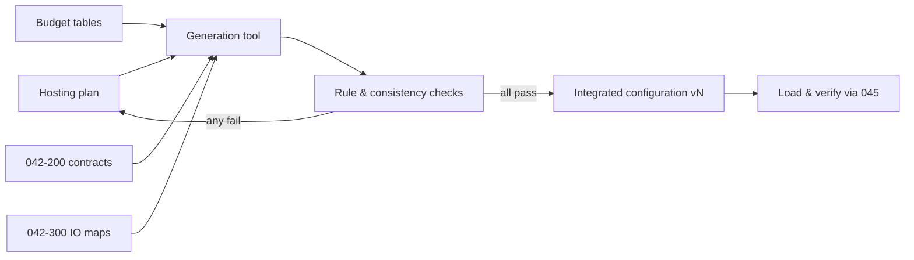

# 042-400-005 — Configuration Data Set and Change Control

**Node:** 042-400_Hosted-Function-Partitioning-and-Configuration · **Subject:** 005

- The integrated configuration is one versioned, consistency-checked data set: partition tables, budget tables, network contract references and IO mapping references — generated, rule-checked, never hand-assembled.
- Generation rules and consistency checks are themselves controlled items; a configuration is releasable only when all checks pass.
- Change classes are enumerated — add function, rebudget, re-host, remove — each with a declared re-verification scope.
- Loading and version verification follow the onboard-maintenance interfaces (REF 045); partial or mixed configurations are prohibited by doctrine.

