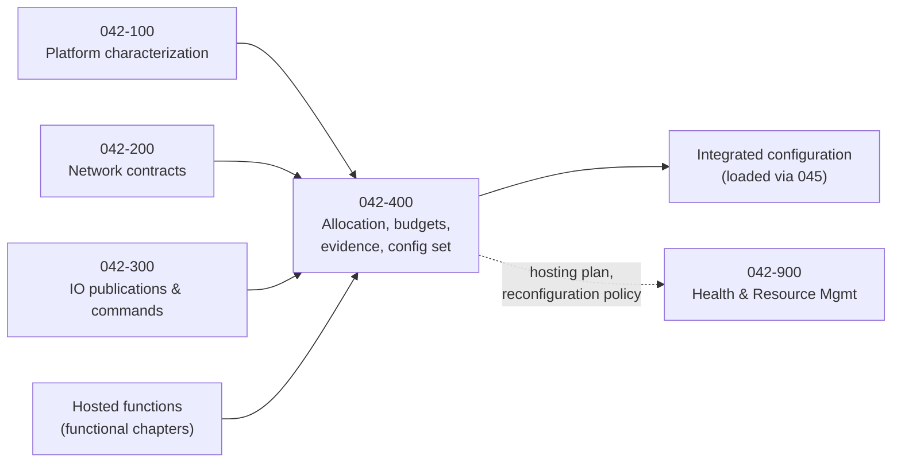

# 042-400_Hosted-Function-Partitioning-and-Configuration

**Chapter:** 042_Integrated-Modular-Avionics · **Node:** 042-400

## Scope

Governance of hosting: partition allocation, resource budgets, interference-protection evidence per hosted set, the integrated configuration data set and its change control, and the incremental acceptance model. This node turns the characterized platform (042-100) and its network contracts (042-200) into allocated, budgeted, evidenced hosting for functions owned by their functional chapters.

## Context

## Subject register

| Subject | Title | Folder |
|---|---|---|
| 000 | Hosted Function Partitioning and Configuration Overview | [042-400-000](042-400-000_Hosted-Function-Partitioning-and-Configuration-Overview/) |
| 001 | Scope and Definitions | [042-400-001](042-400-001_Scope-and-Definitions/) |
| 002 | Partition Allocation and Hosting Plan | [042-400-002](042-400-002_Partition-Allocation-and-Hosting-Plan/) |
| 003 | Resource Budgets and Guarantees | [042-400-003](042-400-003_Resource-Budgets-and-Guarantees/) |
| 004 | Interference Protection and Multicore Usage Domain | [042-400-004](042-400-004_Interference-Protection-and-Multicore-Usage-Domain/) |
| 005 | Configuration Data Set and Change Control | [042-400-005](042-400-005_Configuration-Data-Set-and-Change-Control/) |
| 006 | Incremental Acceptance and Roles | [042-400-006](042-400-006_Incremental-Acceptance-and-Roles/) |
| 007 | Machine Learning and Adaptive Hosted Functions | [042-400-007](042-400-007_Machine-Learning-and-Adaptive-Hosted-Functions/) |
| 008 | Interfaces and Boundaries | [042-400-008](042-400-008_Interfaces-and-Boundaries/) |
| 009 | Evidence and Certification Data | [042-400-009](042-400-009_Evidence-and-Certification-Data/) |

## Boundary summary

Allocation, budgets, interference evidence, configuration set and acceptance: here. Platform mechanisms: 042-100. Network contract governance: 042-200. Acquisition and outputs: 042-300. Runtime health and reconfiguration decisions: 042-900. Loading and DPP: 045. Security domains: 046-500. ML governance: 01-06. Functions: their functional chapters.

