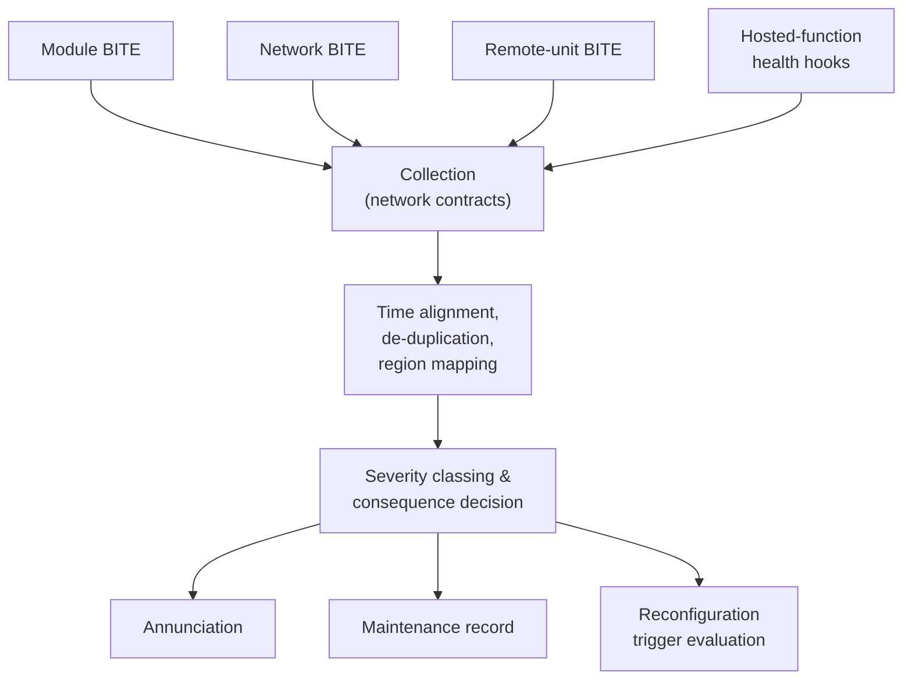

# 042-900-002 — Health Monitoring Architecture

**Node:** 042-900_Platform-Health-and-Resource-Management · **Subject:** 002

- Collection: health sources publish over ordinary network contracts — module BITE (042-100), network device BITE and traffic observability (042-200), remote unit and channel BITE (042-300), and hosted-function health hooks exposed by the platform API.
- Correlation: events are time-aligned (042-200-007 time base), de-duplicated and mapped to containment regions before any consequence is drawn.
- The monitoring function itself is hosted under the same partitioning guarantees it supervises; its own failure is a declared, contained case.

