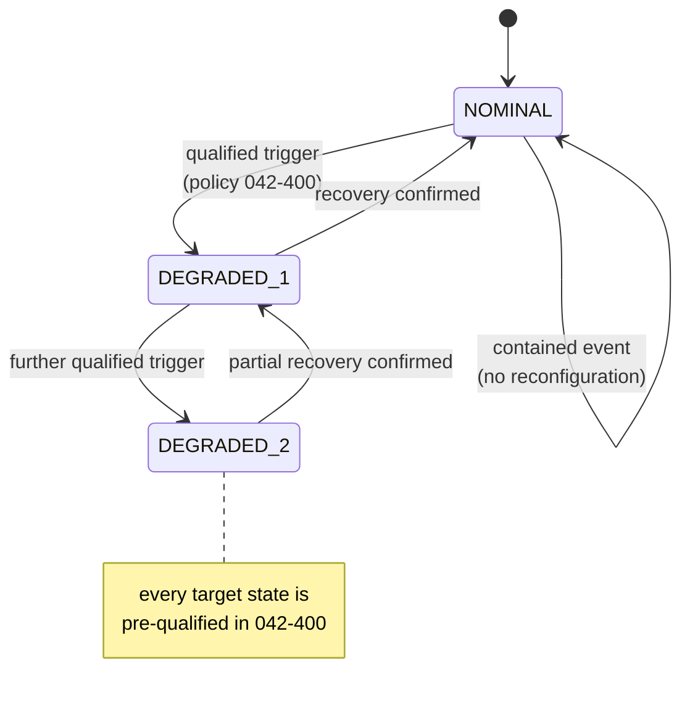

# 042-900-005 — Degraded Modes and Reconfiguration

**Node:** 042-900_Platform-Health-and-Resource-Management · **Subject:** 005

- Reconfiguration doctrine: the platform moves only between pre-qualified configurations — selection among verified states, never synthesis of a new state in operation.
- Triggers, priorities and inhibitions are declared in the reconfiguration policy (042-400); this node evaluates triggers against correlated health state and commands the transition.
- Transitions are managed: ordered function migration or shedding, network contract continuity per 042-200, and positive confirmation of the reached state before annunciation of completion.
- Every transition is recorded with cause, path and confirmation — a reconfiguration without a record did not happen.

