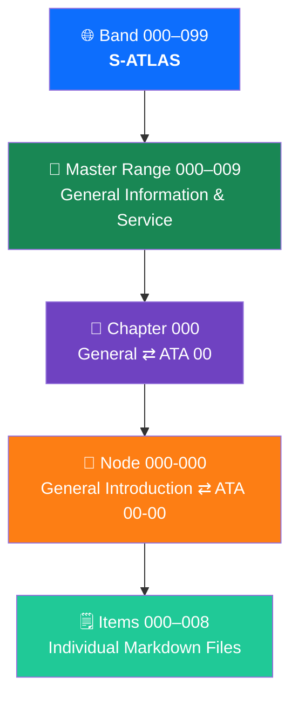
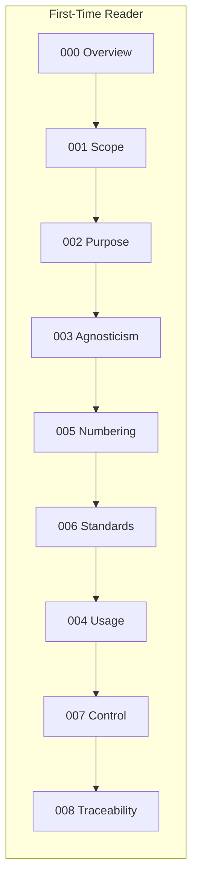

# 000-000-000 — General Introduction: Overview

> **Node:** `000-000` · **Item:** `000` · **ATA ref:** 00-00-00
> **Owner:** Q-DATAGOV · **Status:** baseline · **Agnostic:** yes

This item is the map of node `000-000`. It orients a new reader to the purpose and layout of the entire S-ATLAS data set and to this node's role within it.

---

## Index

- [1. What S-ATLAS Is](#1-what-g-atlas-is)
- [2. Why This Node Exists](#2-why-this-node-exists)
- [3. Scope of This Data Set](#3-scope-of-this-data-set)
- [4. S-ATLAS Four-Tier Hierarchy](#4-g-atlas-four-tier-hierarchy)
- [5. Structure of This Node](#5-structure-of-this-node)
- [6. Reading Order](#6-reading-order)
- [Glossary](#glossary)
- [References and Citations](#references-and-citations)

---

## 1. What S-ATLAS Is

**S-ATLAS** (Sustainable Aviation Top-Level Architecture Schema) is a programme- and product-**agnostic** architectural standard for aviation systems. It defines functions, limits, zones, and intervals in neutral terms — terms that hold true regardless of whether the aircraft uses battery-electric, hydrogen, ammonia, SAF, hybrid, or any other energy carrier, and regardless of airframe geometry (tube-and-wing, blended-wing-body, etc.).

S-ATLAS mirrors the structure of **ATA 100 / iSpec 2200** so that every chapter, section, and subject has a direct analogue in the existing aerospace documentation ecosystem. Where ATA has no equivalent — primarily for novel energy carriers and sustainability accounting — S-ATLAS adds **agnostic delta nodes** (suffix `-900`).

---

## 2. Why This Node Exists

Node `000-000` (ATA 00-00) is the **entry point**. It exists so that any stakeholder — engineer, certifier, supplier, auditor, or programme manager — can answer the following questions before reading any other item in the data set:

| Question | Item that answers it |
|---|---|
| What is S-ATLAS and what does it cover? | [`000`](../000-000-000_General-Introduction-Overview/) (this item) |
| What terms and scope apply? | [`100`](../000-000-100_Scope-and-Definitions/) |
| Why does this standard exist? | [`200`](../000-000-200_Purpose-and-Mission/) |
| How is it kept neutral across programmes? | [`300`](../000-000-300_Programme-and-Product-Agnosticism/) |
| How do I navigate and use it? | [`400`](../000-000-400_How-to-Use-This-Architecture-and-Data-Set/) |
| How is it numbered? | [`500`](../000-000-500_Numbering-and-Structure-Orientation/) |
| How does it relate to ATA / iSpec 2200? | [`600`](../000-000-600_Standards-Alignment-ATA-iSpec-2200/) |
| How is it version-controlled? | [`700`](../000-000-700_Document-Control-and-Configuration/) |
| How does each item trace to evidence? | [`800`](../000-000-800_Traceability-and-Evidence-Index/) |

---

## 3. Scope of This Data Set

S-ATLAS covers **band `000–099`** — the top-level architecture schema — and is organised into ten **master ranges** (`000–009` through `090–099`). This node resides in master range `000–009` (General Information and Service), chapter `000` (General), code section `000-000`.

The data set is:

- **A single-source-of-truth (SSOT)** standard. Programmes publish it into their own CSDBs (PUB) via impact studies; they do not modify the SSOT.
- **Lifecycle-governed**: artefact maturity follows the Q+ATLANTIDE LC-letter stages (LC-A Conceptual Design through LC-N Nature Sustainment).
- **Certification-ready**: every item is structured to support traceability from architecture to requirement, evidence, and Data Module Code (DMC).

---

## 4. S-ATLAS Four-Tier Hierarchy



---

## 5. Structure of This Node

```text
000-000_General-Introduction/
├── README.md                                                    ← node index
├── 000-000-000-General-Introduction-Overview.md                 ← this file
├── 000-000-001-Scope-and-Definitions.md
├── 000-000-002-Purpose-and-Mission.md
├── 000-000-003-Programme-and-Product-Agnosticism.md
├── 000-000-004-How-to-Use-This-Architecture-and-Data-Set.md
├── 000-000-005-Numbering-and-Structure-Orientation.md
├── 000-000-006-Standards-Alignment-ATA-iSpec-2200.md
├── 000-000-007-Document-Control-and-Configuration.md
└── 000-000-008-Traceability-and-Evidence-Index.md
```

---

## 6. Reading Order

For a first-time reader: `000` → `001` → `002` → `003` → `005` → `006` → `004` → `007` → `008`.

For a programme integrator binding S-ATLAS to a specific product: `003` → `006` → `007` → `008`.

For an auditor or certifier: `007` → `008` → `006`.



---

## Glossary

| Term / Acronym | Definition |
|---|---|
| **S-ATLAS** | Sustainable Aviation Top-Level Architecture Schema — agnostic architecture standard for aviation systems. |
| **SSOT** | Single Source of Truth — the authoritative S-ATLAS repository. |
| **PUB** | Programme publication — an S1000D CSDB instance derived from SSOT. |
| **CSDB** | Common Source DataBase — S1000D-compliant storage for programme data modules. |
| **DMC** | Data Module Code — S1000D identifier for a programme data module. |
| **ATA** | Air Transport Association — publisher of ATA 100 / iSpec 2200 documentation structure standard. |
| **iSpec 2200** | ATA specification extending ATA 100 with structured authoring rules for S1000D-compatible content. |
| **S1000D** | International specification for technical publications; defines data module codes and CSDB rules. |
| **LC-letter stage** | Q+ATLANTIDE lifecycle maturity phase: LC-A (Conceptual Design) through LC-N (Nature Sustainment). |
| **Agnostic** | No programme- or product-specific assumption; valid across all energy carriers and airframe geometries. |
| **Delta node** | S-ATLAS node with suffix `-900` covering topics with no ATA equivalent; tagged `[G]`. |
| **Band** | Top-level numbering block of S-ATLAS. Band `000–099` is the S-ATLAS band. |
| **Master range** | Ten-chapter block within a band (e.g. `000–009`). |
| **Node** | Primary addressable S-ATLAS unit; maps to an ATA chapter-section. |
| **Item** | Single markdown file inside a node; maps to an ATA subject. |
| **IEF** | Integrity Evidence Framework — evidence anchoring scheme using SHA-256 hashes. |
| **SAF** | Sustainable Aviation Fuel. |

---

## References and Citations

| # | Reference | External Link | Applicability |
|---|---|---|---|
| R1 | Model Digital Constitution | [`00_MODEL-DIGITAL-CONSTITUTION/`](../../../../../../../../../00_MODEL-DIGITAL-CONSTITUTION/) | Constitutional authority; S-ATLAS is constituted power under MDC |
| R2 | ATA 100 / iSpec 2200 (Airlines for America) | <https://www.airlines.org/data/ispec-2200/> | Chapter–section–subject numbering basis |
| R3 | S1000D Issue 4.2 | <https://www.s1000d.net/> | Data module and DMC rules |
| R4 | ICAO Annex 8 — Airworthiness of Aircraft | <https://www.icao.int/safety/airnavigation/nationalitymarks/annexes_booklet/annex8.pdf> | Regulatory ceiling above all documentation standards |
| R5 | EASA CS-25 | <https://www.easa.europa.eu/en/document-library/certification-specifications/cs-25-large-aeroplanes> | Primary airworthiness certification basis for large aircraft |

---

*Document footprint: S-ATLAS-000-000-000 · v0.1.0 · 2026-06-05 · Owner: Q-DATAGOV · Status: baseline · SHA-256: TBS*
