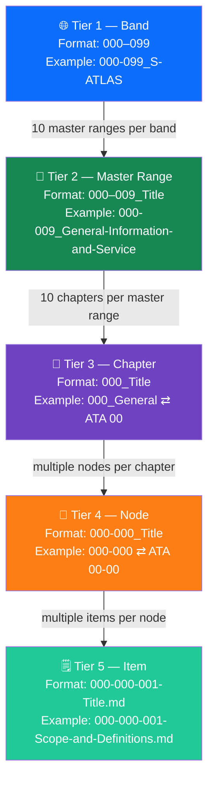

# 000-000-500 — Numbering and Structure Orientation

> **Node:** `000-000` · **Item:** `005` · **ATA ref:** 00-00-05
> **Owner:** Q-DATAGOV · **Status:** baseline · **Agnostic:** yes

---

## Index

- [1. Four-Tier Hierarchy](#1-four-tier-hierarchy)
- [2. Tier Definitions](#2-tier-definitions)
  - [Tier 1 — Band](#tier-1--band)
  - [Tier 2 — Master Range](#tier-2--master-range)
  - [Tier 3 — Chapter (physical folder)](#tier-3--chapter-physical-folder)
  - [Tier 4 — Node (Code Section)](#tier-4--node-code-section)
  - [Tier 5 — Item (Subject File)](#tier-5--item-subject-file)
- [3. Section Scaling Rule](#3-section-scaling-rule)
- [4. Naming Conventions](#4-naming-conventions)
- [5. Worked Example — Full Path](#5-worked-example--full-path)
- [Tier Hierarchy Diagram](#tier-hierarchy-diagram)
- [Glossary](#glossary)
- [References and Citations](#references-and-citations)

---

## 1. Four-Tier Hierarchy

S-ATLAS uses a four-tier hierarchy that mirrors ATA 100 / iSpec 2200:

```text
Band  ──►  Master Range  ──►  Chapter (folder)  ──►  Node (code section)  ──►  Item (subject file)
```

Each tier has a defined numbering format and a corresponding physical location in the repository.

---

## 2. Tier Definitions

### Tier 1 — Band

| Attribute | Value |
|---|---|
| Format | `000–099`, `100–199`, … |
| Example | `000-099_S-ATLAS` |
| Physical | Top-level folder under `01-03-01_Q+ATLANTIDE/` |
| ATA mirror | Major subject group |

### Tier 2 — Master Range

| Attribute | Value |
|---|---|
| Format | `00X–00(X+9)_<Title>` |
| Example | `000-009_General-Information-and-Service` |
| Physical | Sub-folder within the band folder |
| ATA mirror | Group of ATA chapters |
| Note | Previously called *code range* — that term is retired |

### Tier 3 — Chapter (physical folder)

| Attribute | Value |
|---|---|
| Format | `00X_<Title>` |
| Example | `000_General` ⇄ ATA 00 |
| Physical | Sub-folder within the master-range folder |
| ATA mirror | ATA chapter (single digit 0–9 within the master range) |

### Tier 4 — Node (Code Section)

| Attribute | Value |
|---|---|
| Format | `00X-Y00_<Title>` |
| Example | `000-000` ⇄ ATA 00-00 |
| Physical | Sub-folder within the chapter folder |
| ATA mirror | ATA chapter-section (`XX-YY0`) |
| Section scaling | ATA section `Y0` → S-ATLAS `Y00` (multiply by 10) |
| `-000` convention | The `00X-000` node is the chapter-general / overview node |
| `-900` convention | Delta node for topics with no ATA equivalent; tagged `[G]` |

### Tier 5 — Item (Subject File)

| Attribute | Value |
|---|---|
| Format | `<node>-<item>-<Title>.md` |
| Example | `000-000-001-Scope-and-Definitions.md` ⇄ ATA 00-00-01 |
| Physical | Markdown file inside the node folder |
| ATA mirror | ATA subject (`XX-YY-ZZ`) |
| Item `000` | Always the overview item for the node |
| Item `001` | Always scope and definitions |

---

## 3. Section Scaling Rule

ATA uses a two-digit section suffix (`Y0`). S-ATLAS uses a three-digit suffix (`Y00`) to allow future expansion of item codes beyond 99 without ambiguity:

| ATA section | S-ATLAS node suffix | Example |
|---|---|---|
| `00-00` | `-000` | `000-000` ⇄ ATA 00-00 |
| `02-10` | `-100` | `002-100` ⇄ ATA 02-10 |
| `05-50` | `-500` | `005-500` ⇄ ATA 05-50 |
| — (delta) | `-900` | `000-900` — no ATA equivalent |

---

## 4. Naming Conventions

| Element | Rule | Example |
|---|---|---|
| Band folder | `<range>_<Acronym>` | `000-099_S-ATLAS` |
| Master-range folder | `<range>_<Title-words-hyphenated>` | `000-009_General-Information-and-Service` |
| Chapter folder | `<chapter-number>_<Title-words-hyphenated>` | `000_General` |
| Node folder | `<node-id>_<Title-words-hyphenated>` | `000-000_General-Introduction` |
| Item file | `<node>-<item>-<Title-words-hyphenated>.md` | `000-000-001-Scope-and-Definitions.md` |

Title words use **Title-Case-With-Hyphens** (each significant word capitalised; spaces replaced by hyphens).

---

## 5. Worked Example — Full Path

```text
01_OPTIONS_ARCHITECTURE/
└── 01-03_TECHNOLOGIES/
    └── 01-03-01_Q+ATLANTIDE/
        └── 000-099_S-ATLAS/                               ← band
            └── 000-009_General-Information-and-Service/   ← master range
                └── 000_General/                           ← chapter (ATA 00)
                    └── 000-000_General-Introduction/      ← node (ATA 00-00)
                        └── 000-000-005-Numbering-and-Structure-Orientation.md  ← item (ATA 00-00-05)
```

---

## Tier Hierarchy Diagram



---

## Glossary

| Term / Acronym | Definition |
|---|---|
| **Band** | Top-level S-ATLAS numbering block (e.g. `000–099`). |
| **Master range** | Ten-chapter block within a band. Previously called *code range* (retired term). |
| **Chapter** | Physical folder corresponding to one ATA chapter. |
| **Node** | Primary S-ATLAS content unit; maps to an ATA chapter-section. |
| **Item** | Single markdown file inside a node; maps to an ATA subject. |
| **Delta node** | Node with suffix `-900`; covers functions with no ATA equivalent; tagged `[G]`. |
| **Section scaling** | ATA section `Y0` mapped to S-ATLAS `Y00` (×10 multiplier). |
| **Code range** | Retired term for *master range*. |
| **ATA** | Air Transport Association — publisher of ATA 100. |
| **iSpec 2200** | ATA specification for structured technical publications. |
| **SNS** | System/Sub-system/Subject — S1000D code component. |
| **Title-Case-With-Hyphens** | S-ATLAS naming convention for folder and file titles. |

---

## References and Citations

| # | Reference | External Link | Applicability |
|---|---|---|---|
| R1 | ATA 100 / iSpec 2200 (Airlines for America) | <https://www.airlines.org/data/ispec-2200/> | Chapter–section–subject numbering basis and section scaling reference |
| R2 | S1000D Issue 4.2 — SNS rules | <https://www.s1000d.net/> | System/Sub-system/Subject code alignment with node and item numbering |
| R3 | S-ATLAS Band README | [`000-099_S-ATLAS/README.md`](../../../../../../README.md) | Band-level numbering overview and master-range register |
| R4 | Master Range README | [`000-009_.../README.md`](../../../README.md) | Chapter-level node register |

---

*Document footprint: S-ATLAS-000-000-005 · v0.1.0 · 2026-06-05 · Owner: Q-DATAGOV · Status: baseline · SHA-256: TBS*
