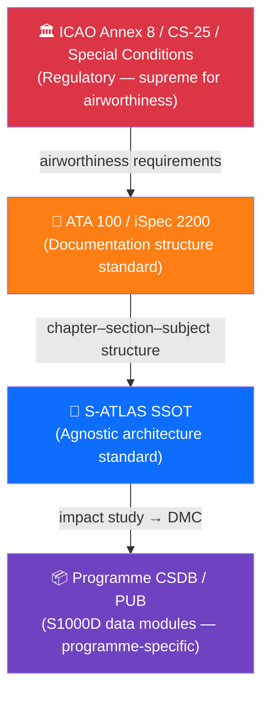

# 000-000-600 — Standards Alignment: ATA 100 / iSpec 2200 / S1000D

> **Node:** `000-000` · **Item:** `006` · **ATA ref:** 00-00-06
> **Owner:** Q-DATAGOV · **Status:** baseline · **Agnostic:** yes

---

## Index

- [1. Purpose of This Item](#1-purpose-of-this-item)
- [2. ATA 100 Alignment](#2-ata-100-alignment)
  - [2.1 Chapter Mirror](#21-chapter-mirror)
  - [2.2 Section Mirror](#22-section-mirror)
  - [2.3 What S-ATLAS Adds](#23-what-g-atlas-adds)
  - [2.4 Chapters Reserved by ATA for Operators](#24-chapters-reserved-by-ata-for-operators)
- [3. iSpec 2200 Alignment](#3-ispec-2200-alignment)
- [4. S1000D Alignment](#4-s1000d-alignment)
  - [4.1 Data Module Codes](#41-data-module-codes)
  - [4.2 Issue Alignment](#42-issue-alignment)
  - [4.3 CSDB and SSOT+PUB](#43-csdb-and-ssotpub)
- [5. Standards Hierarchy](#5-standards-hierarchy)
- [Standards Hierarchy Diagram](#standards-hierarchy-diagram)
- [Glossary](#glossary)
- [References and Citations](#references-and-citations)

---

## 1. Purpose of This Item

This item documents how S-ATLAS aligns to, extends, and differs from the three principal technical publication and architecture standards used in aerospace: **ATA 100**, **iSpec 2200**, and **S1000D**.

---

## 2. ATA 100 Alignment

### 2.1 Chapter Mirror

S-ATLAS mirrors ATA 100 chapter numbering across its first nine bands (`000–099` through `800–899`). Each S-ATLAS chapter `00X` corresponds directly to ATA chapter `0X`.

| S-ATLAS chapter | ATA chapter | Title |
|---|---|---|
| `000` | ATA 00 | General / Introduction |
| `001` | ATA 01 | Maintenance Policy |
| `002` | ATA 02 | Operations |
| `004` | ATA 04 | Airworthiness Limitations |
| … | … | … |

### 2.2 Section Mirror

S-ATLAS section numbers are ATA section numbers scaled by ×10 (three-digit suffix). This preserves full bijective mapping while allowing item codes beyond 99.

| ATA section | S-ATLAS node |
|---|---|
| ATA 00-00 | `000-000` |
| ATA 05-10 | `005-100` |
| ATA 05-50 | `005-500` |

### 2.3 What S-ATLAS Adds

ATA 100 does not define architecture content for:
- Novel energy carriers (batteries, cryogenic hydrogen, ammonia, fuel cells)
- Digital Product Passports
- Lifecycle-phase sustainability accounting (LC-letter stages LC-A through LC-N)
- Post-retirement nature-sustainment

S-ATLAS adds **agnostic delta nodes** (`00X-900`) for each of these. These nodes are formally labelled `[G]` and have no ATA equivalent.

### 2.4 Chapters Reserved by ATA for Operators

ATA chapters 00–03 are reserved by ATA 100 for operator use; ATA does not standardise their sections. S-ATLAS defines sections within these chapters as **S-ATLAS-defined** (not ATA standard). They are marked `†` in the node register.

---

## 3. iSpec 2200 Alignment

iSpec 2200 (ATA) extends ATA 100 with structured authoring rules, module types, and publication specifications for S1000D-compatible content.

S-ATLAS aligns to iSpec 2200 by:

1. Using the ATA/iSpec 2200 chapter–section–subject numbering as the basis for node and item identifiers.
2. Structuring items as **data-module-equivalent content units**, each with a defined purpose, owner, and evidence anchor.
3. Ensuring every item has a natural mapping to an S1000D System/Sub-system/Subject (SNS) code.

S-ATLAS does **not** prescribe iSpec 2200 mark-up tags within markdown files; mark-up is applied at PUB (CSDB) stage by the programme toolchain.

---

## 4. S1000D Alignment

### 4.1 Data Module Codes

Each S-ATLAS item maps to a Data Module Code (DMC) in the programme CSDB. The canonical short form is:

```text
DMC-<PROGRAMME>-<node>-<item>
```

Examples:
- `DMC-EWTW-000-000-001` — eWTW CSDB module for item `001` of node `000-000`
- `DMC-HBWB-004-900-002` — hBWB CSDB module for item `002` of node `004-900`

Full S1000D Issue 4.2 DMC format adds Model Identification Code (MIC), System/Sub-system code, Disassembly Code, Information Code, and Applicability code; these are determined by the programme at PUB stage.

### 4.2 Issue Alignment

S-ATLAS is aligned to **S1000D Issue 4.2** as the baseline. Later issues may be adopted by individual programmes without requiring amendment to the SSOT, provided the SNS mapping remains valid.

### 4.3 CSDB and SSOT+PUB

```text
S-ATLAS SSOT (this repository)
    └── impact study (programme)
        └── Programme CSDB / PUB (S1000D data modules)
```

The SSOT is not itself an S1000D CSDB. It is the upstream source that programmes transform into S1000D data modules. This separation is the **SSOT+PUB doctrine**.

---

## 5. Standards Hierarchy

```text
ICAO Annex 8 / CS-25 / Special Conditions   (regulatory, supreme for airworthiness)
    └── ATA 100 / iSpec 2200                 (documentation structure standard)
        └── S-ATLAS (SSOT)                   (agnostic architecture standard — this data set)
            └── Programme CSDB (PUB)         (programme-specific instantiation, S1000D)
```

S-ATLAS sits between iSpec 2200 and the programme CSDB. It does not override regulatory standards; it provides the architectural framework within which programme documentation is organised.

---

## Standards Hierarchy Diagram



---

## Glossary

| Term / Acronym | Definition |
|---|---|
| **ATA 100** | Air Transport Association specification defining chapter-based aviation documentation structure. |
| **iSpec 2200** | ATA extension to ATA 100 adding structured authoring rules and S1000D compatibility. |
| **S1000D** | International specification for technical publications; defines data module codes and CSDB rules. |
| **DMC** | Data Module Code — S1000D identifier for a programme data module. |
| **MIC** | Model Identification Code — S1000D DMC component identifying the aircraft model. |
| **SNS** | System/Sub-system/Subject — S1000D code component aligning to ATA chapter-section-subject. |
| **CSDB** | Common Source DataBase — S1000D-compliant programme document store. |
| **SSOT** | Single Source of Truth — the authoritative S-ATLAS repository. |
| **PUB** | Programme publication — S1000D CSDB instance derived from SSOT via impact study. |
| **SSOT+PUB** | Two-layer publication architecture: SSOT standard + PUB programme instances. |
| **Delta node** | S-ATLAS node with suffix `-900`; tagged `[G]`; no ATA equivalent. |
| **DPP** | Digital Product Passport — lifecycle sustainability data record. |
| **LC-letter stage** | Q+ATLANTIDE lifecycle maturity phase (LC-A … LC-N). |
| **ICAO** | International Civil Aviation Organization — publisher of Annex 8 (Airworthiness). |
| **CS-25** | EASA Certification Specifications for Large Aeroplanes. |
| **Bijective mapping** | One-to-one correspondence between ATA section numbers and S-ATLAS node suffixes. |

---

## References and Citations

| # | Reference | External Link | Applicability |
|---|---|---|---|
| R1 | ATA 100 / iSpec 2200 (Airlines for America) | <https://www.airlines.org/data/ispec-2200/> | Primary documentation structure standard S-ATLAS mirrors |
| R2 | S1000D Issue 4.2 | <https://www.s1000d.net/> | Data module, CSDB, DMC, and SNS rules |
| R3 | ICAO Annex 8 — Airworthiness of Aircraft | <https://www.icao.int/safety/airnavigation/nationalitymarks/annexes_booklet/annex8.pdf> | Regulatory ceiling above all documentation standards |
| R4 | EASA CS-25 Large Aeroplanes | <https://www.easa.europa.eu/en/document-library/certification-specifications/cs-25-large-aeroplanes> | Primary certification basis for large aircraft programmes |
| R5 | FAA AC 25.1309-1A | <https://rgl.faa.gov/Regulatory_and_Guidance_Library/rgAdvisoryCircular.nsf/0/99c827db969ed18e852569b90069e99c/$FILE/AC25.1309-1A.pdf> | System design and analysis guidance for complex systems |

---

*Document footprint: S-ATLAS-000-000-006 · v0.1.0 · 2026-06-05 · Owner: Q-DATAGOV · Status: baseline · SHA-256: TBS*
