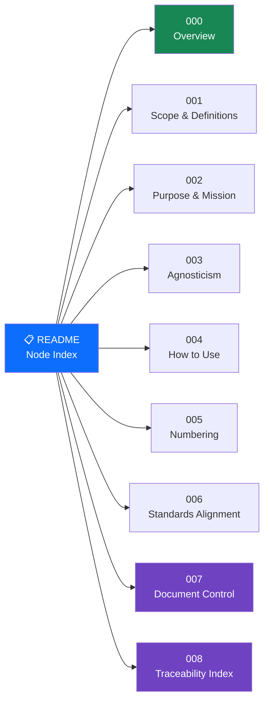

# 000-000 — General / Introduction

**S-ATLAS Node (Code Section) — Node README**

> **Canonical path**
> `01_OPTIONS_ARCHITECTURE/01-03_TECHNOLOGIES/01-03-01_Q+ATLANTIDE/000-099_S-ATLAS/000-009_General-Information-and-Service/000_General/000-000_General-Introduction/`
>
> **Band:** `000–099` S-ATLAS (Sustainable Aviation Top-Level Architecture Schema)
> **Master range:** `000–009` General Information and Service
> **Chapter:** `000` ⇄ ATA 00 (General)
> **Node / code section:** `000-000` ⇄ **ATA 00-00**
> **Owner:** Q-DATAGOV · **Status:** baseline · **Agnostic:** yes (programme/product-neutral)

---

## Index

- [Item Set](#item-set)
- [Node Diagram](#node-diagram)
- [Governance](#governance)
- [Navigation](#navigation)
- [Glossary](#glossary)
- [References and Citations](#references-and-citations)

---

## Item Set

This node is the **orientation entry point** for the entire S-ATLAS data set. It tells a reader what the schema is, why it exists, how it is numbered, how it relates to ATA 100 / iSpec 2200, how it is controlled, and how every item ties back to evidence — **without assuming any energy carrier or airframe geometry**.

| Item | File | ATA ref | Purpose |
|---|---|---|---|
| `000` | [`000-000-000-General-Introduction-Overview.md`](000-000-000-General-Introduction-Overview.md) | 00-00-00 | What this node is; map of the rest |
| `001` | [`000-000-001-Scope-and-Definitions.md`](000-000-001-Scope-and-Definitions.md) | 00-00-01 | Scope of the master range + core terms |
| `002` | [`000-000-002-Purpose-and-Mission.md`](000-000-002-Purpose-and-Mission.md) | 00-00-02 | Why the standard exists |
| `003` | [`000-000-003-Programme-and-Product-Agnosticism.md`](000-000-003-Programme-and-Product-Agnosticism.md) | 00-00-03 | The neutral-standard principle |
| `004` | [`000-000-004-How-to-Use-This-Architecture-and-Data-Set.md`](000-000-004-How-to-Use-This-Architecture-and-Data-Set.md) | 00-00-04 | Reading order, navigation, tags |
| `005` | [`000-000-005-Numbering-and-Structure-Orientation.md`](000-000-005-Numbering-and-Structure-Orientation.md) | 00-00-05 | Master range → chapter → node → item |
| `006` | [`000-000-006-Standards-Alignment-ATA-iSpec-2200.md`](000-000-006-Standards-Alignment-ATA-iSpec-2200.md) | 00-00-06 | ATA / iSpec 2200 / S1000D relationship |
| `007` | [`000-000-007-Document-Control-and-Configuration.md`](000-000-007-Document-Control-and-Configuration.md) | 00-00-07 | Versioning, change control, SSOT+PUB |
| `008` | [`000-000-008-Traceability-and-Evidence-Index.md`](000-000-008-Traceability-and-Evidence-Index.md) | 00-00-08 | Item → requirement → evidence → DMC |

---

## Node Diagram

---

## Governance

Governed under the **SSOT+PUB** doctrine. Lifecycle stages follow the Q+ATLANTIDE LC-letter model (LC-A through LC-N). This node is **SSOT**; programme CSDBs are **PUB**.

---

## Navigation

| Up | Sideways |
|---|---|
| [`000_General/README.md`](../README.md) | [`000-100_Applicability-and-Effectivity/`](../000-100_Applicability-and-Effectivity/) |
| [`000-009_General-Information-and-Service/README.md`](../../README.md) | [`000-200_Identification-and-Designation/`](../000-200_Identification-and-Designation/) |
| [`000-099_S-ATLAS/`](../../../../../) | [`000-300_Vocabulary-Units-and-Reference-Frames/`](../000-300_Vocabulary-Units-and-Reference-Frames/) |

---

## Glossary

| Term / Acronym | Definition |
|---|---|
| **S-ATLAS** | Sustainable Aviation Top-Level Architecture Schema — agnostic architecture standard for aviation systems. |
| **SSOT** | Single Source of Truth — the authoritative S-ATLAS repository; programmes may not modify it. |
| **PUB** | Programme publication — an S1000D CSDB instance derived from SSOT via impact study. |
| **SSOT+PUB** | Two-layer publication architecture: SSOT (this standard) and PUB (programme CSDB). |
| **Node** | Primary addressable unit of S-ATLAS; maps to an ATA chapter-section (e.g. `000-000` ⇄ ATA 00-00). |
| **Item** | A single markdown file inside a node; maps to an ATA subject. |
| **Band** | Top-level numbering block. Band `000–099` is S-ATLAS. |
| **Master range** | A ten-chapter block within a band (e.g. `000–009`). |
| **ATA** | Air Transport Association numbering standard (ATA 100 / iSpec 2200). |
| **DMC** | Data Module Code — an S1000D identifier assigned to a PUB instance of a S-ATLAS item. |
| **CSDB** | Common Source DataBase — S1000D-compliant storage for programme data modules. |
| **Q-DATAGOV** | The Q-Division responsible for S-ATLAS content governance. |
| **LC-letter stage** | Q+ATLANTIDE lifecycle maturity phase (LC-A Conceptual Design … LC-N Nature Sustainment). |
| **IEF** | Integrity Evidence Framework — the evidence anchoring scheme using SHA-256 hashes. |
| **Agnostic** | Content attribute: no programme- or product-specific assumption. |

---

## References and Citations

| # | Reference | External Link | Applicability |
|---|---|---|---|
| R1 | Model Digital Constitution | [`00_MODEL-DIGITAL-CONSTITUTION/`](../../../../../../../../00_MODEL-DIGITAL-CONSTITUTION/) | Constitutional authority for all S-ATLAS content |
| R2 | ATA 100 / iSpec 2200 (Airlines for America) | <https://www.airlines.org/data/ispec-2200/> | Chapter–section–subject numbering basis |
| R3 | S1000D Issue 4.2 | <https://www.s1000d.net/> | Data module and DMC rules |
| R4 | ICAO Annex 8 — Airworthiness of Aircraft | <https://www.icao.int/safety/airnavigation/nationalitymarks/annexes_booklet/annex8.pdf> | Supreme airworthiness regulatory reference |
| R5 | S-ATLAS Band README | [`000-099_S-ATLAS/README.md`](../../../../../README.md) | Band governance, all master ranges |

---

*Document footprint: S-ATLAS-000-000-README · v0.1.0 · 2026-06-05 · Owner: Q-DATAGOV · Status: baseline · SHA-256: TBS*
