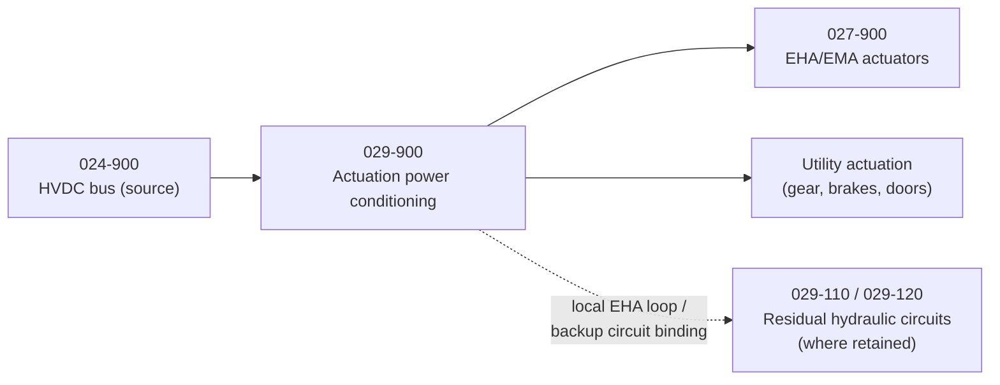

# 029-900_Distributed-Electric-Actuation-and-Utility-Power

**Chapter:** 029_Actuation-and-Utility-Power · **Node:** 029-900

## Scope

Distributed-electric actuation and utility power. Centralized hydraulics (No.1/2/3 systems) are footprint: this node draws actuation and utility power distributed-electric from the HVDC bus (REF 024-900) and conditions it for flight-control actuation (EHA/EMA, REF 027-900) and utility actuation (gear, brakes, doors). Where a local EHA hydraulic loop or a single backup circuit is retained, it binds under `029-110` / `029-120`; a fully more-electric configuration routes all actuation power through this node.

## Context

## Subject register

| Subject | Title | Folder |
|---|---|---|
| 100 | Distributed Electric Actuation Power | [029-900-100](029-900-100_Distributed-Electric-Actuation-Power/) |
| 300 | Local EHA Hydraulic Loop | [029-900-300](029-900-300_Local-EHA-Hydraulic-Loop/) |
| 500 | Utility Actuation Electric Power | [029-900-500](029-900-500_Utility-Actuation-Electric-Power/) |
| 700 | Actuation Power Conditioning from HVDC | [029-900-700](029-900-700_Actuation-Power-Conditioning-from-HVDC/) |

## Boundary summary

Actuation and utility power conditioning and distribution: here. HVDC generation and systems-power architecture: 024-900. EHA/EMA actuator architecture: 027-900. Residual hydraulic circuits: 029-110 / 029-120. Indicating: 029-300 series. Ground-service connections: 029-130.
