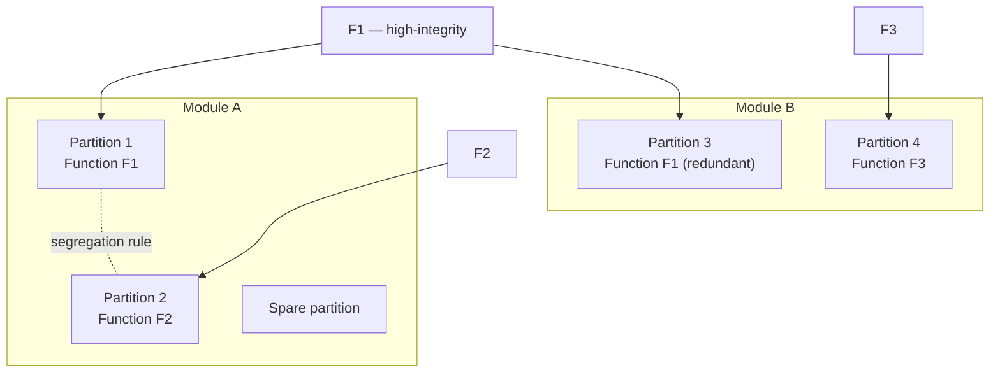

# 042-400-200 — Partition Allocation and Hosting Plan

**Node:** 042-400_Hosted-Function-Partitioning-and-Configuration · **Subject:** 002

- The hosting plan is a controlled architecture item: function-to-partition-to-module assignment with recorded rationale.
- Segregation and co-location rules are declared: independence requirements, mixed-criticality co-hosting conditions, and prohibited combinations.
- Spare partitions and growth capacity are declared reserves of the plan, consistent with platform reserves (042-100).
- Re-hosting a function is a plan change with its own re-verification scope (005), never a maintenance action.

