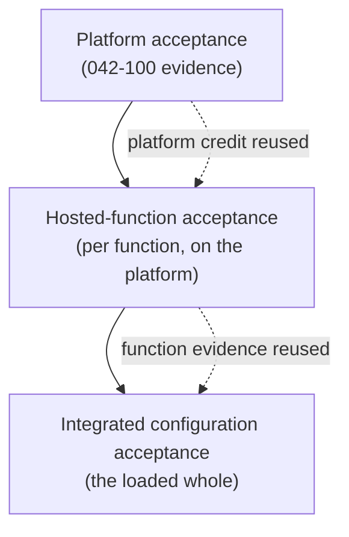

# 042-400-600 — Incremental Acceptance and Roles

**Node:** 042-400_Hosted-Function-Partitioning-and-Configuration · **Subject:** 006

- Roles are contractual and evidence-bearing: platform supplier, hosted-function supplier, system integrator, certification applicant.
- Acceptance is incremental: platform acceptance first (042-100 evidence), then each hosted function accepted against the characterized platform reusing platform credit, then the integrated configuration accepted as a whole.
- Platform credit reuse is the economic point of the architecture: adding a function re-verifies the function and the integration deltas, not the platform.
- Acceptance records per hosted function are evidence items (009).

