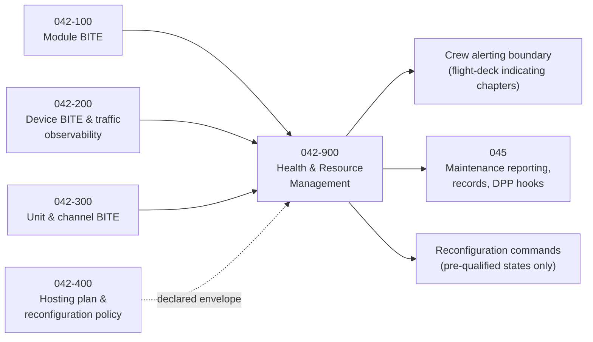

# 042-900_Platform-Health-and-Resource-Management

**Chapter:** 042_Integrated-Modular-Avionics · **Node:** 042-900

## Scope

Runtime guardianship of the integrated modular avionics: health monitoring across platform, network and remote units; fault detection, isolation and containment; resource and margin surveillance against the allocated budgets; degraded-mode reconfiguration among pre-qualified configurations; and maintenance reporting. Hosting policy is declared in 042-400; this node executes runtime decisions within that declared envelope.

## Context

## Subject register

| Subject | Title | Folder |
|---|---|---|
| 000 | Platform Health and Resource Management Overview | [042-900-000](042-900-000_Platform-Health-and-Resource-Management-Overview/) |
| 100 | Scope and Definitions | [042-900-100](042-900-100_Scope-and-Definitions/) |
| 200 | Health Monitoring Architecture | [042-900-200](042-900-200_Health-Monitoring-Architecture/) |
| 300 | Fault Detection Isolation and Containment | [042-900-300](042-900-300_Fault-Detection-Isolation-and-Containment/) |
| 400 | Resource Monitoring and Margin Surveillance | [042-900-400](042-900-400_Resource-Monitoring-and-Margin-Surveillance/) |
| 500 | Degraded Modes and Reconfiguration | [042-900-500](042-900-500_Degraded-Modes-and-Reconfiguration/) |
| 600 | Annunciation and Crew Interface Boundary | [042-900-600](042-900-600_Annunciation-and-Crew-Interface-Boundary/) |
| 700 | Maintenance Reporting and Prognostics Boundary | [042-900-700](042-900-700_Maintenance-Reporting-and-Prognostics-Boundary/) |
| 800 | Interfaces and Boundaries | [042-900-800](042-900-800_Interfaces-and-Boundaries/) |
| 900 | Evidence and Certification Data | [042-900-900](042-900-900_Evidence-and-Certification-Data/) |

## Boundary summary

Correlation, containment, margin surveillance, reconfiguration execution and reporting: here. BITE mechanisms: source nodes. Policy and pre-qualified states: 042-400. Prognostics and analytics: 045. Alerting presentation: flight-deck indicating chapters. Security policy: 046-500.

