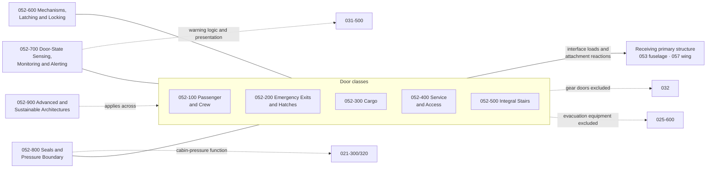

# 052_Doors

**Range:** 050-059_Primary-Structures-and-Programme-Interfaces · **Chapter:** 052

## Scope

Door assemblies and associated mechanisms as programme-agnostic classes: passenger and crew doors, emergency exits and escape hatches, cargo doors, service and access doors, integral boarding stairs, common actuation-latching-locking technology, door-state sensing and alerting interfaces, seals and pressure-boundary provisions, and advanced sustainable door architectures. 052 owns the door leaf, door-integral frame, hinges, guides, actuators, latches, locks, seals, door-side sensing and local mechanisms; the receiving airframe chapter (053 fuselage, 057 wing, or the relevant structural chapter) owns the opening, surrounding frames, sill beams, pressure-shell reinforcement and the airframe-side load path. 052 covers controlled closure assemblies for personnel passage, payload access, servicing access or emergency egress; small removable inspection panels, system-specific covers, nacelle cowlings and fairing access panels remain with their parent structure or system. Instance quantities, locations and arrangements are downstream matters.

## Integration chain

## Section register

| Section | Title | Subjects |
|---|---|---|
| 052-000 | [General](052-000_General/) | 4 |
| 052-100 | [Passenger and Crew Doors](052-100_Passenger-and-Crew-Doors/) | 8 |
| 052-200 | [Emergency Exits and Escape Hatches](052-200_Emergency-Exits-and-Escape-Hatches/) | 5 |
| 052-300 | [Cargo Doors](052-300_Cargo-Doors/) | 5 |
| 052-400 | [Service and Access Doors](052-400_Service-and-Access-Doors/) | 4 |
| 052-500 | [Integral Stairs and Boarding Provisions](052-500_Integral-Stairs-and-Boarding-Provisions/) | 3 |
| 052-600 | [Door Mechanisms Latching and Locking](052-600_Door-Mechanisms-Latching-and-Locking/) | 4 |
| 052-700 | [Door State Sensing Monitoring and Alerting Interfaces](052-700_Door-State-Sensing-Monitoring-and-Alerting-Interfaces/) | 4 |
| 052-800 | [Door Seals Pressure Boundary and Environmental Interfaces](052-800_Door-Seals-Pressure-Boundary-and-Environmental-Interfaces/) | 4 |
| 052-900 | [Advanced and Sustainable Door Architectures](052-900_Advanced-and-Sustainable-Door-Architectures/) | 6 |

## Boundary summary

Door assembly versus receiving structure: 052 owns the door leaf, door-integral frame, hinges, guides, mechanisms, locks, seals and local sensing; 053, 057 or the relevant structural chapter owns the opening, surrounding primary structure, reinforcement and airframe-side load path. Landing-gear doors: 032. Nacelle cowlings and propulsion access panels: 054-700. Evacuation equipment: 025-6xx; door-side girt bars and deployment interfaces: 052-170. Warning split: door-state sensing and local interfaces 052-700; aircraft-level warning logic and presentation 031-5xx. Pressure split: seals, pressure-boundary implementation and residual-pressure interlock provisions 052-800 and 052-620; cabin-pressure control and relief function 021-3xx. Heating split: function 030; door-integrated provisions 052-840. Energy-carrier servicing: operations 012, systems 028, controlled-access doors 052-430, bay provisions 050-530. Cargo and loading functions: 050. Placards: 011. Practices: 051. Type classes 090-099 constrain quantities, locations and egress geometry and shall not duplicate this chapter.

