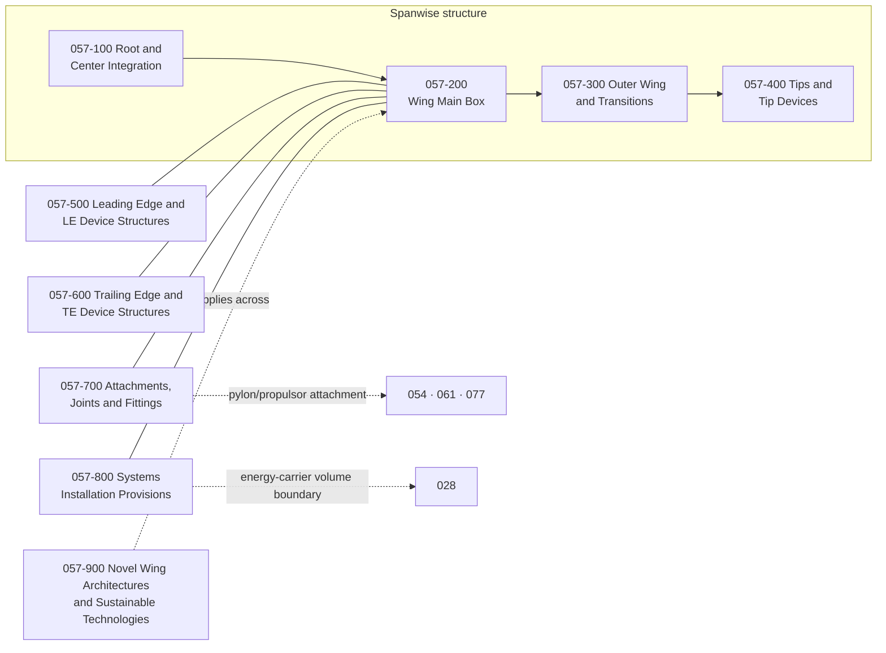

# 057_Wings

**Range:** 050-059_Primary-Structures-and-Programme-Interfaces · **Chapter:** 057

## Scope

Wing primary and secondary structure: root and center integration, main box, outer wing and transitions, tips and tip devices, leading- and trailing-edge structures including high-lift device structures, attachments and fittings, systems installation provisions, and the novel sustainable wing-technology block. Surface structure lives here; surface actuation and control functions are 027; the energy-carrier system is 028; practices are 051; type classes (092) constrain, this chapter owns the technology.

## Structure map

## Section register

| Section | Title | Subjects |
|---|---|---|
| 057-000 | [General](057-000_General/) | 4 |
| 057-100 | [Wing Root and Center Integration](057-100_Wing-Root-and-Center-Integration/) | 5 |
| 057-200 | [Wing Main Box](057-200_Wing-Main-Box/) | 6 |
| 057-300 | [Outer Wing and Transitions](057-300_Outer-Wing-and-Transitions/) | 4 |
| 057-400 | [Wing Tips and Tip Devices](057-400_Wing-Tips-and-Tip-Devices/) | 5 |
| 057-500 | [Leading Edge and LE Device Structures](057-500_Leading-Edge-and-LE-Device-Structures/) | 5 |
| 057-600 | [Trailing Edge and TE Device Structures](057-600_Trailing-Edge-and-TE-Device-Structures/) | 5 |
| 057-700 | [Attachments Joints and Fittings](057-700_Attachments-Joints-and-Fittings/) | 5 |
| 057-800 | [Wing Systems Installation Provisions](057-800_Wing-Systems-Installation-Provisions/) | 5 |
| 057-900 | [Novel Wing Architectures and Sustainable Technologies](057-900_Novel-Wing-Architectures-and-Sustainable-Technologies/) | 7 |

## Boundary summary

Surface structure here; surface actuation, control laws and rigging: 027. Carrier volumes: 057-250/-820 own the structural provision and boundary; the energy-carrier system is 028; sealing practices 051-220. Ice protection: 030 owns the function, 057-550/-830 the structural integration. Landing gear: 032 owns the system, 057-330 the fittings. Pylons and propulsors: 054 pylon structure, 061 installation, 077 propulsor units — 057-720/-950 own the wing-side provisions. Fuselage side: 053. Practices: 051. Jacking operations: 007. Type classes 091-097 constrain; 080-089 incubates and graduates.
