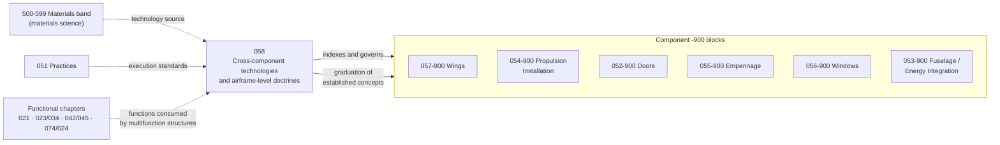

# 058_Advanced-and-Green-Structural-Systems

**Range:** 050-059_Primary-Structures-and-Programme-Interfaces · **Chapter:** 058

## Scope

Cross-component structural technologies and airframe-level structural doctrines: multifunctional structures, structural energy storage, integrated antenna and sensor structures, the airframe-level structural-health architecture, thermal and environmental multifunction structures, bio-based and recycled structural applications, circular airframe architecture, certification pathfinding for novel structural technologies, and the structural technology watch. Reason-to-exist rule: 058 owns technologies whose unit of application spans components or whose governance is airframe-level; component-side implementations live in the sibling -900 blocks (052-900, 054-900, 055-900, 056-900, 057-900, 053-900, 050-900); materials science lives in the materials band; practices live in 051. A technology with a single-component home has no address here. Frontier concepts carry a declared evidence status (080-200 discipline) and graduate to component blocks upon establishment.

## Integration chain

## Section register

| Section | Title | Subjects |
|---|---|---|
| 058-000 | [General and Chapter Doctrine](058-000_General-and-Chapter-Doctrine/) | 4 |
| 058-100 | [Multifunctional Structures Discipline](058-100_Multifunctional-Structures-Discipline/) | 4 |
| 058-200 | [Structural Energy Storage](058-200_Structural-Energy-Storage/) | 4 |
| 058-300 | [Integrated Antenna and Sensor Structures](058-300_Integrated-Antenna-and-Sensor-Structures/) | 4 |
| 058-400 | [Airframe Structural Health Architecture](058-400_Airframe-Structural-Health-Architecture/) | 4 |
| 058-500 | [Thermal and Environmental Multifunction Structures](058-500_Thermal-and-Environmental-Multifunction-Structures/) | 4 |
| 058-600 | [Bio Based and Recycled Structural Applications](058-600_Bio-Based-and-Recycled-Structural-Applications/) | 4 |
| 058-700 | [Circular Airframe Architecture](058-700_Circular-Airframe-Architecture/) | 4 |
| 058-800 | [Certification Pathfinding for Novel Structural Technologies](058-800_Certification-Pathfinding-for-Novel-Structural-Technologies/) | 5 |
| 058-900 | [Structural Technology Watch and Graduation](058-900_Structural-Technology-Watch-and-Graduation/) | 4 |

## Boundary summary

Reason-to-exist rule: 058 owns cross-component structural technologies and airframe-level doctrines; component-side implementations live in the sibling -900 blocks; a single-component technology has no address here. Materials science: the materials band (500-599); materials and process practices: 051. Structural energy storage four-way split: cell and laminate technology in the materials and energy bands; propulsion storage systems 074; non-propulsive electrical storage 024-360; load-bearing application architecture 058-200. SHM: component provisions in sibling blocks; airframe architecture and credit doctrine 058-400; hosting 042-400; data and DPP channel 045. Antenna and sensing systems: 023, 034 and their chapters. Thermal functions: 021 and 078. Type-level certification doctrine for novel configurations: 090-700; structural-technology pathfinding: 058-800. Evidence-status and graduation discipline: 080-200 pattern adopted; graduation targets are the component -900 blocks. Type classes 090-099 constrain and shall not duplicate this chapter.
