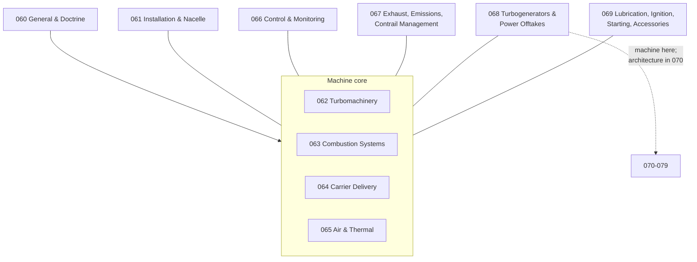

# 060-069_Sustainable-Energy-Carrier-Combustion-Propulsion

**Band:** 000-099_S-ATLAS · **Range:** 060-069

## Scope (ratified)

Turbomachinery, combustion devices and associated propulsion systems designed for sustainable energy carriers, including SAF-capable systems, hydrogen-combustion turbines, fuel-flexible combustors and turbogenerators used by hybrid-electric architectures.

## Chapter map

## Chapter register

| Chapter | Title | Folder |
|---|---|---|
| 060 | General and Range Doctrine | <a>060</a> |
| 061 | Powerplant Installation and Nacelle Integration | <a>061</a> |
| 062 | Combustion Machinery | <a>062</a> |
| 063 | Combustion Systems for Sustainable Carriers | <a>063</a> |
| 064 | Carrier Delivery Metering and Conditioning | <a>064</a> |
| 065 | Engine Air and Thermal Management | <a>065</a> |
| 066 | Control Monitoring and Indicating | <a>066</a> |
| 067 | Exhaust Emissions and Contrail Management | <a>067</a> |
| 068 | Turbogenerators and Power Offtakes | <a>068</a> |
| 069 | Lubrication Ignition Starting and Accessories | <a>069</a> |

## Boundary summary

Carrier storage and aircraft-side distribution: 028 (this range starts at the aircraft interface — 064-100). Loss-of-containment three-layer model: 028 system condition / 026 aircraft-level hazard / 047 atmosphere response. Venting: 028 function / 030-720 terminal mast. Hybrid split: the turbogenerator machine is 068; the hybrid architecture, energy management and drivetrain are 070-079. Fire protection: 026. Waste-heat and vehicle thermal coordination: REF 021 and 070-079. Crew alerting presentation: flight-deck indicating chapters. Hosting of control/monitoring functions on shared platforms: 042-400. Emissions: 063 owns in-combustor formation and combustion-side control; 067 owns exhaust-system effects, plume characterization, measurement, reporting and aircraft-level mitigation provisions. Ice protection: 065 owns anti-ice air generation and powerplant-side supply; 030 owns the aircraft ice-protection function and protected surfaces. Machine classes: functional chapters (063-067, 069) apply across combustion machine classes; machine-specific internals live in 062, with reciprocating and rotary machines at 062-800. Range-extender combustion engines: machine in 062, generator-set integration in 068, hybrid architecture in 070-079.

*Section registers are PROPOSED; ratification by merge. Subjects are scaffolded as General-Information plus reserved slots and are authored per work package.*
