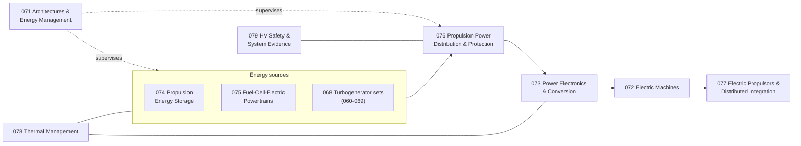

# 070-079_Electric-and-Hybrid-Electric-Propulsion

**Band:** 000-099_S-ATLAS · **Range:** 070-079

## Scope (ratified)

Electric drivetrains and their architectures: motors, drives, distributed propulsion, battery-electric and hybrid-electric integration, and fuel-cell-electric powertrains (electrochemical source, electric drive). 060-069 owns the combustion machine and turbogenerator set; this range owns the hybrid architecture, energy-management logic, drivetrain and propulsor integration.

## Chapter map

## Chapter register

| Chapter | Title | Folder |
|---|---|---|
| 070 | General and Range Doctrine | <a>070</a> |
| 071 | Propulsion Architectures and Energy Management | <a>071</a> |
| 072 | Electric Machines for Propulsion | <a>072</a> |
| 073 | Power Electronics and Conversion | <a>073</a> |
| 074 | Propulsion Energy Storage Systems | <a>074</a> |
| 075 | Fuel Cell Electric Powertrains | <a>075</a> |
| 076 | Propulsion Power Distribution and Protection | <a>076</a> |
| 077 | Electric Propulsors Installation and Distributed Integration | <a>077</a> |
| 078 | Thermal Management of Electric Propulsion | <a>078</a> |
| 079 | High Voltage Safety and System Evidence | <a>079</a> |

## Boundary summary

Machine split: combustion machines and turbogenerator sets are 060-069 (068); this range owns architectures, energy management, drivetrains and propulsor integration; electric-machine technology including hybrid-set generators is 072, consumed by 068 set integration. Aircraft electrical network and general storage: 024 — the propulsion HV network interfaces it at declared points (076-700). Propulsion energy storage doctrine: 074 is propulsion-side energy handling (the electric analogue of 064); cell and stack technology is EPTA (420s, 460s); hydrogen storage and distribution is 028, entering fuel-cell powertrains at the declared interface (075-300); charging follows the split doctrine — function 074, ground operation 010-019. Thermal-runaway three-layer analogue: 074-300 contains the system condition; 026 owns the aircraft-level hazard; atmosphere response per 047. Ice protection: 030 owns the function; 077-800 declares the interfaces. Noise: propulsor source noise is 077-600; combustion source noise is 067-600. Frontier machine concepts cross-reference 080-089 maturity classes. Waste-heat reuse coordinates with 021; crew alerting presentation with the flight-deck indicating chapters; hosted supervisory functions via 042-400.

*Section registers are PROPOSED; ratification by merge. Subjects are scaffolded as General-Information plus reserved slots and are authored per work package.*
