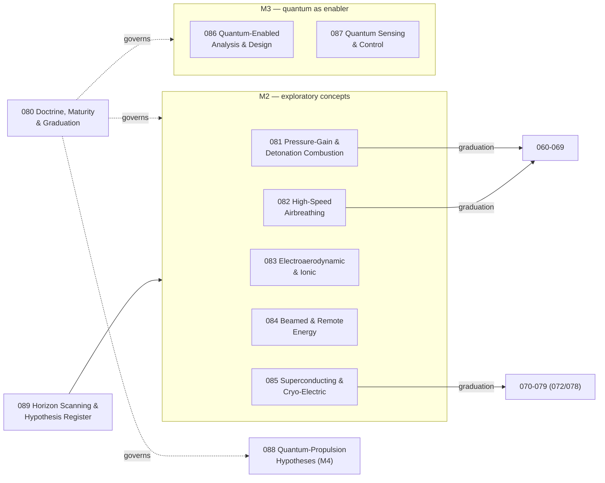

# 080-089_Alternative-and-Quantum-Propulsion

**Band:** 000-099_S-ATLAS · **Range:** 080-089

## Scope (ratified)

Frontier propulsion beyond the combustion/electric classes. The register distinguishes maturity classes — physically established alternative propulsion; exploratory concepts; quantum-enabled analysis, sensing or control; speculative quantum-propulsion hypotheses — and every future chapter in this range carries a declared maturity or evidence status.

## Maturity-class framework

| Class | Meaning |
|---|---|
| M1 | Physically established alternative propulsion |
| M2 | Exploratory concepts — demonstrated physics, aircraft application open |
| M3 | Quantum-enabled analysis, sensing or control (quantum as enabler) |
| M4 | Speculative quantum-propulsion hypotheses — epistemic register only |

## Chapter map

## Chapter register

| Chapter | Title | Maturity | Folder |
|---|---|---|---|
| 080 | General Doctrine Maturity and Graduation | M1-M4 framework | <a>080</a> |
| 081 | Pressure Gain and Detonation Combustion | M2 → graduates to 060 | <a>081</a> |
| 082 | High Speed Airbreathing Propulsion | M2 → graduates to 060 | <a>082</a> |
| 083 | Electroaerodynamic and Ionic Propulsion | M2 | <a>083</a> |
| 084 | Beamed and Remote Energy Propulsion | M2 | <a>084</a> |
| 085 | Superconducting and Cryo Electric Propulsion | M2 → graduates to 072/078 | <a>085</a> |
| 086 | Quantum Enabled Propulsion Analysis and Design | M3 | <a>086</a> |
| 087 | Quantum Sensing and Control for Propulsion | M3 | <a>087</a> |
| 088 | Quantum Propulsion Hypotheses | M4 — epistemic register only | <a>088</a> |
| 089 | Horizon Scanning and Hypothesis Register | Intake — classifies into M1-M4 | <a>089</a> |

## Boundary summary

Graduation doctrine: conversion class decides the range for established technology; maturity decides for the frontier. Concepts incubate here under a declared class and graduate to their conversion-class range upon physical establishment and an open certification path — detonation and high-speed combustion to 060-069; superconducting and cryo-electric to 072/078. Quantum technology itself (computing, sensors, networks) is owned by 900-999 QCSAA; this range documents its propulsion application (M3) only. Solar-electric aircraft are not homed here: the drivetrain is 070-079 and harvesting technology is EPTA — an energy source feeding an electric drive is electric propulsion. EAD high-voltage practice follows 076-class discipline. Beamed-energy ground infrastructure is referenced, never duplicated (S-ATLAS boundary condition). M4 claims discipline: no functional or performance claims may be derived from theoretical or morphological results; falsifiability criteria and energy-momentum accounting are mandatory for any registered hypothesis. Every chapter README carries its maturity class and evidence status; reclassification follows the 080-800 review cycle.

*Section registers are PROPOSED; ratification by merge. Subjects are scaffolded as General-Information plus reserved slots and are authored per work package.*
