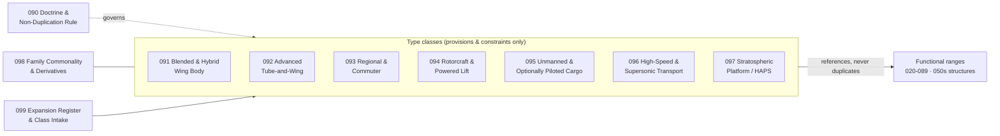

# 090-099_Type-Specific-Architectures-and-Expansion

**Band:** 000-099_S-ATLAS · **Range:** 090-099

## Scope (ratified)

Type-specific architecture chapters define cross-domain configuration provisions and integration constraints. They reference functional chapters in other ranges and shall not duplicate system, structure or propulsion taxonomies. Types are configuration classes, never programmes; programme applicability is mapped downstream.

## Chapter map

## Chapter register

| Chapter | Title | Kind | Folder |
|---|---|---|---|
| 090 | General and Type Architecture Doctrine | Doctrine | [090](090_General-and-Type-Architecture-Doctrine/) |
| 091 | Blended and Hybrid Wing Body Class | Type class | [091](091_Blended-and-Hybrid-Wing-Body-Class/) |
| 092 | Advanced Tube and Wing Class | Type class | [092](092_Advanced-Tube-and-Wing-Class/) |
| 093 | Regional and Commuter Class | Type class | [093](093_Regional-and-Commuter-Class/) |
| 094 | Rotorcraft and Powered Lift Class | Type class | [094](094_Rotorcraft-and-Powered-Lift-Class/) |
| 095 | Unmanned and Optionally Piloted Cargo Class | Type class | [095](095_Unmanned-and-Optionally-Piloted-Cargo-Class/) |
| 096 | High Speed and Supersonic Transport Class | Type class | [096](096_High-Speed-and-Supersonic-Transport-Class/) |
| 097 | Stratospheric Platform and HAPS Class | Type class | [097](097_Stratospheric-Platform-and-HAPS-Class/) |
| 098 | Family Commonality and Derivative Provisions | Cross-class | [098](098_Family-Commonality-and-Derivative-Provisions/) |
| 099 | Expansion Register and Class Intake | Intake | [099](099_Expansion-Register-and-Class-Intake/) |

## Boundary summary

Non-duplication rule (ratified): type chapters define cross-domain configuration provisions and integration constraints; they reference functional chapters and shall not duplicate system, structure or propulsion taxonomies. Section grammar is constrained to provisions, constraints and considerations. Urban air mobility and city vehicles: 700-799 ACV; defence unmanned systems: 200-299 DTTA; space platforms: 100-199 STA. Stratospheric solar platforms: the type class and its integration constraints live here; the electric drivetrain is 070-079 and harvesting technology is EPTA. Supersonic: high-speed propulsion technology matures in 082 and graduates to 060; the class here owns vehicle-level integration constraints only. Structural content: 050s chapters own it, type classes constrain it. Freighter and role change: a family provision (098-600), not a type class. Programme applicability and instance configurations: downstream mapping layers only.

*Section registers are PROPOSED; ratification by merge. Subjects are scaffolded as General-Information plus reserved slots and are authored per work package.*
