# S-ATLAS — Sustainable Aviation Top-Level Architecture Schema

*A programme-agnostic technical taxonomy for aircraft architectures and lifecycle interfaces enabling sustainable aviation.*

---

## 1. Canonical definition

> S-ATLAS stands for Sustainable Aviation Top-Level Architecture Schema. It is the aircraft-focused architecture band within Q+ATLANTIDE, providing a programme-agnostic taxonomy for the aircraft architectures, functions, information domains and lifecycle interfaces required to support sustainable aviation.

## 2. Doctrine

> S-ATLAS documents the aircraft-side architectures, functions, information domains and lifecycle interfaces required to enable sustainable aviation.
>
> It is not limited to an aircraft system breakdown structure. It also covers cross-system integration, propulsion architectures, operational interfaces, certification evidence, maintenance information, technical-publication structures and aircraft dependencies on external energy and infrastructure domains.
>
> S-ATLAS structures the aircraft-side architectures required for sustainable aviation. It references, but does not duplicate, technologies and infrastructures owned by other Q+ATLANTIDE bands.
>
> Fossil-only propulsion configurations have no home in this band by scope declaration, not by omission. Where a programme impact study requires a conventional baseline for comparison, it references established external documentation, including ATA-structured legacy publications, rather than creating an S-ATLAS chapter.
>
> Combustion itself is not excluded. Combustion of sustainable energy carriers remains a valid transition and propulsion architecture and is documented accordingly.

## 3. Range register

| Range | Name | Scope |
|---|---|---|
| `000–009` | General-Information-and-Service | General information, introduction, scope, definitions and service documentation for the band. |
| `010–019` | Ground-Handling-and-Servicing | Ground handling, servicing procedures, ground-equipment coordination and operational safety zones. |
| `020–029` | Core-Aircraft-Systems | Core aircraft systems, including energy-carrier systems (`028`-class). |
| `030–039` | Protection-and-Mechanical-Systems | Protection and mechanical systems, including drain and vent provisions (`030-720`). |
| `040–049` | Avionics-Information-Systems-and-APU | Avionics, information systems, hosted-function platforms (`042`), protective atmospheres (`047`) and auxiliary power (`049`). |
| `050–059` | Primary-Structures-and-Programme-Interfaces | Primary structures, standard structural practices (`051`), fuselage (`053`) and programme interfaces. |
| `060–069` | Sustainable-Energy-Carrier-Combustion-Propulsion | Turbomachinery, combustion devices and associated propulsion systems designed for sustainable energy carriers, including SAF-capable systems, hydrogen-combustion turbines, fuel-flexible combustors and turbogenerators used by hybrid-electric architectures. |
| `070–079` | Electric-and-Hybrid-Electric-Propulsion | Electric drivetrains and architectures: motors, drives, distributed propulsion, battery-electric and hybrid-electric integration, fuel-cell-electric powertrains (electrochemical source, electric drive). 060 owns the combustion machine/turbogenerator; 070 owns the hybrid architecture, energy-management logic, drivetrain and propulsor integration. |
| `080–089` | Alternative-and-Quantum-Propulsion | Frontier propulsion beyond the combustion/electric classes. The register distinguishes maturity classes — physically established alternative propulsion; exploratory concepts; quantum-enabled analysis, sensing or control; speculative quantum-propulsion hypotheses — and every future chapter in this range carries a declared maturity or evidence status. |
| `090–099` | Type-Specific-Architectures-and-Expansion | Type-specific architecture chapters define cross-domain configuration provisions and integration constraints. They reference functional chapters in other ranges and shall not duplicate system, structure or propulsion taxonomies. |

```mermaid
flowchart TB
    ROOT["S-ATLAS<br/>000–099<br/>Sustainable Aviation Top-Level Architecture Schema"]

    B0["000–009 · General Information and Service<br/><br/>
    000 General · 001 Maintenance Policy<br/>
    002 Operations · 003 Support<br/>
    004 Airworthiness Limitations · 005 Maintenance Checks<br/>
    006 Dimensions and Areas · 007 Lifting and Shoring<br/>
    008 Levelling and Weighing · 009 Towing and Taxiing"]

    B1["010–019 · Ground Handling and Servicing<br/><br/>
    010 Parking, Mooring, Storage and RTS<br/>
    011 Placards and Markings<br/>
    012 Servicing<br/>
    013–019 Reserved"]

    B2["020–029 · Core Aircraft Systems<br/><br/>
    020 Maintenance Practices · 021 ECS<br/>
    022 Auto Flight · 023 Communications<br/>
    024 Electrical Power · 025 Equipment and Furnishings<br/>
    026 Fire Protection · 027 Flight Control<br/>
    028 Energy Carriers · 029 Actuation and Utility Power"]

    B3["030–039 · Protection and Mechanical Systems<br/><br/>
    030 Ice and Rain · 031 Indicating and Recording<br/>
    032 Landing Gear · 033 Lights<br/>
    034 Navigation · 035 Oxygen<br/>
    036 Pneumatic · 037 Vacuum<br/>
    038–039 Reserved"]

    B4["040–049 · Avionics, Information Systems and APU<br/><br/>
    040–041 Reserved · 042 IMA<br/>
    043 Reserved · 044 Cabin Systems<br/>
    045 Maintenance Systems · 046 Information Systems<br/>
    047 Protective Atmospheres · 048 Reserved<br/>
    049 Auxiliary Power Module"]

    B5["050–059 · Primary Structures and Interfaces<br/><br/>
    050 Compartments · 051 Structural Practices<br/>
    052 Doors · 053 Fuselage<br/>
    054 Nacelles, Pylons and Integration · 055 Stabilizers<br/>
    056 Windows · 057 Wings<br/>
    058 Advanced Structures · 059 Downstream Interfaces"]

    B6["060–069 · Sustainable-Carrier Combustion Propulsion<br/><br/>
    060 Doctrine · 061 Powerplant Installation<br/>
    062 Combustion Machinery · 063 Combustion Systems<br/>
    064 Carrier Delivery · 065 Air and Thermal Management<br/>
    066 Control and Monitoring · 067 Exhaust and Emissions<br/>
    068 Turbogenerators · 069 Accessories"]

    B7["070–079 · Electric and Hybrid-Electric Propulsion<br/><br/>
    070 Doctrine · 071 Architectures and Energy Management<br/>
    072 Electric Machines · 073 Power Electronics<br/>
    074 Propulsion Storage · 075 Fuel-Cell Powertrains<br/>
    076 HV Distribution · 077 Electric Propulsors<br/>
    078 Thermal Management · 079 HV Safety and Evidence"]

    B8["080–089 · Alternative and Quantum Propulsion<br/><br/>
    080 Maturity Doctrine · 081 Detonation Combustion<br/>
    082 High-Speed Airbreathing · 083 Ionic Propulsion<br/>
    084 Beamed Energy · 085 Cryo-Electric Propulsion<br/>
    086 Quantum Analysis · 087 Quantum Sensing<br/>
    088 Quantum Hypotheses · 089 Horizon Scanning"]

    B9["090–099 · Type-Specific Architectures and Expansion<br/><br/>
    090 Type Doctrine · 091 Blended and Hybrid Wing Body<br/>
    092 Advanced Tube and Wing · 093 Regional and Commuter<br/>
    094 Rotorcraft and Powered Lift · 095 Unmanned Cargo<br/>
    096 High-Speed Transport · 097 HAPS<br/>
    098 Family Commonality · 099 Expansion Register"]

    ROOT --> B0
    ROOT --> B5

    B0 --> B1 --> B2 --> B3 --> B4
    B5 --> B6 --> B7 --> B8 --> B9

    B0 ~~~ B5
    B1 ~~~ B6
    B2 ~~~ B7
    B3 ~~~ B8
    B4 ~~~ B9

    B6 -. "turbogenerator sets consumed by hybrid architectures" .-> B7
    B8 -. "graduation into established propulsion ranges" .-> B6
    B8 -. "graduation into established propulsion ranges" .-> B7
    B9 -. "configuration classes reference functional ranges" .-> B2
    B9 -. "configuration classes reference propulsion ranges" .-> B7

    style ROOT fill:#0f4c5c,stroke:#0a3641,color:#ffffff

    style B0 fill:#f4f6f7,stroke:#607d8b
    style B1 fill:#f4f6f7,stroke:#607d8b
    style B2 fill:#eaf2f8,stroke:#2874a6
    style B3 fill:#eaf2f8,stroke:#2874a6
    style B4 fill:#edf3f8,stroke:#3d5a80
    style B5 fill:#f2f3f4,stroke:#616a6b

    style B6 fill:#fdf3e3,stroke:#c98a2b
    style B7 fill:#e8f4ea,stroke:#3a7d44
    style B8 fill:#ece8f4,stroke:#5e548e
    style B9 fill:#e8eef4,stroke:#3d5a80
```

## 4. Thread indexes

Cross-cutting technology thread indexes are maintained in [`THREADS/`](THREADS/), beside the band register. See [`THREADS/HYDROGEN.md`](THREADS/HYDROGEN.md).

## 5. FAQ

S-ATLAS is not an ASD S-Series specification; the name denotes Sustainable Aviation.

