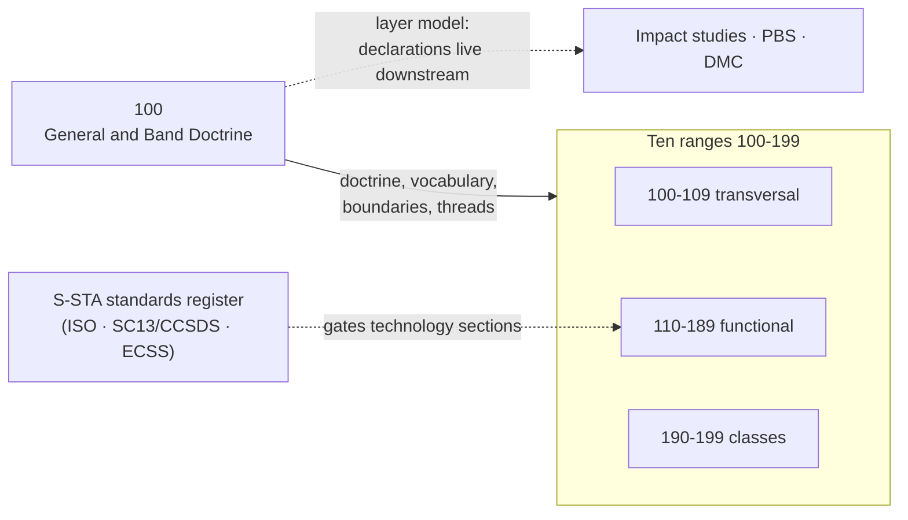

# 100_General-and-Band-Doctrine

**Band:** 100-199_S-STA · **Range:** 100-109 · **Status:** Doctrine chapter — sections derive from ruling S-STA-BAND-RULING v0.4 (the ruling is their register); technology sections across the band remain register-gated. This doctrine chapter is sections-only by design: its sections are the atomic doctrine units; discipline chapters 101-109 carry dual grain.

## Scope

The doctrine chapter of the S-STA band: band scope and the revisitability doctrine, the layer model and agnosticism rule including the expendable scope declaration, the range register and navigation, the lifecycle-and-intervention model, the maturity and graduation discipline, cross-band boundaries, sources and registers governance, cross-cutting threads, and the controlled vocabulary. Doctrine sections derive from ruling S-STA-BAND-RULING v0.4 — their register is the ruling; technology sections across the band remain register-gated. This doctrine chapter is sections-only by design: its sections are the atomic doctrine units; discipline chapters 101-109 carry dual grain.

## Band context

## Section register

| Section | Title |
|---|---|
| 100-000 | [General Information](100-000_General-Information/) |
| 100-100 | [Band Scope and Revisitability Doctrine](100-100_Band-Scope-and-Revisitability-Doctrine/) |
| 100-200 | [Layer Model Agnosticism and Expendable Declaration](100-200_Layer-Model-Agnosticism-and-Expendable-Declaration/) |
| 100-300 | [Range Register and Navigation](100-300_Range-Register-and-Navigation/) |
| 100-400 | [Lifecycle and Intervention Model](100-400_Lifecycle-and-Intervention-Model/) |
| 100-500 | [Maturity and Graduation Discipline](100-500_Maturity-and-Graduation-Discipline/) |
| 100-600 | [Cross Band Boundaries](100-600_Cross-Band-Boundaries/) |
| 100-700 | [Sources Standards and Registers Governance](100-700_Sources-Standards-and-Registers-Governance/) |
| 100-800 | [Threads and Cross Cutting Indexes](100-800_Threads-and-Cross-Cutting-Indexes/) |
| 100-900 | [Glossary and Controlled Vocabulary](100-900_Glossary-and-Controlled-Vocabulary/) |

