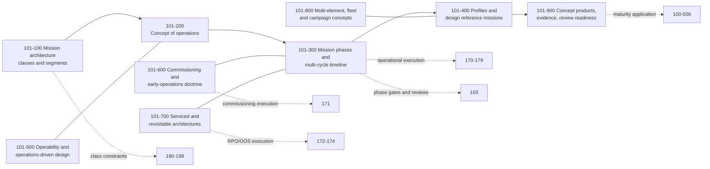

# 101_Mission-Architecture-and-Operational-Concepts

**Band:** 100-199_S-STA · **Range:** 100-109 · **Status:** Register-derived chapter — sections cite their anchoring standards from the S-STA standards register; merge constitutes ratification of this chapter section register under S-STA-BAND-RULING v0.4 §6. Source governance: sections cite standards-register anchors where they exist; the absence of a direct anchor does not invalidate a section when its architectural need is established by the ruling, boundary analysis or multiple source classes.

## Scope

Mission-level architecture and operational concepts as discipline doctrine: mission classes and typologies, concept-of-operations doctrine, mission phases and lifecycle model, design reference missions and profiles, operability doctrine, serviced and revisitable mission architectures, crewed and uncrewed concepts, multi-element and campaign architectures, and concept-phase evidence. This chapter owns concepts and doctrine; operational execution is 170-179 (commissioning doctrine here, commissioning operations 171); programme structure and reviews are 103; system and vehicle classes are 190-199 — mission classes cut across them and never duplicate them.

## Concept flow

## Section register

| Section | Title | Anchors |
|---|---|---|
| 101-000 | [General Information](101-000_General-Information/) | — |
| 101-100 | [Mission Architecture Classes and Segments](101-100_Mission-Architecture-Classes-and-Segments/) | Register-derived; direct architecture source pending |
| 101-200 | [Concept of Operations Doctrine](101-200_Concept-of-Operations-Doctrine/) | ISO 14711 |
| 101-300 | [Mission Phases and Multi Cycle Timeline Model](101-300_Mission-Phases-and-Multi-Cycle-Timeline-Model/) | ISO 14300-1; ISO 21349 |
| 101-400 | [Mission Profiles and Design Reference Missions](101-400_Mission-Profiles-and-Design-Reference-Missions/) | — |
| 101-500 | [Operability and Operations Driven Design](101-500_Operability-and-Operations-Driven-Design/) | ISO 14950 — uncrewed-spacecraft baseline |
| 101-600 | [Commissioning and Early Operations Doctrine](101-600_Commissioning-and-Early-Operations-Doctrine/) | ISO 10784-1/-2/-3 |
| 101-700 | [Serviced and Revisitable Mission Architectures](101-700_Serviced-and-Revisitable-Mission-Architectures/) | ISO 24330 — RPO/OOS anchor |
| 101-800 | [Multi Element Fleet and Campaign Concepts](101-800_Multi-Element-Fleet-and-Campaign-Concepts/) | — |
| 101-900 | [Mission Concept Products Evidence and Review Readiness](101-900_Mission-Concept-Products-Evidence-and-Review-Readiness/) | ISO 14711; ISO 16290; ISO 21349; ISO 23135 |

## Boundary summary

Concepts, classifications, architectural timelines and concept products here; operational execution 170-179 (commissioning 171, RPO/OOS 172-174, fleet 179). Requirements and systems engineering: 102. Programme structure, configuration, documentation and reviews: 103. Assurance and dependability: 104. Human systems: 109. End of life: lifecycle concept 101-300, debris and disposal doctrine 108, execution 178. System and vehicle classes: 190-199 — mission classes cross-cut and never reproduce their physical configuration taxonomies. Maturity: applied through 100-500; ISO 16290 supports technology-readiness evidence and does not govern documentation precedence (band governance: 100-700 and 103).

