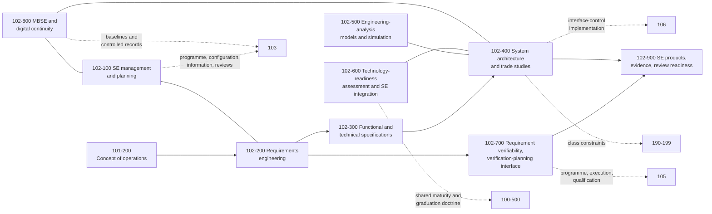

# 102_Systems-Engineering-and-Requirements-Management

**Band:** 100-199_S-STA · **Range:** 100-109 · **Status:** Register-derived chapter at dual grain — sections and subjects cite standards-register anchors; merge constitutes ratification of this chapter register under S-STA-BAND-RULING v0.4 §6. Source governance: a declared absence is preferred to a false anchor.

## Scope

Systems-engineering discipline and requirements management for the band: SE management and planning, requirements engineering, functional and technical specification classes, architecture definition and trade discipline, analysis-model and simulation management, technology assessment and maturity in SE, the verification-planning interface, model-based systems engineering, and SE products with review readiness. This chapter owns requirement classes, grammars and the SE discipline — actual requirements are downstream artifacts and are never instantiated in the taxonomy. Mission concepts are 101 (102 consumes what 101-200 defines); programme structure, configuration, documentation and reviews are 103; verification execution and qualification are 105; interface control is 106; system and vehicle classes are 190-199.

## Concept flow

## Section register

| Section | Title | Subjects | Anchors |
|---|---|---|---|
| 102-000 | [General Information](102-000_General-Information/) | 2 | — |
| 102-100 | [Systems Engineering Management and Planning](102-100_Systems-Engineering-Management-and-Planning/) | 3 | ISO 18676 |
| 102-200 | [Requirements Engineering and Management](102-200_Requirements-Engineering-and-Management/) | 4 | ISO 16404 |
| 102-300 | [Functional and Technical Specifications](102-300_Functional-and-Technical-Specifications/) | 3 | ISO 21351 |
| 102-400 | [System Architecture Definition and Trade Study Discipline](102-400_System-Architecture-Definition-and-Trade-Study-Discipline/) | 3 | Register-derived; trade-study sources pending |
| 102-500 | [Engineering Analysis Models and Simulation Management](102-500_Engineering-Analysis-Models-and-Simulation-Management/) | 4 | ISO 14954 — dynamic/static model exchange; ISO 16781 — control-system simulation; broader engineering-analysis governance register-derived |
| 102-600 | [Technology Readiness Assessment and SE Integration](102-600_Technology-Readiness-Assessment-and-SE-Integration/) | 3 | ISO 16290 |
| 102-700 | [Requirement Verifiability and Verification Planning Interface](102-700_Requirement-Verifiability-and-Verification-Planning-Interface/) | 3 | ISO 23135 — verification programme owned by 105 |
| 102-800 | [Model Based Systems Engineering and Digital Continuity](102-800_Model-Based-Systems-Engineering-and-Digital-Continuity/) | 3 | Register-derived; MBSE sources pending |
| 102-900 | [SE Products Evidence and Review Readiness](102-900_SE-Products-Evidence-and-Review-Readiness/) | 3 | ISO 18676; ISO 21349 |

## Boundary summary

