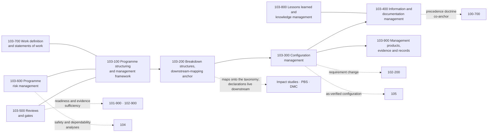

# 103_Programme-Configuration-and-Information-Management

**Band:** 100-199_S-STA · **Range:** 100-109 · **Status:** Register-derived chapter — sections cite their anchoring standards from the S-STA standards register; merge constitutes ratification of this chapter section register under S-STA-BAND-RULING v0.4 §6. Source governance: sections cite standards-register anchors where they exist; the absence of a direct anchor does not invalidate a section when its architectural need is established by the ruling, boundary analysis or multiple source classes.

## Scope

Programme, configuration and information management as discipline doctrine: programme structuring and the management framework, breakdown structures and the downstream-mapping anchor, configuration management, information and documentation management, reviews and gates, programme risk management, work definition and statements of work, lessons learned and knowledge management, and management products with records. This chapter owns management-discipline doctrine and artifact classes; actual programme structures, baselines, registers and records are downstream artifacts and are never instantiated in the taxonomy. Mission concepts are 101; systems engineering is 102; assurance, dependability, non-conformance and problem solving are 104; verification execution is 105.

## Concept flow

## Section register

| Section | Title | Anchors |
|---|---|---|
| 103-000 | [General Information](103-000_General-Information/) | — |
| 103-100 | [Programme Structuring and Management Framework](103-100_Programme-Structuring-and-Management-Framework/) | ISO 14300-1; ISO 23462; ISO 11893 |
| 103-200 | [Breakdown Structures and Downstream Mapping Anchor](103-200_Breakdown-Structures-and-Downstream-Mapping-Anchor/) | ISO 27026 |
| 103-300 | [Configuration Management](103-300_Configuration-Management/) | ISO 21886 |
| 103-400 | [Information and Documentation Management](103-400_Information-and-Documentation-Management/) | ISO 10789 |
| 103-500 | [Reviews and Gates](103-500_Reviews-and-Gates/) | ISO 21349 |
| 103-600 | [Programme Risk Management](103-600_Programme-Risk-Management/) | ISO 17666 |
| 103-700 | [Work Definition and Statements of Work](103-700_Work-Definition-and-Statements-of-Work/) | ISO 17255 |
| 103-800 | [Lessons Learned and Knowledge Management](103-800_Lessons-Learned-and-Knowledge-Management/) | ISO 16192 |
| 103-900 | [Management Products Evidence and Records](103-900_Management-Products-Evidence-and-Records/) | ISO 10795; ISO 21349 |

## Boundary summary

Management discipline and artifact classes here; actual programme structures, baselines, registers and records are downstream — the taxonomy holds classes, never instances. Breakdown structures: recognized as a family at 103-200 with the open clause; the taxonomy is the reference architecture they map onto and is not itself a programme breakdown; the downstream-mapping doctrine of the interface chapters anchors here. Configuration split: discipline and classes 103-300; requirement change 102-200; as-verified evidence 105; baseline instances downstream. Documentation: precedence is band governance (100-700) operationalized at 103-400; operational documentation 170; data standards 156. Reviews: process, authorities and gates 103-500; readiness and evidence sufficiency with the producing chapters (101-900, 102-900). Risk: programme governance 103-600; safety, dependability and probabilistic analyses 104. Lessons learned 103-800; closed-loop problem solving and non-conformance 104. Phase model 101-300; gates here. Classes 190-199 constrain and shall not duplicate management discipline.

