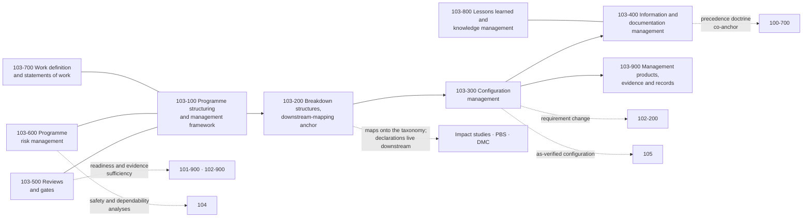

# 103_Programme-Configuration-and-Information-Management

**Band:** 100-199_S-STA · **Range:** 100-109 · **Status:** Register-derived chapter at dual grain — sections and subjects cite standards-register anchors; merge constitutes ratification of this chapter register under S-STA-BAND-RULING v0.4 §6. Source governance: a declared absence is preferred to a false anchor.

## Scope

Programme, configuration and information management as discipline doctrine: programme structuring and the management framework, breakdown structures and the downstream-mapping anchor, configuration management, information and documentation management, reviews and gates, programme risk management, work definition and statements of work, lessons learned and knowledge management, and management products with records. This chapter owns management-discipline doctrine and artifact classes; actual programme structures, baselines, registers and records are downstream artifacts and are never instantiated in the taxonomy. Mission concepts are 101; systems engineering is 102; assurance, dependability, non-conformance and problem solving are 104; verification execution is 105.

## Concept flow

## Section register

| Section | Title | Subjects | Anchors |
|---|---|---|---|
| 103-000 | [General Information](103-000_General-Information/) | 2 | — |
| 103-100 | [Programme Structuring and Management Framework](103-100_Programme-Structuring-and-Management-Framework/) | 4 | ISO 14300-1; ISO 23462; ISO 11893 |
| 103-200 | [Breakdown Structures and Downstream Mapping Anchor](103-200_Breakdown-Structures-and-Downstream-Mapping-Anchor/) | 4 | ISO 27026 |
| 103-300 | [Configuration Management](103-300_Configuration-Management/) | 4 | ISO 21886 |
| 103-400 | [Information and Documentation Management](103-400_Information-and-Documentation-Management/) | 3 | ISO 10789 |
| 103-500 | [Reviews and Gates](103-500_Reviews-and-Gates/) | 3 | ISO 21349 |
| 103-600 | [Programme Risk Management](103-600_Programme-Risk-Management/) | 3 | ISO 17666 |
| 103-700 | [Work Definition and Statements of Work](103-700_Work-Definition-and-Statements-of-Work/) | 3 | ISO 17255 |
| 103-800 | [Lessons Learned and Knowledge Management](103-800_Lessons-Learned-and-Knowledge-Management/) | 3 | ISO 16192 |
| 103-900 | [Management Products Evidence and Records](103-900_Management-Products-Evidence-and-Records/) | 3 | ISO 10795; ISO 21349 |

## Boundary summary

