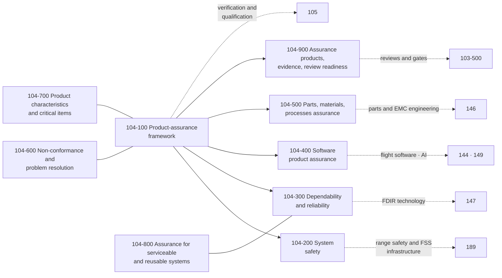

# 104_Product-Assurance-Safety-Dependability-and-Quality

**Band:** 100-199_S-STA · **Range:** 100-109 · **Status:** Register-derived chapter at dual grain — sections and subjects cite standards-register anchors; merge constitutes ratification of this chapter register under S-STA-BAND-RULING v0.4 §6. Source governance: a declared absence is preferred to a false anchor.

## Scope

Product assurance, safety, dependability and quality as discipline doctrine at section and subject grain: the assurance framework, system safety, dependability and reliability, software product assurance, parts-materials-and-processes assurance, non-conformance and problem resolution, product characteristics and critical items, assurance for serviceable and reusable systems, and assurance products with review readiness. This chapter owns assurance doctrine and artifact classes; actual assurance plans, records and dispositions are downstream. Requirements discipline is 102; programme governance, configuration, reviews and programme risk are 103; verification execution and qualification are 105; parts and EMC engineering are 146; FDIR technology is 147; range safety and flight-safety-system infrastructure are 189.

## Assurance map

## Section register

| Section | Title | Subjects | Anchors |
|---|---|---|---|
| 104-000 | [General Information](104-000_General-Information/) | 3 | — |
| 104-100 | [Product Assurance Framework](104-100_Product-Assurance-Framework/) | 4 | ISO 14300-2; ISO 27025 |
| 104-200 | [System Safety](104-200_System-Safety/) | 4 | ISO 14620-1 |
| 104-300 | [Dependability and Reliability](104-300_Dependability-and-Reliability/) | 4 | ISO 23460 |
| 104-400 | [Software Product Assurance](104-400_Software-Product-Assurance/) | 3 | ISO 22893 |
| 104-500 | [Parts Materials and Processes Assurance](104-500_Parts-Materials-and-Processes-Assurance/) | 4 | ISO 14621-1 |
| 104-600 | [Non Conformance and Problem Resolution](104-600_Non-Conformance-and-Problem-Resolution/) | 4 | ISO 23461 |
| 104-700 | [Product Characteristics and Critical Items](104-700_Product-Characteristics-and-Critical-Items/) | 3 | ISO 19826 |
| 104-800 | [Assurance for Serviceable and Reusable Systems](104-800_Assurance-for-Serviceable-and-Reusable-Systems/) | 4 | Register-derived; serviceability-assurance sources pending |
| 104-900 | [Assurance Products Evidence and Review Readiness](104-900_Assurance-Products-Evidence-and-Review-Readiness/) | 3 | ISO 27025; ISO 21349 |

## Boundary summary

Assurance doctrine and classes here; plans, records and dispositions downstream. Requirements discipline 102; programme governance, configuration, reviews and programme risk 103 — programme risk 103-600 versus safety and probabilistic analyses 104-200. Verification execution and qualification 105. Parts and EMC engineering 146; assurance of parts 104-500. Flight software 144 and AI technology 149; their assurance 104-400. FDIR technology 147; its assurance view 104-340. Range safety and flight-safety-system infrastructure 189; safety doctrine here. Materials methods 114 and propellant fluids 124; their assurance doctrine 104-520. Lessons learned 103-800; the failure loop 104-600. Serviceability assurance 104-800 with operations 170-179 and recovery 186. Classes 190-199 constrain and shall not duplicate assurance discipline.

