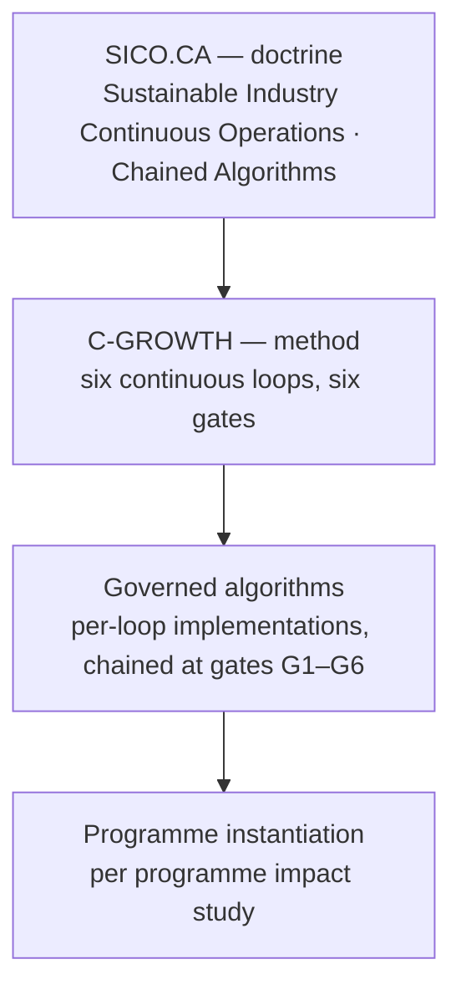
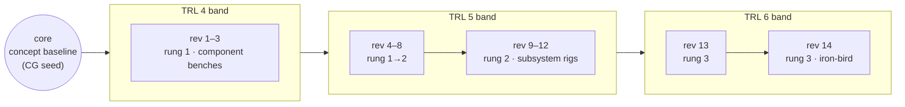
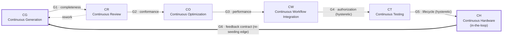

# C-GROWTH-METHOD-SPEC

**Circular Growing by Generation, Reviewing, Optimizing, Workflowing, Testing, Hardware**

---

## 0. Document Control

| Field | Value |
|---|---|
| Document ID | `Q+A-METHOD-CGROWTH-SPEC-001` |
| Title | C-GROWTH Method Specification |
| Version | `v0.1.4` |
| Status | DRAFT — for review |
| Classification | Controlled method specification |
| Owner | Q+A.inc — Methods & Lifecycle Governance |
| Author | AM.PEL (Amedeo Pelliccia) |
| Taxonomy registration | Q+ATLANTIDE — **TBD** (band and code range pending round-table decision; see §9) |
| Doctrine | **SICO.CA** — Sustainable Industry Continuous Operations · Chained Algorithms (see §1.0, §7) |
| Governing frameworks | DEGF v1.0 · Model Digital Constitution · Q+ATLANTIDE1000 · OPTIONS · LC-letter lifecycle axis |
| Language | English (controlled) |
| Change authority | Q+ round table; SICO.CA-class authorization gate for baseline promotion |

### 0.1 Normative Status

This specification is **normative** for any Q+A.inc programme that declares C-GROWTH conformance in its programme impact study. It is **informative** otherwise.

### 0.2 No-AAA Rule

Per Q+ core values, `AAA` is not a valid loop, gate, phase, identifier, or taxonomy element within this specification.

### 0.3 Diagram Notation

**Mermaid** is the controlled in-document diagram notation for this specification (native rendering on GitHub; versionable as text; diffable under configuration management like any other artefact). Data-derived figures — in particular the growth-ring visualization (§1.5) — are **computed ICNs** generated from anchored SSOT data per OI-09; their in-document Mermaid form is a schematic, not the canonical figure.

---

## 1. Purpose

### 1.0 Doctrinal Position

**SICO.CA** — *Sustainable Industry Continuous Operations · Chained Algorithms* — is the governing **doctrine**. **C-GROWTH** is the **method** by which that doctrine materializes in governed algorithms: each of the six loops is realized as a chained, auditable algorithm, and the gates between loops are the chaining points at which authorization, anchoring, and evidence production are enforced.

The hierarchy is therefore:

### 1.1 Method Definition

C-GROWTH defines the **intra-phase execution method** for Q+A.inc programmes: the controlled, circular process by which artefacts are generated, reviewed, optimized, integrated, tested, and physically correlated **within** a lifecycle phase of the LC-letter axis.

C-GROWTH does not replace, span, or re-sequence lifecycle phases. Lifecycle progression (phase entry/exit) remains governed exclusively by the LC-letter axis and its gates. C-GROWTH governs **what happens inside a phase**: it is the engine; the LC axis is the road.

### 1.2 Problem Addressed

Linear CI/CD-style methods close their feedback loop at the software layer (software observing software). Aerospace programmes — in particular hydrogen-electric and hybrid-electric architectures — require the loop to close at the **physical layer**: fuel-cell degradation curves, LH₂ boil-off measurements, DEP thermal behaviour, and structural correlation data must flow back into the controlled artefact baselines from which they originated. C-GROWTH formalizes that physical closure as a first-class loop (CH) with a contractual feedback edge (CH→CG).

### 1.3 Design Intent

| Property | Realization |
|---|---|
| Circularity | Six loops arranged as a directed cycle with a mandatory CH→CG feedback edge |
| Continuity | Each loop runs continuously within its own scope |
| Auditability | All inter-loop transitions are gated (six gates per revolution; see §5) |
| Traceability | Every artefact carries Q+ATLANTIDE node assignment from creation (CG), never retrofitted |
| Certification readiness | Evidence is produced as a by-product of execution, not assembled after the fact |

### 1.4 Strategic Pathway — Softwareization and Sensorization

C-GROWTH is the pathway to **softwareization** and **sensorization** of the aerospace product. In practical terms, it is a **scalable cycle** whose end-state is an **intelligent, quantum-sensored, assembled aerospace vehicle**.

The two trajectories are driven by distinct edges of the cycle:

| Trajectory | Driving mechanism | Direction of growth |
|---|---|---|
| **Softwareization** | Each CH→CG feedback package converts physically observed behaviour into governed models, control laws, and software-defined functions. Functionality migrates, revolution by revolution, from hardware-fixed to software-governed — under gates, never by drift | Hardware-fixed → software-defined |
| **Sensorization** | Each revolution increases the instrumentation density validated at CH: channels are declared at CG, correlated at CH, and retained only if they earn their place in the correlation report. The sensing architecture grows by evidence, not by accretion | Sparse telemetry → dense, validated sensing fabric (classical → quantum sensing) |

**Scalability ladder.** The cycle is scale-invariant: the same six loops and six gates apply at every level of assembly. Scalability is realized by climbing the integration ladder, with CH instantiated at progressively higher integration levels:

| Rung | CH instantiation | Sensorization state | Softwareization state |
|---:|---|---|---|
| 1 — Component | Bench / HIL per component | Component-local channels validated | Component behaviour modelled and code-governed |
| 2 — Subsystem | Subsystem rig (e.g., fuel-cell string, DEP pod) | Cross-component fusion validated | Subsystem control laws software-defined |
| 3 — System | Iron-bird / integrated system rig | System-level sensing fabric, including first quantum-sensing channels where applicable | System-level health, energy, and mission functions software-governed |
| 4 — Assembled vehicle | Demonstrator / flight or orbital asset | Vehicle-wide quantum-sensored fabric: the vehicle is its own correlation instrument | Intelligent vehicle: onboard models continuously re-seeded by CH→CG, within certified envelopes |

Rung promotion is not a C-GROWTH gate: it is an **LC-letter axis decision** informed by accumulated revolution evidence at the current rung. C-GROWTH supplies the evidence; the lifecycle axis spends it.

**End-state definition.** An *intelligent, quantum-sensored, assembled aerospace vehicle* is one in which: (a) the sensing fabric — including quantum sensing channels — has been validated rung by rung through CH correlation; (b) the governing functions are software-defined and traceably derived from feedback packages; (c) the assembled vehicle itself operates as the terminal CH instance, closing the loop in service; and (d) all of the above remains inside the gate discipline of §5 — intelligence is achieved *through* governance, not around it. Onboard adaptation in service is bounded by certified envelopes; any adaptation beyond an envelope is a feedback package, not a self-modification.

### 1.5 TRL Growth Reading — The Organic Metaphor

C-GROWTH is also the **visualization of how programmes and products grow gradually through their TRL maturity plan** — like living bodies being fed.

The metaphor is controlled, with each organic term mapped to a method element:

| Organic term | C-GROWTH element | Controlled meaning |
|---|---|---|
| **Feeding cycle** | One revolution (CG→…→CH→CG) | The body is fed once per revolution |
| **Nutrient** | The CH→CG feedback package (§6) | Physical evidence is the only nutrient; opinion, simulation alone, and assertion do not feed the body |
| **Digestion** | CR + CO + CT on re-seeded artefacts | Nutrients are not absorbed raw: they are reviewed, optimized, and verified before they become body mass |
| **Body mass** | The anchored, correlated evidence baseline | Growth is measured in validated evidence, not in artefact count |
| **Growth stage** | TRL level (per the TRL control layer) | A TRL claim is a statement of accumulated, digested mass — never of appetite |
| **Metabolic rate** | Revolution cadence (OI-02 metrics) | A programme's health is read from its cadence and feedback-closure rate |
| **Growth rings** | Completed revolutions, clustered per TRL stage | The programme's history is legible in its rings, like a tree's |

**Growth-ring visualization (canonical form).** The programme is rendered as concentric rings: each completed revolution adds a ring; rings cluster into TRL bands; ring thickness encodes evidence mass added by that revolution; the integration rung (§1.4 ladder) at which CH executed is marked on each ring. Read from the core outward, the figure shows the whole maturation history at a glance. The canonical radial figure is a computed ICN (OI-09); its in-document Mermaid schematic linearizes the rings core-outward:

**Anti-force-feeding rule.** The organic reading carries a normative consequence: a living body cannot be force-fed to maturity. TRL promotion claims that are not backed by digested mass — revolutions completed, feedback packages closed, correlation thresholds met — are non-conformant. Where schedule pressure and evidence diverge, the TRL control layer reports the body's *actual* growth stage, and the divergence itself becomes a programme risk record. Conversely, a body that is fed but not growing (revolutions completing, evidence mass flat) signals a metabolic problem — typically correlation thresholds set too loosely to be nutritive, or feedback packages dispositioned as "no change" at a rate that warrants audit.

---

## 2. Acronym Integrity

The expansion is self-verifying: each letter of **GROWTH** maps one-to-one onto a continuous loop.

| Letter | Expansion | Loop |
|---:|---|---|
| **G** | Generation | CG — Continuous Generation |
| **R** | Reviewing | CR — Continuous Review |
| **O** | Optimizing | CO — Continuous Optimization |
| **W** | Workflowing | CW — Continuous Workflow Integration |
| **T** | Testing | CT — Continuous Testing |
| **H** | Hardware | CH — Continuous Hardware (in-the-loop) |

The prefix **C-** is read twice: *Circular* (the method's topology) and *Continuous* (the prefix inherited by every loop). Both readings are controlled meanings.

---

## 3. Topology

One full traversal CG→CR→CO→CW→CT→CH→CG is a **revolution**. A phase of the LC axis typically contains many revolutions; revolution count and cadence are programme-defined. The thick CH→CG edge is the re-seeding edge governed by the feedback contract (§6); the dashed CR→CG edge is rework, which returns artefacts without traversing forward gates.

### 3.1 Loop Concurrency

Loops are continuous and may run concurrently on *different* artefacts. A single artefact, however, occupies exactly one loop at any time. Artefact loop-position is part of its configuration state and shall be recorded in the SSOT impact/config layer (`AMPEL360-AMM-INFOCODE-CM-001` pattern or programme equivalent).

---

## 4. Loop Definitions

### 4.1 CG — Continuous Generation

| Field | Definition |
|---|---|
| Scope | Authoring of controlled artefacts: requirements (ReqBS), models, S1000D data modules, source code, configurations, BREX rules, impact analyses |
| Entry condition | Authorized work package within the active LC phase, **or** a CH feedback package (§6) |
| Controlled obligation | Q+ATLANTIDE node assignment at creation. An artefact without a node assignment is non-conformant and shall not exit CG |
| Output | Versioned candidate artefacts with provisional DMC mapping where applicable |
| Exit gate | **G1** — completeness check: identification, node assignment, declared applicability |

### 4.2 CR — Continuous Review

| Field | Definition |
|---|---|
| Scope | Conformance and impact review: BREX validation, schema validation, round-table impact analysis, cross-PMC boundary checks (AMM/ECHM/FIM/SRM/IPC discipline), human and agent review |
| Controlled obligation | Every finding receives a disposition (accept / rework / reject) with accountable ownership. Silent acceptance is non-conformant |
| Output | Review record + dispositioned artefact |
| Exit gate | **G2** — all findings dispositioned; rework returns the artefact to CG, it does not bypass forward |

### 4.3 CO — Continuous Optimization

| Field | Definition |
|---|---|
| Scope | Refinement against TPMs and budgets (mass, energy, cost, thermal, noise); classical optimization always; quantum-assisted optimization only in non-safety-critical decision support, per the certifiable-integration-path constraint |
| Controlled obligation | Every optimization delta is traceable: baseline → objective function → delta → new candidate. Untraceable improvement is non-conformant |
| Output | Optimized candidate with delta record |
| Exit gate | **G3** — TPM compliance statement or documented waiver request |

### 4.4 CW — Continuous Workflow Integration

| Field | Definition |
|---|---|
| Scope | Merge into the controlled pipeline: CSDB ingestion, repository merge, CI execution (GitHub Actions class), ledger anchoring (ATA_96 pattern), SSOT state update |
| Controlled obligation | Integration is atomic per configuration unit; partial anchoring is non-conformant |
| Output | Integrated, anchored configuration state with audit record (SHA-256 class) |
| Exit gate | **G4** — SICO.CA-class hysteretic authorization gate. Nothing enters the anchored workflow state without authorization; once anchored, de-anchoring requires a higher authority level than anchoring did (hysteresis) |

### 4.5 CT — Continuous Testing

| Field | Definition |
|---|---|
| Scope | Verification against the ReqBS baseline: unit, integration, system, regression of evidence chains; execution within the OPTIONS Operations axis, conformance baselines drawn from the Standards axis |
| Controlled obligation | Each test maps to one or more requirement IDs. Tests without requirement linkage are exploratory and produce no conformance evidence |
| Output | Test evidence records with per-requirement pass/fail and coverage statement |
| Exit gate | **G5** — hardware-readiness gate, aligned to the LC-letter axis. Placing an artefact on hardware is the most expensive and least reversible transition in the revolution; G5 therefore requires both CT coverage thresholds **and** LC-phase authorization |

### 4.6 CH — Continuous Hardware (in-the-loop)

| Field | Definition |
|---|---|
| Scope | Physical correlation: HIL benches, iron-bird rigs, demonstrators, flight or orbital telemetry. The physical asset acts as ground truth against the digital baseline |
| Controlled obligation | Correlation thresholds (model-vs-physical acceptable deltas) are declared **before** execution, per programme impact study |
| Output | Correlated physical evidence; model deltas; degradation/wear data; anomaly records |
| Exit gate | **G6** — feedback-contract gate (§6). CH does not terminate the revolution; it re-seeds it |

---

## 5. Gate Matrix

| Gate | Transition | Class | Authority | Hysteretic | Records produced |
|---:|---|---|---|:---:|---|
| G1 | CG → CR | Completeness | Authoring lead | No | Identification + node-assignment record |
| G2 | CR → CO | Conformance | Review board / round table | No | Disposition log |
| G3 | CO → CW | Performance | TPM owner | No | Delta + compliance statement |
| G4 | CW → CT | Authorization | SICO.CA-class gate | **Yes** | Anchoring record (SHA-256 class) |
| G5 | CT → CH | Lifecycle | LC-phase authority | **Yes** | Hardware-readiness record |
| G6 | CH → CG | Feedback contract | Configuration management | No | Feedback package (§6) |

Six gates per revolution give an auditable cadence without breaking continuity *within* each loop. Gates G4 and G5 are hysteretic: reversal requires higher authority than passage.

---

## 6. The CH→CG Feedback Contract (G6)

The CH→CG edge is the substantive distinction between C-GROWTH and linear CI/CD. It is governed by contract, not convention.

### 6.1 Feedback Package — Mandatory Content

| Element | Definition |
|---|---|
| Source asset ID | Physical asset (bench, rig, demonstrator, vehicle) with configuration tail |
| Telemetry extract | Time-bounded, channel-identified, units-controlled |
| Correlation report | Model-vs-physical deltas against pre-declared thresholds |
| Anomaly set | Each anomaly classified (model error / hardware deviation / instrumentation) |
| Affected artefacts | Q+ATLANTIDE node + DMC list of baselines impacted by the deltas |
| Recommended CG actions | Per affected artefact: revise / re-baseline / no-action with rationale |
| Audit record | SHA-256 class hash of the package; ledger-anchored |

### 6.2 Contract Rules

1. A feedback package that identifies affected artefacts **obligates** a CG entry for each; the disposition may be "no change," but the disposition itself must exist.
2. Feedback packages are configuration items: versioned, anchored, and traceable like any other artefact.
3. Degradation and wear data (e.g., fuel-cell polarization drift, LH₂ boil-off rates, DEP thermal margins) feed the descriptive and procedural DM baselines and the SSOT impact layer — they are not retained as side-channel engineering notes.
4. The CH→CG edge never bypasses gates: re-seeded artefacts traverse the full revolution.

---

## 7. Relationship to Existing Frameworks

| Framework | Relationship |
|---|---|
| **SICO.CA** (doctrine) | *Sustainable Industry Continuous Operations · Chained Algorithms.* The doctrine within which C-GROWTH materializes as governed algorithms: each loop is a chained, auditable algorithm; gates G1–G6 are the chaining points. G4 inherits the SICO.CA hysteretic authorization class directly |
| LC-letter lifecycle axis | C-GROWTH operates **within** LC phases. LC gates control phase transitions; C-GROWTH gates control loop transitions. The two gate families never substitute for each other |
| **OPTIONS** | *Organizations, Programs, Technologies, Infrastructures, Operations, Neural Networks, Standards.* CT executes within the Operations axis; CH extends Operations into physical correlation; the Standards axis supplies conformance baselines for CR and CT; Neural Networks axis governs agent-review roles in CR (OI-05) |
| Q+ATLANTIDE1000 | Node assignment at CG; method-spec registration TBD per §9 |
| S1000D / CSDB | CW is the ingestion and anchoring boundary; DM baselines are CG/CR/CO subjects |
| CI/CD (industry) | C-GROWTH ⊃ CI/CD: CG/CW/CT subsume generation–integration–test; CR, CO, and CH are the additions, with CH providing physical-layer loop closure absent from CI/CD |

---

## 8. Conformance

A programme declares C-GROWTH conformance in its programme impact study by providing:

1. Loop instantiation table — how each of the six loops is realized in the programme (tools, owners, cadence).
2. Gate authority map — named authority per gate G1–G6.
3. CH configuration — benches/rigs/assets, telemetry channels, correlation thresholds.
4. Feedback-contract implementation — package format, anchoring mechanism, SSOT linkage.

Partial conformance (e.g., revolutions terminating at CT during early TRL phases, before hardware exists) is permitted and shall be declared as **C-GROWTH/CT-bounded**, with a planned G5/G6 activation milestone tied to an LC gate.

---

## 9. Taxonomy Registration — TBD

| Field | Value |
|---|---|
| Architecture | **TBD** — pending round-table decision |
| Master range / Code range | **TBD** |
| Status | Registration deliberately open at v0.1.1. C-GROWTH is registered in Q+ATLANTIDE only after the round table assigns band and code range (OI-01) |
| Per-programme instantiation | Independent of registration outcome: the method spec is taxonomy-level; each programme's CH configuration (benches, channels, thresholds) is a programme impact-study artefact mapped to DMCs |

No candidate band is asserted normatively in this version. Until registration, the document is identified solely by its document ID (`Q+A-METHOD-CGROWTH-SPEC-001`).

---

## 10. Open Items for v0.2.0

| ID | Item |
|---|---|
| OI-01 | Assign Q+ATLANTIDE taxonomy registration (architecture, band, code range — currently TBD) via round-table decision record |
| OI-02 | Define revolution cadence metrics (revolutions per LC phase; mean revolution time) as TPM candidates |
| OI-03 | Specify the feedback-package XML/JSON schema and its BREX rules |
| OI-04 | Map G1–G6 records to the Digital Product Passport logic |
| OI-05 | Define agent-review roles in CR (human-in-the-loop vs agent-in-the-loop disposition authority) |
| OI-06 | Worked example: one full revolution on the eWTW 021 (Air Conditioning and Pressurization) DM set |
| OI-07 | Define rung-promotion evidence criteria (§1.4 scalability ladder): minimum revolutions, correlation-threshold attainment, and feedback-package closure rate required before LC-axis promotion to the next integration rung |
| OI-08 | Specify quantum-sensing channel qualification path (rung 3→4): classical-channel redundancy requirements during quantum-channel introduction |
| OI-09 | Formalize the growth-ring visualization (§1.5) as a controlled diagram class (ICN candidate): ring encoding rules (thickness = evidence mass, marker = integration rung, band = TRL stage) and its generation from the SSOT/TRL control layer so the figure is computed from anchored data, never drawn by hand |

---

## 11. Changelog

| Version | Date | Change | Authority |
|---|---|---|---|
| v0.1.0 | 2026-06-11 | Initial draft: six-loop topology, gate matrix G1–G6, CH→CG feedback contract, conformance clause, proposed DTCEC registration | AM.PEL — for round-table review |
| v0.1.1 | 2026-06-11 | Corrections: owner set to Q+A.inc; taxonomy registration set to TBD (DTCEC proposal withdrawn); OPT-INS replaced by OPTIONS (Organizations, Programs, Technologies, Infrastructures, Operations, Neural Networks, Standards); SICO.CA expanded as *Sustainable Industry Continuous Operations · Chained Algorithms* and repositioned as governing doctrine (new §1.0) within which C-GROWTH materializes as governed algorithms | AM.PEL — author corrections |
| v0.1.2 | 2026-06-11 | Strategic pathway added (§1.4): C-GROWTH defined as the pathway to softwareization and sensorization; four-rung scalability ladder (component → subsystem → system → assembled vehicle); end-state defined as the intelligent, quantum-sensored, assembled aerospace vehicle; OI-07 (rung-promotion criteria) and OI-08 (quantum-sensing qualification path) opened | AM.PEL — author amendment |
| v0.1.3 | 2026-06-11 | TRL growth reading added (§1.5): controlled organic metaphor (revolution = feeding cycle, feedback package = nutrient, evidence baseline = body mass, TRL = growth stage); growth-ring visualization defined as canonical form; anti-force-feeding rule made normative (TRL claims require digested evidence mass; schedule–evidence divergence becomes a risk record); OI-09 opened (growth-ring diagram as controlled ICN computed from SSOT) | AM.PEL — author amendment |
| v0.1.4 | 2026-06-11 | Diagram notation controlled (§0.3): Mermaid adopted as the in-document diagram notation (GitHub-native, versionable, diffable); §1.0 hierarchy, §3 topology, and §1.5 growth-ring schematic converted from text art to Mermaid; canonical radial growth-ring figure confirmed as computed ICN (OI-09), with the in-document Mermaid form designated schematic | AM.PEL — notation amendment |

---

*End of controlled document. Modifications require change authority per §0. The No-AAA Rule applies throughout.*
