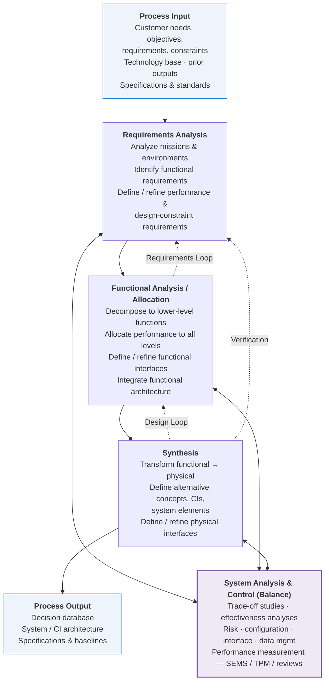
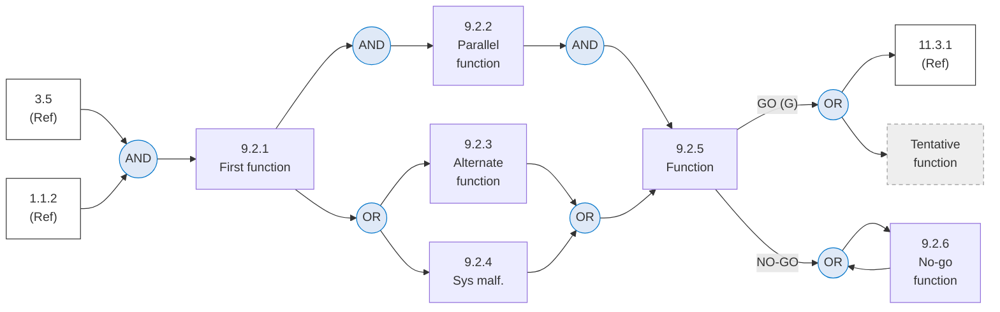
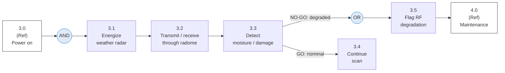
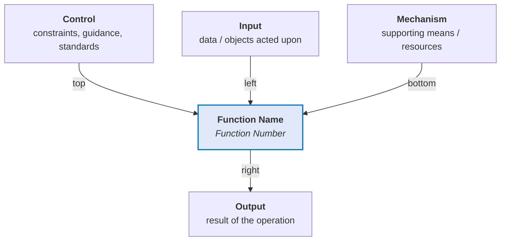

# Systems Engineering Process & Functional Analysis — Reference Diagrams

## 1. Purpose and source

This reference renders the foundational systems-engineering diagrams used across Q-plus-A as **Mermaid**, so they live in the controlled repository rather than as external images. The diagrams are adapted from the *Systems Engineering Fundamentals* text (Defense Acquisition University Press, January 2001), a U.S. Government work in the public domain.

These diagrams are the methodological origin of several Q-plus constructs: the **ReqBS class set**, the **breakdown structures** (FBS/IBS/TPMS), the **requirements evolution rule**, and **System Analysis & Control** (risk/CM/TPM). §5 maps each diagram to the rule it underpins.

---

## 2. The Systems Engineering Process (adapted from Fig 3-1)

The process is iterative and recursive: inputs are analyzed into requirements, decomposed into functions, synthesized into a physical design, and verified — with three feedback loops (requirements, design, verification) and a balancing control activity acting across all steps.

---

## 3. Functional Flow Block Diagram — FFBD format (adapted from Fig 5-4)

The FFBD describes **what** the system does and in **what sequence**, functionally — not how it is built. Grammar: each function is a single block with a consistent number (`1.0`, `1.1`, `1.1.1`); circular **summing gates** carry `AND` (parallel — all paths required) or `OR` (alternative paths); **GO / NO-GO** branches (`G` / `G̅`) leave a function to indicate conditional paths; **reference blocks** point to other diagrams; a **tentative function** is drawn dashed.

**Gate semantics.** `AND` = parallel functions, all conditions must be satisfied to proceed. `OR` = alternative paths, any one satisfies. `G` / `G̅` = go / no-go conditions placed on the lines leaving a function. `(Ref)` blocks connect this diagram to higher- or lower-level FFBDs (the second-level flow designator and title block are omitted here for clarity).

### 3.1 Applied micro-example (Q-plus domain — not from source)

A small FFBD fragment for radome operational functions, using the same grammar:

---

## 4. IDEF0 box — ICOM format (adapted from Fig 5-5)

Where the FFBD shows functional flow, **IDEF0** shows data/control flow and lifecycle-process flow. Each function box has four sides — the **ICOM** convention: **I**nputs enter from the left, **C**ontrols from the top, **O**utputs leave to the right, **M**echanisms join at the bottom. Edge labels below name the true ICOM side.

---

## 5. Mapping to the Q-plus framework

Each diagram is the method behind a controlled rule already in the repository.

| Source diagram | Q-plus construct it underpins |
|---|---|
| SE Process — Requirements Loop & Design Loop (Fig 3-1) | `REQBS-REV-001` (requirements evolve by revision); the loops are *why* ReqBS/IBS/CBS/RBS/EBS are revisioned, not static. |
| SE Process — System Analysis & Control (Fig 3-1) | `RBS` (risk), `TPMS` (technical performance measures = TPM/SEMS), and configuration-management authority in the lifecycle model. |
| SE Process — Synthesis → Output baselines (Fig 3-1) | `QATL-BASELINE-HIERARCHY-001` (functional / allocated / product baselines). |
| FFBD (Fig 5-4) | Functional Analysis/Allocation → `FBS` and `ReqBS-10` (Functional Requirements), `ReqBS-12` (Modes of Operation). |
| IDEF0 / ICOM (Fig 5-5) | Interface and data/control flow → `IBS` and `ReqBS-07` (Interfaces). |

---

## 6. Footprint

| Field | Value |
|---|---|
| Document ID | `QPLUS-SE-PROCESS-FUNCTIONAL-ANALYSIS-REFERENCE` |
| Register | Q-plus / OPTIONS (S-Standards) |
| Source | DAU *Systems Engineering Fundamentals*, Jan 2001 (public domain) |
| Diagrams | SE Process, FFBD format, IDEF0 box, applied FFBD micro-example |
| Version | 0.1.0 |
| Status | draft |
| Evidence anchor (IEF) | `<sha256: to-be-stamped-at-commit>` |

**Change log.**

| Version | Date | Change |
|---|---|---|
| 0.1.0 | 2026-05-31 | Initial Mermaid renderings of SE Process (Fig 3-1), FFBD format (Fig 5-4), IDEF0 box (Fig 5-5); framework mapping to ReqBS/FBS/IBS/TPMS/RBS and the requirements-evolution and baseline-hierarchy rules. |
