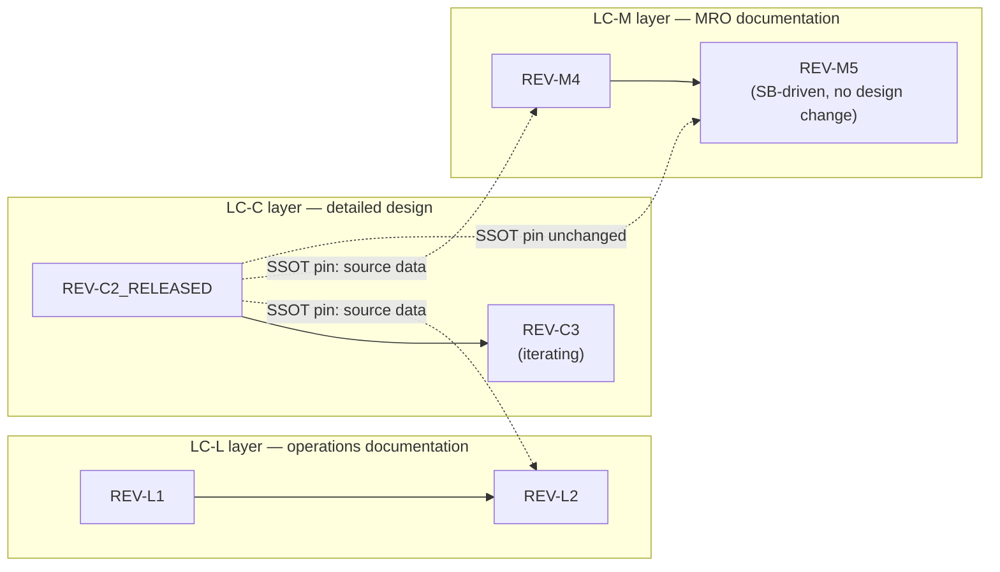

# 02_LIFECYCLE_MODEL — Lifecycle Model

## 1. Purpose

`02_LIFECYCLE_MODEL/` defines the controlled lifecycle maturity model used by Q-plus-A artefacts, products, CAD models, PLM records, publication modules, requirements records, evidence records, upgrade branches, and configuration baselines.

This lifecycle model provides a common governance language for the deliverables of every lifecycle stage — from conceptual definition through preliminary design, detailed design, qualification, certification, operations, MRO, and final nature-sustainment.

Version `0.4.0` extended the lifecycle model with TRL integration, upgradeability and technology-insertion governance, upgrade revision-cycle restart rules, evolutionary block logic, SBS-level breakdown integration, and revision-specific `ReqBS`, `IBS`, `CBS`, `RBS`, `EBS`, `TPMS`, BOM, CAD, and publication records.

Version `0.5.0` bound the **C-GROWTH execution method** (`Q+A-METHOD-CGROWTH-SPEC-001`, co-located in this folder) as the controlled intra-stage execution engine.

Version `0.6.0` applies a **critical structural correction**: LC stages are **deliverable layers**, each with its REV letter **anchored**; iteration numbers are **decoupled** across layers; cross-layer consistency is maintained exclusively by **SSOT source-data pinning**; and **every stage may initiate its own C-GROWTH revolutions and work packages independently** of upstream stage activity. See §2.

It retains the single LC-letter lifecycle axis (no enterprise LC01–LC14 axis). The only orthogonal overlay is TRL (technology maturity), which is distinct from LC-letter (deliverable maturity) by design — see §13.

---

## 2. Lifecycle Model Type

Q-plus-A uses an **LC-letter deliverable-layer maturity model**: each LC stage owns a deliverable set, and the deliverables of every stage carry that stage's letter permanently.

```text
LC-letter stage      = deliverable stage / layer (its deliverables carry that letter, always)
REV-<LETTER><n>      = iteration n of that stage's deliverable set
                       — the LETTER is anchored to the stage and never changes
                       — only the NUMBER iterates
*_RELEASED           = formal release baseline of that stage's deliverable set
```

### 2.1 Anchored Letters, Decoupled Numbers

The lifecycle has two distinct regimes:

**Staged initialization (sequential).** A stage's deliverable layer is first initialized only after the upstream layer reaches a usable released baseline. The first `REV-B0` exists only after `REV-A_RELEASED`; the first operations manual `REV-L0` exists only once there is a released design/certification baseline to document.

**Concurrent evolution (decoupled).** Once initialized, **every layer iterates independently**. Iteration in one layer does not, by itself, create iterations in any other layer:

- A `REV-C3` in detailed design **may not generate** a new `REV-Lx` or `REV-Mx` in manuals, DMs, or infocodes. Whether it does is the outcome of an impact assessment, not an automatic propagation.
- A manual **may iterate without any design change**: service bulletins, document-structure improvements, infocode reorganizations, or regulatory editorial requirements create a new `REV-Mx` while the design SSOT remains unchanged.



In the figure: design iterates to `REV-C3` without forcing any documentation iteration; `REV-M5` iterates on a service bulletin while remaining pinned to the same released design source (`REV-C2_RELEASED`).

```yaml
rev_letter_anchoring_rule:
  id: QPLUS-LC-REVLETTER-001
  name: "REV Letter Anchoring Rule"
  rule: >
    The REV letter of a deliverable is anchored to its owning LC stage and
    shall never change over the deliverable's life. Design deliverables of
    LC-C are always REV-Cx; operations documentation of LC-L is always
    REV-Lx; MRO documentation of LC-M is always REV-Mx. Only the iteration
    number advances. The REV letter identifies the deliverable layer, not the
    product's current position on the lifecycle axis.

decoupled_iteration_rule:
  id: QPLUS-LC-DECOUPLE-001
  name: "Decoupled Iteration Rule"
  rule: >
    Iteration counters are independent per LC stage layer. An iteration in one
    layer shall not, by itself, create an iteration in any other layer.
    Cross-layer propagation occurs only through impact assessment: an upstream
    change either results in a downstream iteration with updated source-data
    pinning, or in a recorded no-action disposition. Both outcomes are
    controlled records.
```

### 2.2 SSOT Source-Data Pinning

Decoupling is safe only because coupling is moved into the SSOT: every downstream deliverable revision must declare exactly which upstream artefact revisions it consumed.

```yaml
ssot_source_pinning_rule:
  id: QPLUS-LC-SSOT-PIN-001
  name: "SSOT Source-Data Pinning Rule"
  rule: >
    Every REV of a downstream deliverable shall record in its SSOT stack the
    identified revisions of the upstream artefacts used as source data (the
    "pinned source set"). A REV-Lx or REV-Mx publication revision shall pin
    the relevant last design artefact used as source data (e.g.
    RADOME-REV-C2_RELEASED). A deliverable revision without a valid pinned
    source set is non-conformant. When an upstream artefact changes, each
    downstream layer shall perform an impact assessment and either (a) iterate
    and re-pin to the new source, or (b) record a no-action disposition with
    rationale, retaining the existing pin. When a deliverable iterates for
    layer-internal reasons (service bulletin, structure improvement), it shall
    re-validate and restate its pinned source set, which may be unchanged.
```

Minimum pinning metadata, carried per deliverable REV:

```yaml
pinned_source_set:
  deliverable_revision: "AMM-RADOME-REV-M5"
  iteration_driver: "service bulletin"      # enum: upstream-source-delta | service-bulletin | structure-improvement | regulatory | feedback-package | other
  pins:
    - artefact: "RADOME design baseline"
      pinned_revision: "RADOME-REV-C2_RELEASED"
      pin_status: "unchanged"               # enum: new | re-pinned | unchanged
    - artefact: "ReqBS"
      pinned_revision: "ReqBS-RADOME-REV-C2"
      pin_status: "unchanged"
  upstream_deltas_assessed:
    - upstream_change: "RADOME-REV-C3 (iterating, not released)"
      disposition: "no-action"
      rationale: "C3 not released; pin remains on last released design baseline"
```

### 2.3 Execution Method within a Stage Layer — C-GROWTH

The LC-letter axis defines **deliverable layers**; the REV cycle defines **iterations per layer**; **C-GROWTH** defines **how iterations are produced**. C-GROWTH (Circular Growing by Generation, Reviewing, Optimizing, Workflowing, Testing, Hardware) is the controlled execution method, materializing the SICO.CA doctrine in governed algorithms. Its normative definition is `Q+A-METHOD-CGROWTH-SPEC-001` (this folder); this section controls only the binding.

**Independent initiation.** Because layers iterate independently, **every LC stage may start new C-GROWTH revolutions and initiate work packages from stage-local inputs**, independent of upstream stage activity:

```yaml
cgrowth_independent_initiation_rule:
  id: QPLUS-LC-CG-INIT-001
  name: "Per-Stage C-GROWTH Initiation Rule"
  rule: >
    Each LC stage layer may initiate C-GROWTH revolutions and work packages
    from inputs local to that layer — upstream source-data deltas, service
    bulletins, document-structure improvements, operator feedback, regulatory
    change, or routed feedback packages — independent of whether any upstream
    or downstream layer is currently iterating. Every revolution executes
    within exactly one stage layer, and its gate records (G1–G6) attach to the
    REV of that layer. Revolutions in different layers are coordinated only
    through SSOT source-data pinning (QPLUS-LC-SSOT-PIN-001), never through
    forced co-revision.

cgrowth_binding_rule:
  id: QPLUS-LC-CGROWTH-001
  name: "C-GROWTH Binding Rule"
  rule: >
    The C-GROWTH gate family (G1–G6, loop transitions) and the lifecycle gate
    family (*_RELEASED, layer baseline release) are disjoint: neither
    substitutes for the other. A layer's baseline is released only by its
    approved *_RELEASED revision; a loop transition is authorized only by its
    G-gate.
```

**Feedback-package routing.** A CH→CG feedback package (in-service evidence, qualification correlation, teardown findings) may affect several layers at once. The package shall be routed to **every affected layer**, and each affected layer opens its own CG entry — e.g., an in-service anomaly may simultaneously seed a design fix revolution in the LC-C layer and a procedure revision revolution in the LC-M layer. Each resulting deliverable REV re-pins per §2.2.

**Gate family separation:**

| Gate family | Governs | Authority | Defined in |
|---|---|---|---|
| `G1–G6` | Loop transitions inside a revolution (per layer) | Per C-GROWTH gate matrix | `Q+A-METHOD-CGROWTH-SPEC-001` §5 |
| `*_RELEASED` | Layer baseline release | Per §5 of this README | This README |

The single deliberate coupling point is **G5 (CT→CH)**: placing an artefact on hardware requires both C-GROWTH test coverage and lifecycle authorization, because physical-article availability is a property of the programme state, not of the method.

**CH availability.** The CH loop activates only where physical articles exist. Physical-article availability is a **programme-level state** consumed by all layers:

| Programme state | C-GROWTH conformance mode | CH instantiation |
|---|---|---|
| No physical article (typically before `LC-F` deliverables exist) | **C-GROWTH/CT-bounded** — revolutions terminate at CT in every layer | None (digital-only; simulation under CT) |
| First physical article (`LC-F` PMA / Wind Tunnel deliverables) | **G5/G6 activation milestone** | Mock-up, wind-tunnel article |
| Qualification through industrialization (`LC-G`–`LC-K` articles) | Full C-GROWTH | Qualification articles, iron-bird, embodied hardware, flight-test asset |
| In service (`LC-L`/`LC-M` layers active) | Full C-GROWTH, terminal CH | The in-service vehicle as its own correlation instrument; feedback packages route to design and documentation layers |
| Retirement (`LC-N` layer) | CH closes | Teardown evidence as final feedback packages into circularity records |

**Findings coupling.** C-GROWTH CR dispositions and feedback packages produce findings in the classes of §6 (`F-INFO` / `F-WARN` / `F-BLOCK` / `F-DEFER`), raised against the REV of the layer in which the revolution ran. Open `F-BLOCK` findings block that layer's `*_RELEASED`.

**Upgrade branches.** C-GROWTH applies identically to upgrade branches (§14–§15): an upgrade branch starting at `<ITEM>-UPG-<NNN>-REV-A0` initializes its own layer set and runs its own revolutions; its records attach to the upgrade-specific REV identifiers.

---

## 3. Controlled LC-letter Stages

Each stage is a **deliverable layer**. The "Scope" column describes the deliverable set whose REVs permanently carry that stage's letter.

| LC | Stage / Layer | Deliverable scope | Release Gate |
|---|---|---|---|
| `LC-A` | Conceptual Design | First concept, first geometry, early proportions, early feasibility placeholder, initial requirements baseline, initial upgrade watch list. | `REV-A_RELEASED` |
| `LC-B` | Preliminary Design | Main geometry, architecture sizing, preliminary interfaces, major configuration decisions, first interface-controlled upgrade compatibility logic. | `REV-B_RELEASED` |
| `LC-C` | Detailed Design | Detailed CAD/product definition, material stack, BOM/CAD consistency, drawing preparation, detailed `ReqBS/IBS/CBS/RBS/EBS/TPMS` alignment. | `REV-C_RELEASED` |
| `LC-D` | Analysis / Verification Design | Analysis-ready geometry, verification setup, simulation models, test logic, requirements verification planning. | `REV-D_RELEASED` |
| `LC-E` | Release Candidate / Engineering Definition | Engineering release candidate before physical mock-up, qualification, or certification use. | `REV-E_RELEASED` |
| `LC-F` | PMA — Physical Mock-Up Article and Wind Tunnel | Physical mock-up, installation mock-up, aerodynamic mock-up, wind-tunnel preparation. | `REV-F_RELEASED` |
| `LC-G` | Qualification | Qualification test article, qualification evidence, test reports, compliance-relevant records. | `REV-G_RELEASED` |
| `LC-H` | Hardware & Software Embodiment | Hardware embodiment, digital configuration, software/data integration, product-data binding. | `REV-H_RELEASED` |
| `LC-I` | Installation and Interface | Installation closure, interface maturity, aircraft or system integration readiness. | `REV-I_RELEASED` |
| `LC-J` | Certification | Certification configuration, compliance evidence, authority-facing artefacts. | `REV-J_RELEASED` |
| `LC-K` | First Flight and Industrialization | First-flight configuration, manufacturing readiness, industrialization transition. | `REV-K_RELEASED` |
| `LC-L` | Operations | In-service operational configuration and operations documentation (manuals, DMs, infocodes for operation), operator feedback, operational evidence. | `REV-L_RELEASED` |
| `LC-M` | MRO and Continuous Airworthiness | Maintenance, repair, overhaul documentation (AMM-class DMs and infocodes), service bulletins, continued-airworthiness records. | `REV-M_RELEASED` |
| `LC-N` | Nature Sustainment | Circular economy, retirement, reuse, disposal, recycling, environmental sustainment. | `REV-N_RELEASED` |

> [!NOTE]
> Naming reconciled in revision D: `LC-F` = **PMA** (Physical Mock-up Article — `PMU` collides with Power Management Unit in the electric programmes) and **Wind Tunnel** (not Wind Gallery); `LC-H` = **Software Embodiment**. The stage table (§3) and folder pattern (§7) now agree. If the prior terms are deliberate house terms, override here and record the decision.

---

## 4. Revision Naming Pattern

Generic revision pattern:

```text
REV-<LC_LETTER><SEQUENCE>
```

The `<LC_LETTER>` is the anchored letter of the deliverable's owning layer (`QPLUS-LC-REVLETTER-001`); the `<SEQUENCE>` is the layer-local iteration number (`QPLUS-LC-DECOUPLE-001`).

Examples:

```text
REV-A0
REV-A1
REV-A2
REV-A_RELEASED

REV-B0
REV-B1
REV-B_RELEASED
```

For item-specific usage, the item name may be prefixed:

```text
RADOME-REV-A0
RADOME-REV-A1
RADOME-REV-A_RELEASED
```

For deliverable-specific usage in documentation layers:

```text
AMM-RADOME-REV-M4
AMM-RADOME-REV-M5
AMM-RADOME-REV-M_RELEASED
```

For upgrade-specific usage, the upgrade identifier shall be included:

```text
RADOME-UPG-001-REV-A0
RADOME-UPG-001-REV-A1
RADOME-UPG-001-REV-A_RELEASED
```

---

## 5. Release Gate Rule

```yaml
release_gate_rule:
  id: QPLUS-LC-RELEASE-001
  rule: >
    A stage layer's deliverable baseline is released only through its approved
    *_RELEASED revision. The FIRST initialization of the next stage layer
    shall not start as a controlled baseline while blocking findings remain
    open in the upstream layer's pending release. Once a layer has been
    initialized, it iterates independently per QPLUS-LC-DECOUPLE-001, and a
    new iteration cycle within an already-initialized layer does not require
    re-authorization from upstream layers — only valid source-data pinning
    per QPLUS-LC-SSOT-PIN-001.
```

> [!NOTE]
> `*_RELEASED` gates are lifecycle gates. They are distinct from the C-GROWTH loop gates `G1–G6` (§2.3) and are never satisfied by them: completing revolutions does not release a baseline; only the approved `*_RELEASED` revision does.

---

## 6. Blocking Finding Rule

Any deliverable revision in any layer may record findings.

| Finding Class | Meaning | Gate Impact |
|---|---|---|
| `F-INFO` | Informational note. | Does not block release. |
| `F-WARN` | Warning or limitation. | May block release depending on severity. |
| `F-BLOCK` | Blocking finding. | Blocks `*_RELEASED` of the owning layer. |
| `F-DEFER` | Deferred to a later layer or iteration. | Does not block current release if explicitly accepted. |

```yaml
finding_rule:
  id: QPLUS-LC-FINDING-001
  rule: >
    No revision shall be promoted to *_RELEASED while F-BLOCK findings remain
    open against it. Deferred findings shall identify the layer and condition
    in which they become mandatory. Findings may originate from any source,
    including C-GROWTH CR dispositions and routed feedback packages (§2.3),
    and are raised against the REV of the layer in which they were found.
```

---

## 7. Artefact Folder Pattern

Recommended lifecycle folder pattern (rule `CAD-REVDIR-001`): each layer materializes as a directory family; each `REV` folder holds the native deliverable plus a stable-named `*-Record.md`. The CAD tree shown is the LC-A–LC-E design example; documentation layers follow the same pattern under their own roots (e.g., `pub/`).

```text
cad/
└── freecad/
    ├── LC-A_Concept-Design/
    │   ├── REV-A0/
    │   ├── REV-A1/
    │   ├── REV-A2/
    │   └── REV-A_RELEASED/
    │
    ├── LC-B_Preliminary-Design/
    │   ├── REV-B0/
    │   ├── REV-B1/
    │   └── REV-B_RELEASED/
    │
    ├── LC-C_Detailed-Design/
    ├── LC-D_Analysis-Verification-Design/
    ├── LC-E_Release-Candidate-Engineering-Definition/
    ├── LC-F_PMA-Physical-Mock-Up-and-Wind-Tunnel/
    ├── LC-G_Qualification/
    ├── LC-H_Hardware-and-Software-Embodiment/
    ├── LC-I_Installation-and-Interface/
    ├── LC-J_Certification/
    ├── LC-K_First-Flight-and-Industrialization/
    ├── LC-L_Operations/
    ├── LC-M_MRO-and-Continuous-Airworthiness/
    └── LC-N_Nature-Sustainment/
```

---

## 8. Minimum Lifecycle Metadata

Every controlled lifecycle record shall include:

```yaml
lifecycle_record:
  lifecycle_model: "LC-letter deliverable-layer maturity model"
  lc_layer: "LC-A"
  lc_layer_name: "Conceptual Design"
  current_revision: "REV-A0"
  revision_status: "created"        # enum: created | iterating | released
  next_release_gate: "REV-A_RELEASED"
  iteration_driver: "<see pinned_source_set enum>"
  pinned_source_set: []             # per QPLUS-LC-SSOT-PIN-001; empty only for root LC-A concept seeds
  blocking_findings: []
  deferred_findings: []
```

For item-specific records:

```yaml
item_lifecycle_record:
  pbs_id: "<PBS-ID>"
  part_number: "<PN>"
  lifecycle_model: "LC-letter deliverable-layer maturity model"
  lc_layer: "LC-A"
  current_revision: "<ITEM>-REV-A0"
  next_release_gate: "<ITEM>-REV-A_RELEASED"
  pinned_source_set: []
```

For upgrade-specific records:

```yaml
upgrade_lifecycle_record:
  upgrade_id: "<ITEM>-UPG-<NNN>"
  parent_baseline: "<baseline id>"
  lifecycle_model: "LC-letter deliverable-layer maturity model"
  lc_layer: "LC-A"
  current_revision: "<ITEM>-UPG-<NNN>-REV-A0"
  next_release_gate: "<ITEM>-UPG-<NNN>-REV-A_RELEASED"
  pinned_source_set:
    - artefact: "parent product baseline"
      pinned_revision: "<baseline id>"
      pin_status: "new"
```

Where C-GROWTH conformance is declared, the record may additionally carry:

```yaml
cgrowth_execution_record:
  cgrowth_conformance: "full | CT-bounded"        # per Q+A-METHOD-CGROWTH-SPEC-001 §8
  revolutions_completed_this_rev: 0
  open_feedback_packages: []
  last_gate_passed: "G0-none"                     # G1..G6
```

---

## 9. Traceability Chain

The lifecycle model shall preserve the following chain:

```text
PBS → PNR → PN → BOM → CAD → STEP → Drawing → Evidence → Lifecycle Gate
```

| Layer | Required |
|---|---|
| PBS item | Yes |
| PNR | Yes, for physical items |
| Part Number | Yes, for physical items |
| BOM | Yes, when composition is defined |
| CAD native file | Yes, when CAD exists |
| STEP/export file | Required when export is produced |
| Drawing | Required when drawing is produced |
| Evidence record | Yes |
| Release gate | Yes |

For engineering breakdown traceability, the revision shall also reference:

```text
PBS REV-X → ReqBS REV-X → IBS REV-X → CBS REV-X → RBS REV-X → EBS REV-X → TPMS REV-X
```

For cross-layer traceability, every downstream deliverable REV additionally references its pinned source set per `QPLUS-LC-SSOT-PIN-001`:

```text
AMM-<ITEM>-REV-Mx → pinned_source_set → <ITEM>-REV-C?_RELEASED (+ ReqBS, IBS, … as applicable)
```

---

## 10. Relationship to OPTIONS Architecture

This lifecycle model supports the `OPTIONS_ARCHITECTURE` repository structure.

```text
OPTIONS =
O  Organizations
P  Programmes
T  Technologies
I  Infrastructures
O  Operations
N  Neural Networks
S  Standards
```

Lifecycle records may appear under product-specific folders, especially under `01_OPTIONS_ARCHITECTURE/01-02_PROGRAMMES/…`. The root lifecycle model remains the controlling reference.

---

## 11. SBS Integration and Revisioned Breakdown Structures

Each SBS acts as the parent integration layer for controlled breakdown structures.

```text
SBS_System-Breakdown-Structure/
├── PBS_Product-Breakdown-Structure/
├── FBS_Functional-Breakdown-Structure/
├── WBS_Work-Breakdown-Structure/
├── CBS_Cost-Breakdown-Structure/
├── RBS_Risk-Breakdown-Structure/
├── LBS_Logistic-Breakdown-Structure/
├── EBS_Evidence-Breakdown-Structure/
├── IBS_Interface-Breakdown-Structure/
├── ReqBS_Requirements-Breakdown-Structure/
├── TPMS_Technical-Performance-Measurement-Structure/
└── TPuBS_Technical-Publications-Breakdown-Structure/
```

The SBS defines the breakdown family. The PBS defines the physical item. Each `PBS REV-X` defines the authoritative state of its associated revision-specific breakdowns.

The **TPuBS** structures the technical-publications deliverable set (PMCs, subject nodes, DMs, infocodes) per programme. It is the breakdown home of the documentation layers (`LC-L`/`LC-M` deliverables, `REV-Lx`/`REV-Mx`): publication REVs are TPuBS items, and their `pinned_source_set` records (`QPLUS-LC-SSOT-PIN-001`) are carried at TPuBS level — making the TPuBS the place where the decoupled documentation layers declare which PBS/design revisions they sit on.

```yaml
revisioned_breakdown_structure_rule:
  id: SBS-REV-BREAKDOWN-001
  name: "Revisioned Breakdown Structures Rule"
  rule: >
    Each SBS shall include controlled breakdown structures for product,
    function, work, cost, risk, logistics, evidence, interfaces, requirements,
    technical performance measurement, and technical publications. These
    structures may define generic architecture patterns at SBS level, but
    their authoritative state for a physical product item shall be recorded
    per PBS item revision. Therefore, each PBS revision shall maintain its own
    revision-specific ReqBS, IBS, CBS, RBS, EBS, BOM, CAD, and TPMS records as
    applicable. TPuBS items, being deliverables of the decoupled documentation
    layers, revise on their own layer-local counters and reference the
    applicable PBS revisions through their pinned source sets rather than
    revising in lockstep with the PBS.
```

---

## 12. Requirements Evolution Rule

Requirements shall not be treated as static lifecycle-folder content. They shall be revisioned artefacts linked to the applicable PBS item, product configuration, and lifecycle maturity state.

```yaml
requirements_evolution_rule:
  id: REQBS-REV-001
  name: "Requirements Evolve by Product Revision"
  rule: >
    Requirements shall be controlled as revisioned artefacts linked to the
    applicable PBS item, product configuration, and lifecycle maturity state.
    A change in requirements that affects geometry, interfaces, cost, risk,
    evidence, certification, operations, maintainability, or sustainability
    shall create or update the corresponding REV-X ReqBS and trigger impact
    assessment across IBS, CBS, RBS, EBS, BOM, CAD, TPMS, and PUB artefacts.
    Per QPLUS-LC-DECOUPLE-001, the impact assessment determines per layer
    whether to iterate and re-pin or to record a no-action disposition.
```

Minimum ReqBS class set:

| ReqBS Class | Name |
|---|---|
| `ReqBS-01` | Customer Expectations |
| `ReqBS-02` | Project and Enterprise Constraints |
| `ReqBS-03` | External Constraints |
| `ReqBS-04` | Operational Scenarios |
| `ReqBS-05` | Measures of Effectiveness |
| `ReqBS-06` | System Boundaries |
| `ReqBS-07` | Interfaces |
| `ReqBS-08` | Utilization Environments |
| `ReqBS-09` | Lifecycle Requirements |
| `ReqBS-10` | Functional Requirements |
| `ReqBS-11` | Performance Requirements |
| `ReqBS-12` | Modes of Operation |
| `ReqBS-13` | Technical Performance Measures |
| `ReqBS-14` | Physical Characteristics |
| `ReqBS-15` | Human Systems Integration |

---

## 13. TRL, Upgradeability, and Technology Insertion

Q-plus-A distinguishes technology maturity from deliverable lifecycle maturity.

```text
TRL        = technology maturity            (overlay; see 01-03 Q+ATLANTIDE TRL layer)
LC-letter  = deliverable layer (anchored letter per stage's deliverable set)
REV cycle  = controlled iteration inside a layer (decoupled numbers)
C-GROWTH   = execution method producing iterations and their evidence (§2.3)
```

```yaml
trl_lifecycle_relationship:
  id: QATL-TRL-LC-001
  rule: >
    TRL measures technology maturity. LC-letter layers measure deliverable,
    CAD, integration, and configuration maturity. A technology reaching a
    target TRL does not automatically authorize installation into a product
    baseline. It authorizes the start of a controlled product-specific upgrade
    revision cycle.
```

```yaml
trl_evidence_rule:
  id: QATL-TRL-EVIDENCE-001
  name: "TRL Claims Require Digested Evidence"
  rule: >
    TRL promotion claims shall be backed by accumulated, dispositioned evidence:
    completed C-GROWTH revolutions, closed feedback packages, and met
    correlation thresholds, as recorded in the EBS and TPMS revision packages.
    Where schedule pressure and evidence diverge, the TRL control layer shall
    report the evidence-based maturity state, and the divergence shall be
    recorded in the RBS as a programme risk record.
```

```yaml
technology_insertion_rule:
  id: QATL-TICC-001
  name: "Technology Insertion and Configuration Compatibility"
  rule: >
    Product and architecture designs shall define a baseline configuration
    using technology mature enough for the current lifecycle stage, while
    maintaining controlled compatibility paths for future alternatives with
    higher sustainability, efficiency, maintainability, safety, circularity,
    or performance potential. No future technology shall be inserted into a
    controlled product configuration without TRL assessment, interface
    compatibility assessment, evidence delta analysis, lifecycle insertion
    gate definition, and configuration-control approval.
```

---

## 14. Upgrade Revision-Cycle Restart Rule

When a future upgrade or alternative technology reaches the target TRL required for insertion, it shall not overwrite the existing released baseline. It shall start its own controlled concept baseline.

```yaml
upgrade_revision_cycle_rule:
  id: QATL-UPGRADE-REV-CYCLE-001
  name: "Upgrade Revision Cycle Restart Rule"
  rule: >
    When an alternative technology reaches the target TRL required for product
    insertion, it shall not overwrite the current released baseline. The upgrade
    shall start a new controlled revision cycle from its own concept baseline,
    beginning at LC-A / REV-A0 or an equivalent upgrade-specific concept state.
    The upgrade may only modify or replace the current product baseline after
    interface compatibility, evidence delta, configuration-control approval,
    and lifecycle release gates are satisfied.
```

```text
A technology upgrade becomes eligible through TRL maturity.
It becomes installable only through LC/REV maturity.
It becomes part of the operational baseline only through configuration-control approval.
```

---

## 15. Upgrade Branch Record

```yaml
upgrade_branch_record:
  upgrade_id: "<UPGRADE-ID>"
  upgrade_name: "<upgrade name>"
  parent_product_baseline: "<baseline id>"
  parent_block: "<block id>"
  triggering_condition: "target TRL reached"
  triggering_trl: "TRL-<1..9>"
  starts_at_lifecycle_stage: "LC-A"
  starts_at_revision: "<ITEM>-UPG-<NNN>-REV-A0"
  current_revision: "<ITEM>-UPG-<NNN>-REV-A0"
  next_release_gate: "<ITEM>-UPG-<NNN>-REV-A_RELEASED"
  baseline_relation: "<replacement | modification | optional block upgrade | service bulletin candidate>"
  insertion_allowed_only_after:
    - "interface compatibility approved"
    - "evidence delta closed"
    - "requirements validation completed"
    - "risk assessment accepted"
    - "configuration-control approval"
    - "lifecycle release gate closed"
  operational_baseline_impact: "<none | optional | partial | replacement>"
  status: "<concept | iterating | released | inserted | rejected | superseded>"
```

---

## 16. Evolutionary Acquisition and Baseline Structuring

```text
Core baseline → evolutionary blocks → incremental capability releases → associated product improvements
```

| Characterization | System Level | Programme Level | Documentation Required | Baseline | CM Authority |
|---|---|---|---|---|---|
| Overall Need | Major Programme / Portfolio / Business Area | Capstone or Sub-Portfolio | Capstone Acquisition Documentation | Top-Level Functional Baseline | PMO |
| Core and Evolutionary Blocks | Build or Block of Major Programme | Acquisition Programme | Full Programme Documentation | Cumulative Functional and Allocated Baseline | PMO with Contractor Support |
| Incremental Delivery of Capability | Release or Version of Block | Internal to Acquisition Programme | Separate Acquisition Documentation not required unless required by programme rules | Product Baseline | Contractor / Delivery Authority; must meet Allocated Baseline |
| Associated Product Improvements | Application, Bridge, Upgrade Branch, or Product Improvement | Parallel Product Improvement / Technology Insertion Candidate | Component-Level or Lower-Decision-Level Processing | Functional, Allocated, and Product Baselines | PMO / Contractor / Responsible Q-Division |

```yaml
evolutionary_acquisition_rule:
  id: QATL-EVO-ACQ-001
  name: "Evolutionary Acquisition and Baseline Structuring Rule"
  rule: >
    Programmes shall define an operationally suitable core baseline and identify
    the subsystems, components, technologies, interfaces, and documentation sets
    most likely to evolve. Evolutionary blocks, incremental capability releases,
    and associated product improvements shall be planned through controlled
    baselines, TRL assessment, evidence records, configuration-management
    authority, and lifecycle gates.
```

---

## 17. Open Architecture Upgrade Rule

```yaml
open_architecture_upgrade_rule:
  id: QATL-OPEN-ARCH-UPGRADE-001
  rule: >
    The core system architecture shall emphasize openness, modularity,
    functional partitioning, stable interfaces, and open-system design so that
    future upgrades can be inserted through controlled modification rather than
    uncontrolled redesign wherever technically and economically feasible.
```

```yaml
baseline_hierarchy_rule:
  id: QATL-BASELINE-HIERARCHY-001
  rule: >
    Q+ATLANTIDE and programme baselines shall distinguish top-level functional
    baselines, allocated baselines, product baselines, and upgrade branch
    baselines. Incremental capability releases shall meet the allocated baseline.
    Upgrade branches shall not overwrite released product baselines until
    configuration approval and lifecycle release gates are satisfied.
```

---

## 18. Example — AMPEL360 eWTW Radome

```text
eWTW-PBS-10-10-10-10-10 — Radome
```

```yaml
radome_lifecycle_example:
  pbs_id: "eWTW-PBS-10-10-10-10-10"
  part_number: "PN-eWTW-5310-0001"
  lc_layer: "LC-A"
  lc_layer_name: "Conceptual Design"
  current_revision: "RADOME-REV-A1"
  revision_status: "iterating"
  next_release_gate: "RADOME-REV-A_RELEASED"
  next_revision: "RADOME-REV-A2"
  cgrowth_conformance: "CT-bounded"   # no physical article yet; G5/G6 planned at LC-F
```

Current revision-specific breakdown package:

```yaml
radome_rev_a1_breakdown_package:
  pbs_revision: "RADOME-REV-A1"
  reqbs: "01_REQUIREMENTS/REV-A1/ReqBS-RADOME-REV-A1.md"
  ibs: "02_INTERFACES/REV-A1/IBS-RADOME-REV-A1.md"
  cbs: "03_COST/REV-A1/CBS-RADOME-REV-A1.md"
  rbs: "04_RISK/REV-A1/RBS-RADOME-REV-A1.md"
  ebs: "05_EVIDENCE/REV-A1/EBS-RADOME-REV-A1.md"
  cad: "LC-A_Concept-Design/REV-A1/FreeCAD/"
  pub_040: "pub/040_descriptive/"
  pub_258: "pub/258_bonding-and-lightning-check/"
```

Known REV-A1 gate findings:

| Finding | Class | Meaning | Gate Impact |
|---|---|---|---|
| `F1` | `F-BLOCK` | Absolute scale must be verified or closed. | Blocks `RADOME-REV-A_RELEASED`. |
| `F2` | `F-DEFER` | Solid body only; sandwich wall deferred. | Becomes mandatory at LC-C. |
| `F3` | `F-BLOCK` | Controlled metadata must be completed. | Blocks `RADOME-REV-A_RELEASED`. |
| `F4` | `F-WARN` | ReqBS exists; IBS/CBS/RBS/EBS/TPMS revision packages pending. | Blocks full configuration release if not completed or explicitly deferred. |

### 18.1 Decoupled-Iteration Example (illustrative, future state)

Once the radome programme is in service, the layers iterate independently under pinning:

```yaml
# Design layer iterates; documentation does not (automatically) follow:
radome_design_iteration:
  lc_layer: "LC-C"
  current_revision: "RADOME-REV-C3"
  revision_status: "iterating"
  note: >
    REV-C3 in work. Per QPLUS-LC-DECOUPLE-001 this does not create REV-Lx or
    REV-Mx iterations. Documentation layers assess impact only at C3 release.

# Documentation layer iterates without any design change:
radome_amm_iteration:
  lc_layer: "LC-M"
  deliverable: "AMM radome subject-node DMs and infocodes"
  current_revision: "AMM-RADOME-REV-M5"
  iteration_driver: "service-bulletin"
  pinned_source_set:
    - artefact: "RADOME design baseline"
      pinned_revision: "RADOME-REV-C2_RELEASED"
      pin_status: "unchanged"
  note: >
    M5 driven by SB-eWTW-5310-002 procedure change; design SSOT unchanged;
    pin re-validated and restated per QPLUS-LC-SSOT-PIN-001.
```

Example upgrade candidate:

```yaml
radome_upgrade_candidate_example:
  upgrade_id: "RADOME-UPG-001"
  upgrade_name: "Recyclable Low-Loss Dielectric Core"
  baseline_configuration: "RADOME-CONF-A"
  baseline_technology: "Conventional RF-transparent sandwich laminate"
  qatl_reference: "AMTA material node TBD (material maturity owned by AMTA); ATLAS 050-059 integration, node TBC"
  current_trl: "TRL-5"
  target_trl_for_insertion: "TRL-6"
  decision_status: "watched"
  expected_benefit:
    sustainability: "high"
    efficiency: "medium"
    circularity: "high"
    weight_reduction: "medium"
    maintainability: "medium"
    safety: "medium"
  compatibility_constraints:
    - "radome backup mechanical interface"
    - "RF transparency"
    - "bird-strike resistance"
    - "lightning diverter compatibility"
    - "moisture ingress resistance"
    - "certification basis"
  upgrade_revision_cycle:
    trigger: "target TRL reached"
    starts_at: "LC-A / RADOME-UPG-001-REV-A0"
    next_release_gate: "RADOME-UPG-001-REV-A_RELEASED"
    baseline_relation: "candidate replacement or modification to RADOME-CONF-A"
```

---

## 19. Governance Rules

1. The lifecycle model shall use LC-letter layers from `LC-A` through `LC-N`.
2. The REV letter is anchored to the deliverable's owning layer and shall never change; only the iteration number advances (`QPLUS-LC-REVLETTER-001`).
3. Iteration numbers are decoupled across layers; cross-layer propagation occurs only through impact assessment (`QPLUS-LC-DECOUPLE-001`).
4. Every downstream deliverable REV shall carry a valid pinned source set in its SSOT stack (`QPLUS-LC-SSOT-PIN-001`).
5. A layer's deliverable baseline shall be released only through its `*_RELEASED` gate; first initialization of the next layer requires the upstream release, but already-initialized layers iterate independently (`QPLUS-LC-RELEASE-001`).
6. Blocking findings (`F-BLOCK`) shall prevent release-gate closure of the owning layer.
7. Deferred findings (`F-DEFER`) shall identify the layer and condition where they become mandatory.
8. Lifecycle records shall preserve PBS, PN, CAD, evidence, release-gate, and pinned-source traceability.
9. Product-specific lifecycle folders may extend this model but shall not contradict it.
10. Each SBS shall define the controlled breakdown family for PBS, FBS, WBS, CBS, RBS, LBS, EBS, IBS, ReqBS, TPMS, and TPuBS.
11. Each PBS revision shall maintain its own revision-specific breakdown records where applicable.
12. Requirements shall evolve by product revision and shall not be stored only as static LC-folder content.
13. TRL maturity shall not be treated as product installation maturity.
14. A mature upgrade shall start its own LC/REV concept baseline before insertion.
15. Upgrade branches shall not overwrite released product baselines without configuration-control approval.
16. The root `02_LIFECYCLE_MODEL/README.md` is the controlling lifecycle reference for Q-plus-A unless superseded by a higher governance document.
17. C-GROWTH (`Q+A-METHOD-CGROWTH-SPEC-001`) is the controlled execution method; every revolution executes within exactly one layer, its gate records (G1–G6) attach to that layer's REV, and G-gates never substitute for `*_RELEASED` gates (`QPLUS-LC-CGROWTH-001`).
18. Every layer may initiate C-GROWTH revolutions and work packages from layer-local inputs, independent of upstream or downstream activity (`QPLUS-LC-CG-INIT-001`).
19. C-GROWTH conformance while no physical article exists shall be declared CT-bounded, with G5/G6 activation planned at the first physical article (default: `LC-F` deliverables).
20. TRL promotion claims shall be evidence-based per `QATL-TRL-EVIDENCE-001`; schedule–evidence divergence shall be recorded in the RBS.

---

## 20. Controlled Closure Statement

`02_LIFECYCLE_MODEL/README.md` defines the root lifecycle maturity model for Q-plus-A artefacts, on a single LC-letter axis of **deliverable layers** with anchored REV letters and decoupled iteration numbers.

Version `0.6.0` additionally controls the relationship between:

```text
LC-letter deliverable layers (anchored REV letters)
REV-controlled configuration states (decoupled iteration numbers)
SSOT source-data pinning (the sole cross-layer coupling mechanism)
C-GROWTH per-layer execution (revolutions, gates G1–G6, feedback-package routing)
SBS breakdown families (including TPuBS for technical publications)
PBS revision-specific engineering truth
ReqBS / IBS / CBS / RBS / EBS / TPMS revision packages
TPuBS publication items (layer-local REVs, pinned to PBS/design sources)
TRL maturity (orthogonal overlay; evidence-based promotion)
upgradeability
evolutionary acquisition blocks
upgrade branch baselines
```

It shall be referenced by product-specific lifecycle records such as:

```text
LC-A_Concept-Design/REV-A1/FreeCAD/Radome-CAD-Record.md
01_REQUIREMENTS/REV-A1/ReqBS-RADOME-REV-A1.md
```

Companion controlled document in this folder:

```text
02_LIFECYCLE_MODEL/C-GROWTH-METHOD-SPEC.md   (Q+A-METHOD-CGROWTH-SPEC-001)
```

---

## Revision history

| Version | Date | Change |
|---|---|---|
| `0.1.0` | 2026-05-30 | Initial root lifecycle model. |
| `0.2.0` | 2026-05-31 | (Branch) two-axis orthogonality + revision_status enum + naming reconciliations. |
| `0.3.0` | 2026-05-31 | Removed the two-axis distinction and all LC01–LC14 references. Single LC-letter lifecycle. |
| `0.4.0` | 2026-05-31 | Major extension (renumbered from the shared 0.2.0/A1 draft to keep versioning monotonic above 0.3.0): TRL integration (§13), technology insertion & upgrade revision-cycle rules (§13–§15), evolutionary acquisition & open-architecture baselines (§16–§17), SBS breakdown families & revisioned breakdown structures (§11), requirements evolution & ReqBS classes (§12). Single LC-letter axis retained; TRL is the only orthogonal overlay. §3↔§7 naming aligned (PMA / Wind Tunnel / Software Embodiment). |
| `0.5.0` | 2026-06-11 | C-GROWTH binding (rev E): bound `Q+A-METHOD-CGROWTH-SPEC-001` as the controlled intra-stage execution method; gate family separation (G1–G6 vs `*_RELEASED`); CH availability mapped per LC stage; findings coupling; `cgrowth_execution_record` metadata; `QATL-TRL-EVIDENCE-001`. |
| `0.6.0` | 2026-06-11 | **Critical structural correction (rev F)**: LC stages redefined as deliverable layers with anchored REV letters (`QPLUS-LC-REVLETTER-001`); iteration numbers decoupled across layers (`QPLUS-LC-DECOUPLE-001`) — a REV-C3 design iteration does not force REV-Lx/REV-Mx documentation iterations, and documentation may iterate (service bulletins, structure improvements) with design SSOT unchanged; SSOT source-data pinning made the sole cross-layer coupling mechanism (`QPLUS-LC-SSOT-PIN-001`, `pinned_source_set` metadata); release gate rule reframed (first initialization sequential, thereafter independent iteration); every layer may initiate C-GROWTH revolutions and work packages from layer-local inputs (`QPLUS-LC-CG-INIT-001`); feedback-package routing across layers defined; decoupled-iteration radome example added (§18.1); governance rules renumbered and extended (1–20). |
| `0.6.1` | 2026-06-11 | TPuBS added to the SBS breakdown family (rev G): `TPuBS_Technical-Publications-Breakdown-Structure` registered in §11 as the breakdown home of the documentation layers (`REV-Lx`/`REV-Mx` publication items: PMCs, subject nodes, DMs, infocodes); TPuBS items revise on layer-local counters and carry their `pinned_source_set` records at TPuBS level per `QPLUS-LC-SSOT-PIN-001`; `SBS-REV-BREAKDOWN-001` extended accordingly (replacing the informal "publication references" wording); governance rule 10 and closure statement updated. |
