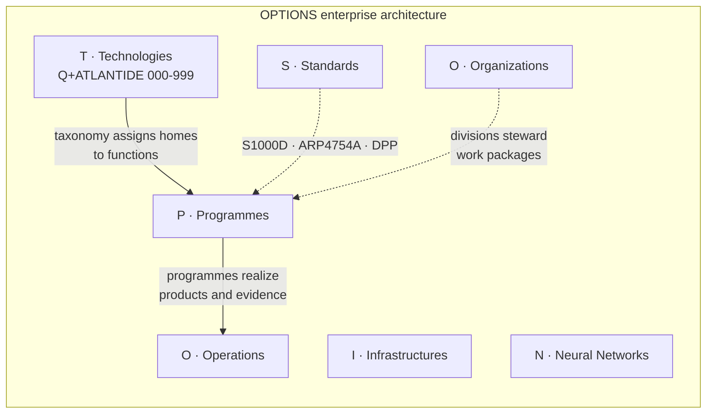
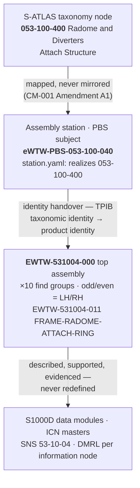
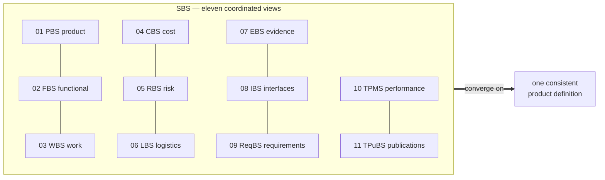

# Q+A — Open Aerospace Engineering Architecture

**From structured engineering intent to models, simulations, evidence and physical product definition.**

Q+A is a collaborative aerospace and advanced-systems engineering repository built around controlled product structures, deterministic identifiers, technical-information governance and lifecycle traceability. It is the working repository of the **Q+** initiative and hosts the **Q+ATLANTIDE** architecture taxonomy, the **OPTIONS** enterprise architecture, and the programme breakdown structures of the **AMPEL360**, **GAIA-AIR**, **GAIA-SPACE** and **ROBBBO-T** programmes.

> **The repository is not a designed aircraft. It is a governed engineering address space that must now be populated with geometry, models, simulations, analyses and evidence.**

> [!IMPORTANT]
> **Q+A is actively looking for contributors with experience in CAD, CAE, engineering simulation, systems engineering and aerospace product development.** The immediate objective is to turn structured product nodes and planned part numbers into traceable engineering artefacts. Start with [CONTRIBUTING.md](CONTRIBUTING.md).

---

## The architecture in one view



| Area | Path | Content |
|---|---|---|
| Model Digital Constitution | [`00_MODEL-DIGITAL-CONSTITUTION/`](00_MODEL-DIGITAL-CONSTITUTION/) | Governance principles, controlled vocabulary, change control, validation rules |
| **O** — Organizations | [`01-01_ORGANIZATIONS/`](01_OPTIONS_ARCHITECTURE/01-01_ORGANIZATIONS/) | Technical and enterprise divisions, team registry |
| **P** — Programmes | [`01-02_PROGRAMMES/`](01_OPTIONS_ARCHITECTURE/01-02_PROGRAMMES/) | AMPEL360, GAIA-AIR, GAIA-SPACE, ROBBBO-T |
| **T** — Technologies | [`01-03_TECHNOLOGIES/`](01_OPTIONS_ARCHITECTURE/01-03_TECHNOLOGIES/) | Q+ATLANTIDE architecture bands (register below) |
| **I** — Infrastructures | [`01-04_INFRASTRUCTURES/`](01_OPTIONS_ARCHITECTURE/01-04_INFRASTRUCTURES/) | Airports/FALs, vertiports, spaceports, hangars, energy chains, test facilities |
| **O** — Operations | [`01-05_OPERATIONS/`](01_OPTIONS_ARCHITECTURE/01-05_OPERATIONS/) | Flight/mission ops, maintenance, continuing airworthiness, retirement and circularity |
| **N** — Neural Networks | [`01-06_NEURAL-NETWORKS/`](01_OPTIONS_ARCHITECTURE/01-06_NEURAL-NETWORKS/) | Deterministic AI, synthetic data, NBT gates, certification-aware AI |
| **S** — Standards | [`01-07_STANDARDS/`](01_OPTIONS_ARCHITECTURE/01-07_STANDARDS/) | IDEALE-ESG, S1000D / ATA iSpec 2200 / ASD-STE100, ARP4754A / DO-178C / DO-254 / CS-25, CSDB-DMC, Digital Product Passport, evidence and provenance |

<details>
<summary><strong>Organizational structure (divisions)</strong></summary>

```text
01-01_ORGANIZATIONS
├── 01-01-01_TECHNICAL-DIVISIONS
│   ├── 01-01-01-01_Q-AIR          ├── 01-01-01-07_Q-HORIZON
│   ├── 01-01-01-02_Q-SPACE        ├── 01-01-01-08_Q-MECHANICS
│   ├── 01-01-01-03_Q-GREENTECH    ├── 01-01-01-09_Q-GROUND
│   ├── 01-01-01-04_Q-STRUCTURES   ├── 01-01-01-10_Q-INDUSTRY
│   ├── 01-01-01-05_Q-DATAGOV      └── 01-01-01-11_Q-SCIRES
│   └── 01-01-01-06_Q-HPC
├── 01-01-02_ENTERPRISE-DIVISIONS
│   ├── Q-FINANCE · Q-HR · Q-CSR · Q-LEGAL · Q-PMO · Q-RISK
│   ├── Q-GOV · Q-ESG · Q-DEI
│   ├── PROCUREMENT-AND-SUPPLIERS
│   └── AUTHORITIES-AND-REGULATORS-INTERFACES
├── TEAM-MEMBERS.csv
└── TEAM-MEMBERS.md
```

</details>

---

## Q+ATLANTIDE — the technology taxonomy

**Q+ATLANTIDE** (Quantum + Aerospace Top Level Architectures and Novel Technologies Identification in Data Ecosystem) organizes all technology domains into ten controlled bands of one hundred chapters each — the `Q+ATLANTIDE1000` schema. The taxonomy assigns **homes to functions, never to molecules or programmes**: applicability lives downstream, in programme impact studies, product structures and data-module mappings.

| Range | Code | Controlled meaning |
|---:|---|---|
| `000–099` | [`S-ATLAS`](01_OPTIONS_ARCHITECTURE/01-03_TECHNOLOGIES/01-03-01_Q+ATLANTIDE/000-099_S-ATLAS/) | Sustainable Aviation Top-Level Architecture Schema |
| `100–199` | [`S-STA`](01_OPTIONS_ARCHITECTURE/01-03_TECHNOLOGIES/01-03-01_Q+ATLANTIDE/100-199_S-STA/) | Sustainable Space Technology Architecture |
| `200–299` | [`DTTA`](01_OPTIONS_ARCHITECTURE/01-03_TECHNOLOGIES/01-03-01_Q+ATLANTIDE/200-299_DTTA/) | Defence Technology Type Architecture |
| `300–399` | [`DTCEC`](01_OPTIONS_ARCHITECTURE/01-03_TECHNOLOGIES/01-03-01_Q+ATLANTIDE/300-399_DTCEC/) | Digital Twin, Cloud, Edge & AI Architecture |
| `400–499` | [`EPTA`](01_OPTIONS_ARCHITECTURE/01-03_TECHNOLOGIES/01-03-01_Q+ATLANTIDE/400-499_EPTA/) | Energy and Propulsion Technology Architecture |
| `500–599` | [`AMTA`](01_OPTIONS_ARCHITECTURE/01-03_TECHNOLOGIES/01-03-01_Q+ATLANTIDE/500-599_AMTA/) | Advanced Material, Bio & Nanotechnology Architecture |
| `600–699` | [`OGATA`](01_OPTIONS_ARCHITECTURE/01-03_TECHNOLOGIES/01-03-01_Q+ATLANTIDE/600-699_OGATA/) | On-Ground Automation Technology Architecture |
| `700–799` | [`ATACV`](01_OPTIONS_ARCHITECTURE/01-03_TECHNOLOGIES/01-03-01_Q+ATLANTIDE/700-799_ATACV/) | Air Traffic and Aerial City Vehicles |
| `800–899` | [`CYB`](01_OPTIONS_ARCHITECTURE/01-03_TECHNOLOGIES/01-03-01_Q+ATLANTIDE/800-899_CYB/) | Cybersecurity Architecture |
| `900–999` | [`QCSAA`](01_OPTIONS_ARCHITECTURE/01-03_TECHNOLOGIES/01-03-01_Q+ATLANTIDE/900-999_QCSAA/) | Quantum Computing and Sentient Agency Architecture |

**Band state.** `S-ATLAS` carries 87 realized chapters on the canonical fractal grid — chapters, sections and first-tier subjects all on the hundreds pattern (`X00`), with each `N00` subject root reserving its `N00–N99` interval for descendant taxonomy. `S-STA` is live with all 100 chapters ratified and a dual-grain doctrine spine (`100–104`: band doctrine, mission architecture, systems engineering, programme management, product assurance — 158 nine-digit nodes), anchored to a machine-readable **standards register** (ISO/TC20/SC14 seeded; SC13/CCSDS and ECSS pending acquisition). Standards are cited undated in taxonomy content; editions live in the register.

---

## From taxonomy to product: the identity boundary

One deterministic grammar connects taxonomy, product structure, part numbers and technical publications. **Sections are 1:1 by number** (taxonomy `053-N00` ↔ PBS `053-N00`); **subjects are related by declared mapping** (`realizes:`, machine-verified against the current taxonomy); **part numbers derive from the PBS-local code** and are immune to taxonomy evolution.



The assembly station is the **Taxonomy–Product Identity Boundary (TPIB)**: the single normative point where identity switches from taxonomy code to part number. Above it, S-ATLAS addresses; below it, configuration-controlled part numbers; at it, a recorded, machine-verifiable binding. PN changes never imply taxonomy changes, and taxonomic decomposition never implies PN decomposition. Folder identity is the single source of truth; YAML metadata mirrors it. `AAA` is not a valid identifier anywhere (No-AAA rule).

---

## Programme models and breakdown structures

The AMPEL360 programme structures four models — **eWTW**, **BWB-Q100**, **MRTT-Q300**, **Q10** — each governed through a System Breakdown Structure family of coordinated views converging on one product definition:



---

## Current engineering focus — AMPEL360 eWTW

* **Fuselage PBS, chapter 053** — realized on the S-ATLAS-aligned grammar: ten sections (`053-000 … 053-900`, 1:1 with taxonomy sections), ~55 subjects, **55 assembly stations**, **~330 controlled part numbers** from radome attach to the energy-carrier bay, including LH/RH variants and constituents. Realized exemplar: the radome and nose-cone attach structure (`EWTW-531004-…`). Status: PLANNED identifiers under configuration governance.
* **ECS / ATA 021 technical publications** — information-centric TPuBS nodes with node-local DMRLs, per-subject **info-code breakdowns** (description · servicing · remove · install, with effectivity variants), publication-neutral S1000D ICN vector masters, metadata sidecars and a deterministic rendition stamper.
* **Deterministic generators** — chapter scaffolds, registers and migrations are produced by idempotent, committed Python realizers with reconciliation companions; manifests are regenerated from the same data, never hand-edited; every generator change ships with its migration plan.
* **Energy-carrier and hydrogen concepts** — structural integration provisions (`053-900`), pack-bay and belly-fairing architecture, electric ECS (bleedless, E-pack based).

### A product node is an engineering contract

A folder or part number here is not merely a directory. It progressively defines: what the object is; where it belongs; what it interfaces with; what function it supports; what assumptions govern it; what artefacts define it; what evidence validates it; what configuration and effectivity apply. A planned part number does not imply a manufactured component exists — it establishes a controlled identity under which the component can be designed, analysed, reviewed and matured.

---

## Contributors wanted

### 1. CAD and product definition
Parametric part modelling; surface and solid modelling; aerospace structural design; assembly modelling; interface and installation definition; composite and metallic concepts; tubing, ducting and routing; equipment installation; lightweight design; drawings; DfM. Tools: FreeCAD, CATIA, NX, SolidWorks, Fusion, Onshape, OpenCASCADE workflows, Blender (non-authoritative visualization) — with neutral exports preferred: `STEP` (preferred) · IGES · STL · OBJ · DXF · SVG · PDF.

### 2. CAE and simulation
**Structural** (FEA, strength, buckling, modal, fatigue assumptions, crash paths, fittings, pressure boundaries) · **Aero and fluids** (external, internal, ECS ducts, thermal-fluid, hydrogen and cryogenic behaviour, venting) · **Thermal** (networks, insulation, cryo heat leak, equipment cooling, battery and fuel-cell management) · **Electrical and energy** (power flow, HV distribution, fuel-cell and battery behaviour, fault modes) · **Multiphysics and mission** (coupled analyses, budgets, performance, turnaround, R&M). Open, reproducible toolchains especially welcome.

### 3. Systems and interface engineering
Requirements; functional decomposition; ICDs; installation constraints; mass and energy budgets; data flows; failure modes; safety assumptions; verification methods; allocation and traceability across PBS, FBS, ReqBS, TPMS, IBS, RBS and EBS.

### 4. Technical publications and engineering data
S1000D; ATA iSpec 2200; CSDB architecture; data modules; IPD; maintenance concepts; installation instructions; inspection requirements; M&P specifications; Digital Product Passports; configuration records; evidence; technical illustration. Publication content must remain connected to the node that owns it.

### Contribution package

```text
<controlled-product-node>/
├── README.md
├── CAD/            SOURCE/ · STEP/ · MESH/ · PREVIEW/
├── DRAWINGS/
├── ANALYSIS/       assumptions.md · load-cases.yaml · boundary-conditions.yaml · calculations/
├── SIMULATION/     model/ · solver/ · results/ · report.md
├── INTERFACES/
└── EVIDENCE/
```

<details>
<summary><strong>Minimum information — CAD contribution</strong></summary>

Owning PBS or part-number node; modelled object; CAD software and version; units and coordinate system; principal dimensions; assumed materials; reference interfaces; design assumptions and known limitations; source format and neutral exports; contributor and revision information.

</details>

<details>
<summary><strong>Minimum information — simulation contribution</strong></summary>

Engineering question; analysed node; assumptions and geometry source; material properties; initial and boundary conditions; load cases; mesh or discretization; solver and version; convergence criteria; input and output files; interpretation; limitations and unresolved uncertainties; reproducibility instructions. *A plot without model assumptions and source data is not engineering evidence.*

</details>

### Workflow


> [!IMPORTANT]
> All CAD, assembly, simulation and data-module contributions require an **approved allocation issue** — see [CONTRIBUTING.md](CONTRIBUTING.md). Propose the object and its controlled location, obtain approval from the architecture authority, then act as engineering steward of the work package.

### Good first engineering contributions

Each maps to a controlled PBS address that already exists (space declared by prefix):

* a simplified parametric **radome attach-ring** — `eWTW-PBS-053-100-040` (`EWTW-531004-011`)
* a **forward pressure bulkhead** preliminary FE model — `eWTW-PBS-053-800-010`
* a **skin-panel and stringer bay** arrangement — `eWTW-PBS-053-500` / `-600`
* a **passenger floor beam** — `eWTW-PBS-053-700-020`; a **seat-track** section — `eWTW-PBS-053-700-060`
* **NLG bay walls** structural concept — `eWTW-PBS-053-100-020`
* a **wing-to-fuselage fairing** surface model — `eWTW-PBS-053-200-020`
* an **ECS duct pressure-loss** model — TPuBS node `021-200-010` (`ICN-EWTW-021200010`)
* an **energy-carrier bay crash load path** study — `eWTW-PBS-053-900-020`
* a **cryogenic tank support** model (BWB-Q100 hydrogen concepts)
* a **mass-property estimate** linked to any PBS node

A contribution need not be a final design; it must distinguish `known · assumed · calculated · simulated · estimated · unresolved`.

---

## Engineering maturity

Repository presence does **not** imply an artefact is validated, optimized, certified, airworthy, production-ready, approved by a design organization, or accepted by any authority. Every contribution declares its status:

```text
CONCEPT · PLANNED · DRAFT · IN-WORK · REVIEWED · VERIFIED · VALIDATED · RELEASED · SUPERSEDED
```

Certification claims require explicit evidence and are never inferred from nomenclature, directory position or formatting.

## Repository principles

**Traceability over presentation** — a modest reproducible contribution outweighs an impressive visualization without assumptions or ownership. **Folder identity as SSOT** — metadata and artefacts mirror the controlled folder identity. **Evidence over assertion.** **Deterministic structure** — identifiers stay stable and machine-processable; scaffolds, registers and migrations come from committed, idempotent tools with reconciliation companions. **Progressive maturity** — conceptual work is welcome when its uncertainty is explicit. **Interoperability** — open, documented formats alongside native ones. **No-AAA rule** — absolute.

## What must not be contributed

Employer-confidential information; proprietary supplier or customer data; export-controlled technical data; classified or restricted information; copyrighted CAD or documents without redistribution rights; leaked documentation; personal data; unlicensed third-party assets; results presented as validated when they are not; files whose origin or permissions cannot be established. Contributors are responsible for ensuring their work can legally be shared.

## Independent research status

Q+A is an independent engineering architecture and research initiative. It is **not** an approved aircraft design, an authorized design organization, a certification programme, or an official publication of any employer, manufacturer or authority. References to aerospace standards, manufacturers and certification frameworks are used for research, architecture and interoperability purposes only.

## Licensing

**No repository-wide licence is published yet.** Under default copyright rules, public visibility does not by itself grant rights of commercial reuse, redistribution or relicensing; until an explicit `LICENSE` is added, treat content as all-rights-reserved and open an issue to discuss intended use. A formal `LICENSE` is a planned governance action; contributor terms are governed by [CONTRIBUTING.md](CONTRIBUTING.md) §16 (interim). Contributors should identify the licensing status of externally sourced material and contribute only work they are authorized to share.

## Join the Q+A engineering community

Register in a technical or enterprise division through an approved GitHub issue: [Contribution governance](CONTRIBUTING.md) · [Team registry](01_OPTIONS_ARCHITECTURE/01-01_ORGANIZATIONS/TEAM-MEMBERS.md) · [Technical divisions](01_OPTIONS_ARCHITECTURE/01-01_ORGANIZATIONS/01-01-01_TECHNICAL-DIVISIONS/) · [Enterprise divisions](01_OPTIONS_ARCHITECTURE/01-01_ORGANIZATIONS/01-01-02_ENTERPRISE-DIVISIONS/)

Open an engineering issue; propose a product-node realization; submit a CAD or simulation model; review assumptions; validate calculations; improve interface definitions; add publication content; identify architecture inconsistencies; propose a reproducible workflow; submit a pull request.

> **Main objective: transform every meaningful product node from a planned identifier into a traceable package of geometry, behaviour, interfaces, analysis and evidence.**

The repository already provides the addresses. The next task is to provide the engineering.
